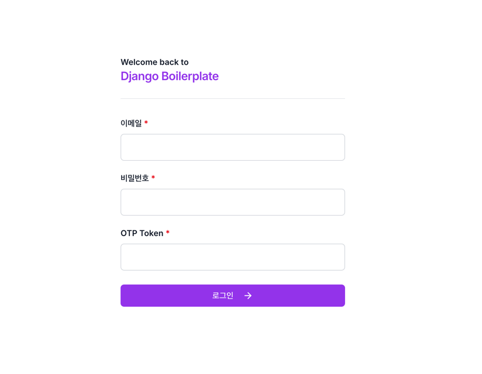
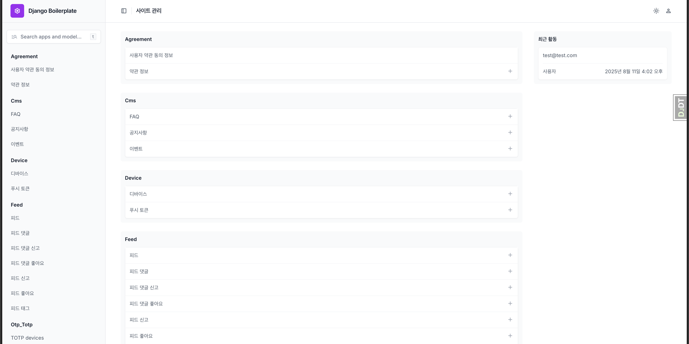

# Django Enterprise Boilerplate

[한국어](README.md) | [English](README.en.md)


An enterprise-grade Django boilerplate designed for real production environments. It ships with robust auth/security, API versioning, caching, async processing, documentation, and observability so you can start building products immediately.

## 🌟 Key Features

### User Management
- [x] Registration, email verification, login (JWT)
- [x] Social login (Google)
- [x] User profile management
- [ ] Permission and role-based access control
- [x] Multi-device management

### Content Management
- [x] Feed management
- [ ] User-based subscriptions
- [x] Feed and comment likes, reporting
- [x] Large file upload and management

### Communication
- [x] Email delivery system
- [ ] Push notifications
- [ ] 1:1 inquiries
- [x] FAQ and announcements

### Game Features
- [x] Attendance check

### Utilities
- [x] Short URL creation and management
- [ ] Statistics and analytics
- [ ] Admin dashboard
- [x] API version management

### Infrastructure
- [x] Asynchronous task processing (Celery)
- [ ] Search optimization (Elasticsearch)
- [x] Cache management (Redis, Memcached)
- [ ] Media storage (AWS S3)
- [x] Logging and monitoring (Sentry, structured logs)

## 🚀 Getting Started

### Requirements

- Python 3.11+
- Django 5.1+
- Redis (provided via docker-compose for local development)
- PostgreSQL (provided via docker-compose for local development)

### Installation

```bash
# Clone repository
git clone https://github.com/lee-lou2/django-boilerplate.git
cd django-boilerplate

# Install uv (if not installed)
# macOS (Homebrew recommended):
#   brew install uv
# Other platforms: see https://docs.astral.sh/uv/getting-started/

# Sync dependencies (automatically creates .venv)
uv sync

# Move to source folder
cd src

# Create logs file
mkdir -p logs

# Set environment variables
cp .env.example .env
# Edit .env file to configure database, email, S3, etc.

# Run migrations
uv run python manage.py migrate

# Create admin user (optional)
uv run python manage.py createsuperuser

# Start development server
uv run python manage.py runserver
```

### Run with Docker

```bash
# From repository root
docker compose up -d --build

# Web: http://localhost:8000
# API health: http://localhost:8000/_health/
```

### Run Celery

- Local (uv): `uv run celery -A conf.celery.app worker -l info`
- Docker: `docker compose up -d worker`

## 📚 Documentation

Detailed documentation is provided for each feature. Documentation is available in both Korean and English.

### Apps

- [Account Management](docs/en/apps/account.md) - Registration, login, social login, email verification, etc.
- [User Management](./docs/en/apps/user.md) - User profile management
- [Device Management](./docs/en/apps/device.md) - Device/push token registration
- [Short URL Management](./docs/en/apps/short-url.md) - Short URL creation and management
- [Feed Management](./docs/en/apps/feed.md) - Feed management
- [Content Management](./docs/en/apps/cms.md) - Announcements, events, FAQ management
- [Games](./docs/en/apps/game.md) - Attendance check

### Security

- [Data Encryption](./docs/en/security/encryption.md)

### Setup and Deployment

- [Docker Environment Setup](./docs/en/deploy/docker-setup.md)
- [Server Deployment Guide](./docs/en/deploy/deployment.md) (Coming soon)
- [CI/CD Pipeline](./docs/en/deploy/ci-cd.md) (Coming soon)


## 🔧 Environment Configuration

Supported environments controlled by `DJANGO_SETTINGS_MODULE`:

- Local: `conf.settings.local`
- Develop: `conf.settings.develop`
- Stage: `conf.settings.stage`
- Production: `conf.settings.prod`

Key environment variables (.env):

- Required
  - `SECRET_KEY`: Django secret key
  - `DJANGO_SETTINGS_MODULE`: e.g., `conf.settings.local` or `conf.settings.develop`
  - `DEBUG`: `True`/`False`
- Database (PostgreSQL recommended for develop/stage/prod)
  - `POSTGRES_DB`, `POSTGRES_USER`, `POSTGRES_PASSWORD`, `POSTGRES_HOST`, `POSTGRES_PORT`
  - `POSTGRES_REPLICA_HOST`, `POSTGRES_REPLICA_PORT` (optional)
- Email
  - `EMAIL_HOST`, `EMAIL_PORT`, `EMAIL_HOST_USER`, `EMAIL_HOST_PASSWORD`, `DEFAULT_FROM_EMAIL`
- Sentry
  - `SENTRY_DSN`
- AWS/Storage (optional)
  - `AWS_ACCESS_KEY_ID`, `AWS_SECRET_ACCESS_KEY`, `AWS_REGION_NAME`
- Signup/password URLs
  - `SIGNUP_CONFIRM_URL`, `RESET_PASSWORD_URL`, `SIGNUP_COMPLETED_URL`


## 📂 Project Structure

```
django-boilerplate/
├── src/                       # Source folder
│   ├── apps/                  # App modules
│   │   ├── account/           # Account management
│   │   ├── agreement/         # Terms management
│   │   ├── benefit/           # Benefits management
│   │   ├── cms/               # Content management
│   │   ├── device/            # Device management
│   │   ├── feed/              # Feed system
│   │   ├── file/              # File management
│   │   ├── game/              # Games
│   │   ├── short_url/         # Short URL management
│   │   └── user/              # User management
│   ├── base/                  # Common modules
│   │   ├── enums              # Enumerations
│   │   ├── utils              # Common utilities
│   │   └── fields             # Field classes
│   ├── conf/                  # Project settings
│   │   ├── settings/          # Environment-specific settings
│   │   │   ├── base.py        # Base settings
│   │   │   ├── local.py       # Local environment
│   │   │   ├── develop.py     # Development environment
│   │   │   ├── stage.py       # Stage environment
│   │   │   └── prod.py        # Production environment
│   │   ├── urls/              # URL settings
│   │   │   ├── admin.py       # Admin URL settings
│   │   │   ├── api.py         # API URL settings
│   │   │   └── url.py         # URL Shortener settings
│   │   ├── authentications.py # Authentication settings
│   │   ├── caches.py          # Cache settings
│   │   ├── celery.py          # Celery settings
│   │   ├── exceptions.py      # Exception handling
│   │   ├── filters.py         # Filter settings
│   │   ├── hosts.py           # Host settings
│   │   ├── routers.py         # Router settings
│   │   ├── schedules.py       # Scheduler settings
│   │   ├── utils.py           # Common utility functions
│   │   └── wsgi.py            # WSGI settings
│   ├── static/                # Static files
│   ├── templates/             # Template files
│   ├── .env.example           # Environment variables example
│   ├── Makefile               # Make targets
│   └── manage.py              # Django management commands
├── docs/                      # Documentation
│   ├── files/                 # Files
│   ├── ko/                    # Korean documentation
│   └── en/                    # English documentation
├── docker-compose.yml         # Docker Compose settings
├── Dockerfile                 # Docker image settings
├── pyproject.toml             # Project configuration and dependencies (uv)
├── uv.lock                    # Dependency lock file
└── README.md                  # Project introduction
```

## 🧩 App Structure

Each app follows this structure:

```
app_name/
├── v1/                        # API version 1
│   ├── filters.py             # Filter set classes
│   ├── serializers.py         # Serializers
│   ├── views.py               # View functions/classes
│   ├── urls.py                # URL patterns
│   ├── utils.py               # Utility functions
│   ├── tasks.py               # Asynchronous tasks
│   └── tests.py               # Tests
├── migrations/                # DB migrations
├── management/                # Management commands
│   └── commands/              # Custom commands
├── admin.py                   # Admin interface
├── apps.py                    # App settings
├── models.py                  # Data models
└── signals.py                 # Signal handling
```

## 🛠️ Technology Stack

### Backend
- Django 5.1+: Web framework
- Django REST Framework 3.15+: API development
- Celery 5.2+: Asynchronous task processing
- Sentry: Error/tracing monitoring
- JWT: Authentication

### Infrastructure
- Docker: Containerization
- Nginx: Web server
- AWS S3: File storage
- GitHub Actions: CI/CD
- AWS: Cloud hosting

### Operations/Observability
- drf-spectacular: OpenAPI/Swagger docs
- django-hosts: Subdomain/host separation
- django-otp: 2FA (admin)
- debug-toolbar: Local debugging
- WhiteNoise: Static file serving

## 📈 Performance Optimization

- Database query optimization
- Redis caching strategy
- Asynchronous task processing with Celery
- Chunked upload for large file processing
- Pagination and filtering optimization
 - Read/Write split (DB router, replica)

## 🔒 Security

- JWT-based authentication
- User permission management
- CSRF/XSS protection
- API request rate limiting
- Data encryption
- OAuth2 security settings
- Sensitive information management through environment variables
 - Two-factor authentication (django-otp, admin site)
 - AWS SSM Parameter Store integration (optional; external secret management)

## 📑 API Docs and Endpoints

- OpenAPI JSON: `/openapi.json/` (local/develop)
- Swagger UI: `/swagger/` (local/develop)
- Redoc: `/redoc/` (local/develop)
- Health check: `/_health/`
- API versioning: All APIs are prefixed with `/v1/`.

Admin (local only): `/admin/`
- Admin login uses django-otp based 2FA. On first local login, configure OTP via the issued URL.

## 📝 Development Guidelines

- Code review process
- Test-driven development (TDD)
- Continuous integration and deployment (CI/CD)
- Code quality management (linting, formatting)
- Git branch strategy ([Custom branch strategy](https://lee-lou2.notion.site/Git-Branch-78a65eecaa2d4070ad19221681a96a00?pvs=4))

## 📸 Screenshots

### Admin Page



## 🧪 Testing

```bash
# Run all tests
uv run python manage.py test

# Test specific app
uv run python manage.py test apps.account
```

## 🧰 Makefile Usage

Helpful targets are defined in `src/Makefile`.

- Development server: `make dev`
- Unit tests: `make test`
- Load test (headless Locust): `make load-test`

After the load test finishes, a report will be generated at `src/locust_report.html`.

## 🧱 Rapid App Scaffolding with Template

With the template under `apps/common`, you can quickly scaffold a standardized app structure:

```bash
uv run python src/manage.py startapp my_app
```

- App location: `src/apps/my_app`
- Template path: `apps/common/management/app_template`

## ⚙️ Load Testing with Locust

This project includes `tests/locust/locustfile.py`. You can run it as follows:

```bash
# Using Makefile (recommended)
make load-test

# Or run directly
uv run python -m locust -f src/tests/locust/locustfile.py \
  --headless -u 10 -r 5 -t 30s \
  --host=http://127.0.0.1:8000 \
  --html=locust_report.html
```

When the run completes, check `src/locust_report.html` for the results.

## 🤝 Contributing

1. Fork this repository
2. Create a feature branch (`git checkout -b feature/amazing-feature`)
3. Commit your changes (`git commit -m 'Add some amazing feature'`)
4. Push to the branch (`git push origin feature/amazing-feature`)
5. Create a Pull Request

## 📄 License

This project is licensed under the MIT License. See the [LICENSE](LICENSE) file for details.

## 📮 Contact

- Project Manager: [JAKE](mailto:lee@lou2.kr)
- Issue Tracker: [GitHub Issues](https://github.com/lee-lou2/django-boilerplate/issues)
