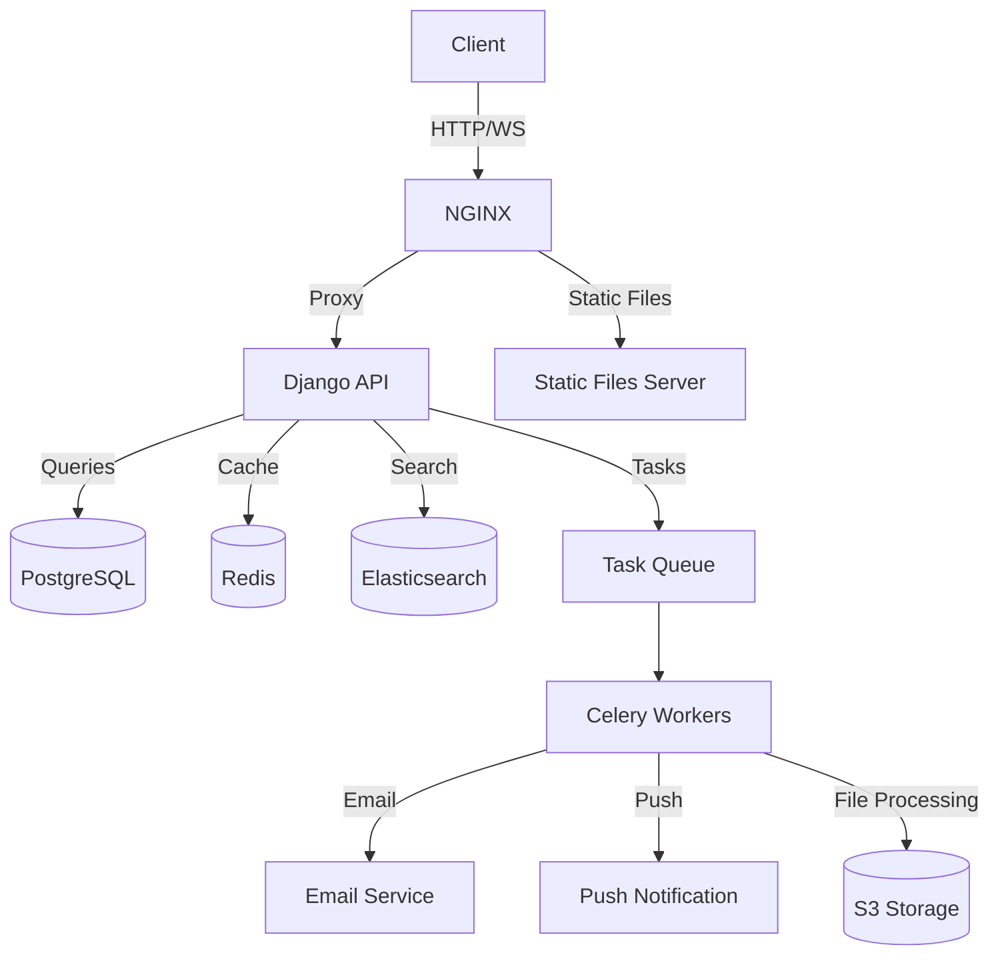

# Django Enterprise Boilerplate

[한국어](README.md) | [English](README.en.md)


An enterprise-grade Django boilerplate ready for immediate use in production environments. It includes all essential features for modern web services, such as user management, content creation, social features, and notification systems.

## 🌟 Key Features

### User Management
- [x] Registration, email verification, login (JWT)
- [x] Social login (Google)
- [x] User profile management
- [ ] Permission and role-based access control
- [x] Multi-device management

### Content Management
- [x] Feed management
- [ ] User-based subscriptions
- [x] Feed and comment likes, reporting
- [x] Large file upload and management

### Communication
- [x] Email delivery system
- [ ] Push notifications
- [ ] 1:1 inquiries
- [x] FAQ and announcements

### Game Features
- [x] Attendance check

### Utilities
- [x] Short URL creation and management
- [ ] Statistics and analytics
- [ ] Admin dashboard
- [x] API version management

### Infrastructure
- [x] Asynchronous task processing (Celery)
- [ ] Search optimization (Elasticsearch)
- [x] Cache management (Redis, Memcached)
- [ ] Media storage (AWS S3)
- [x] Logging and monitoring

## 🚀 Getting Started

### Requirements

- Python 3.11+
- Django 5.1+

### Installation

```bash
# Clone repository
git clone https://github.com/lee-lou2/django-boilerplate.git
cd django-boilerplate

# Create and activate virtual environment
python -m venv venv
source venv/bin/activate  # Windows: venv\Scripts\activate

# Install dependencies
pip install -r requirements.txt

# Move to source folder
cd src

# Set environment variables
cp .env.example .env
# Edit .env file to configure database, email, S3, etc.

# Run migrations
python manage.py migrate

# Start development server
python manage.py runserver
```

## 📚 Documentation

Detailed documentation is provided for each feature. Documentation is available in both Korean and English.

### Apps

- [Account Management](docs/en/apps/account.md) - Registration, login, social login, email verification, etc.
- [User Management](./docs/en/apps/user.md) - User profile management
- [Device Management](./docs/en/apps/device.md) - Device/push token registration
- [Short URL Management](./docs/en/apps/short-url.md) - Short URL creation and management
- [Feed Management](./docs/en/apps/feed.md) - Feed management
- [Content Management](./docs/en/apps/cms.md) - Announcements, events, FAQ management
- [Games](./docs/en/apps/game.md) - Attendance check

### Security

- [Data Encryption](./docs/en/security/encryption.md)

### Setup and Deployment

- [Docker Environment Setup](./docs/en/deploy/docker-setup.md)
- [Server Deployment Guide](./docs/en/deploy/deployment.md) (Coming soon)
- [CI/CD Pipeline](./docs/en/deploy/ci-cd.md) (Coming soon)

## 🏗️ Architecture



## 📂 Project Structure

```
django-boilerplate/
├── src/                       # Source folder
│   ├── apps/                  # App modules
│   │   ├── account/           # Account management
│   │   ├── agreement/         # Terms management
│   │   ├── benefit/           # Benefits management
│   │   ├── cms/               # Content management
│   │   ├── device/            # Device management
│   │   ├── feed/              # Feed system
│   │   ├── file/              # File management
│   │   ├── game/              # Games
│   │   ├── short_url/         # Short URL management
│   │   └── user/              # User management
│   ├── common/                # Common modules
│   │   ├── enums              # Enumerations
│   │   ├── utils              # Common utilities
│   │   └── fields             # Field classes
│   ├── conf/                  # Project settings
│   │   ├── settings/          # Environment-specific settings
│   │   │   ├── base.py        # Base settings
│   │   │   ├── dev.py         # Development environment
│   │   │   ├── test.py        # Test environment
│   │   │   └── prod.py        # Production environment
│   │   ├── urls/              # URL settings
│   │   │   ├── admin.py       # Admin URL settings
│   │   │   ├── api.py         # API URL settings
│   │   │   └── url.py         # URL Shorter settings
│   │   ├── authentications.py # Authentication settings
│   │   ├── caches.py          # Cache settings
│   │   ├── celery.py          # Celery settings
│   │   ├── exceptions.py      # Exception handling
│   │   ├── filters.py         # Filter settings
│   │   ├── hosts.py           # Host settings
│   │   ├── routers.py         # Router settings
│   │   ├── schedules.py       # Scheduler settings
│   │   ├── utils.py           # Common utility functions
│   │   └── wsgi.py            # WSGI settings
│   ├── static/                # Static files
│   ├── templates/             # Template files
│   ├── .env.example           # Environment variables example
│   └── manage.py              # Django management commands
├── docs/                      # Documentation
│   ├── ko/                    # Korean documentation
│   └── en/                    # English documentation
├── docker/                    # Docker-related files
│   ├── nginx/                 # Nginx settings
│   ├── postgres/              # PostgreSQL settings
│   └── redis/                 # Redis settings
├── docker-compose.yml         # Docker Compose settings
├── Dockerfile                 # Docker image settings
├── requirements.txt           # Python dependencies
└── README.md                  # Project introduction
```

## 🧩 App Structure

Each app follows this structure:

```
app_name/
├── v1/                        # API version 1
│   ├── filters.py             # Filter set classes
│   ├── serializers.py         # Serializers
│   ├── views.py               # View functions/classes
│   ├── urls.py                # URL patterns
│   ├── utils.py               # Utility functions
│   ├── tasks.py               # Asynchronous tasks
│   └── tests.py               # Tests
├── migrations/                # DB migrations
├── management/                # Management commands
│   └── commands/              # Custom commands
├── admin.py                   # Admin interface
├── apps.py                    # App settings
├── models.py                  # Data models
└── signals.py                 # Signal handling
```

## 🛠️ Technology Stack

### Backend
- Django 5.1+: Web framework
- Django REST Framework 3.15+: API development
- Celery 5.2+: Asynchronous task processing
- Sentry: Error monitoring
- JWT: Authentication

### Infrastructure
- Docker: Containerization
- Nginx: Web server
- AWS S3: File storage
- GitHub Actions: CI/CD
- AWS: Cloud hosting

## 📈 Performance Optimization

- Database query optimization
- Redis caching strategy
- Asynchronous task processing with Celery
- Chunked upload for large file processing
- Pagination and filtering optimization

## 🔒 Security

- JWT-based authentication
- User permission management
- CSRF/XSS protection
- API request rate limiting
- Data encryption
- OAuth2 security settings
- Sensitive information management through environment variables

## 📝 Development Guidelines

- Code review process
- Test-driven development (TDD)
- Continuous integration and deployment (CI/CD)
- Code quality management (linting, formatting)
- Git branch strategy ([Custom branch strategy](https://lee-lou2.notion.site/Git-Branch-78a65eecaa2d4070ad19221681a96a00?pvs=4))

## 🧪 Testing

```bash
# Run all tests
python manage.py test

# Test specific app
python manage.py test apps.account
```

## 🤝 Contributing

1. Fork this repository
2. Create a feature branch (`git checkout -b feature/amazing-feature`)
3. Commit your changes (`git commit -m 'Add some amazing feature'`)
4. Push to the branch (`git push origin feature/amazing-feature`)
5. Create a Pull Request

## 📄 License

This project is licensed under the MIT License. See the [LICENSE](LICENSE) file for details.

## 📮 Contact

- Project Manager: [JAKE](mailto:lee@lou2.kr)
- Issue Tracker: [GitHub Issues](https://github.com/lee-lou2/django-boilerplate/issues)
