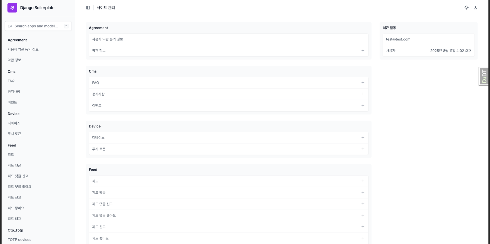

# Django Enterprise Boilerplate

[한국어](README.md) | [English](README.en.md)


실제 프로덕션 환경을 목표로 설계된 엔터프라이즈급 Django 보일러플레이트입니다. 강력한 인증/보안, API 버저닝, 캐싱, 비동기 처리, 문서화, 관측성까지 기본 제공하여 바로 제품 개발에 착수할 수 있습니다.

## 🌟 주요 기능

### 사용자 관리
- [x] 회원가입, 이메일 인증, 로그인 (JWT)
- [x] 소셜 로그인 (Google)
- [x] 사용자 프로필 관리
- [ ] 권한 및 역할 기반 접근 제어
- [x] 멀티 디바이스 관리

### 컨텐츠 관리
- [x] 피드 관리
- [ ] 사용자 기반 구독
- [x] 피드 및 댓글 좋아요, 신고
- [x] 대용량 파일 업로드 및 관리

### 커뮤니케이션
- [x] 이메일 발송 시스템
- [ ] 푸시 알림
- [ ] 1:1 문의
- [x] FAQ 및 공지사항

### 게임 기능
- [x] 출석 체크

### 유틸리티
- [x] 숏링크 생성 및 관리
- [ ] 통계 및 분석
- [x] 어드민 대시보드
- [x] API 버전 관리

### 인프라
- [x] 비동기 작업 처리 (Celery)
- [ ] 검색 최적화 (Elasticsearch)
- [x] 캐시 관리 (Redis, Memcached)
- [ ] 미디어 저장소 (AWS S3)
- [x] 로깅 및 모니터링 (Sentry, 구조화 로그)

## 🚀 시작하기

### 요구사항

- Python 3.11+
- Django 5.1+
- Redis (로컬 개발 시 docker-compose로 자동 제공)
- PostgreSQL (로컬 개발 시 docker-compose로 자동 제공)

### 설치

```bash
# 저장소 클론
git clone https://github.com/lee-lou2/django-boilerplate.git
cd django-boilerplate

# uv 설치 (미설치 시)
# macOS (Homebrew 권장):
#   brew install uv
# 기타 환경: https://docs.astral.sh/uv/getting-started/ 참고

# 의존성 동기화 (자동으로 .venv 생성)
uv sync

# 소스 폴더로 이동
cd src

# logs 폴더 생성
mkdir -p logs

# 환경 변수 설정
cp .env.example .env
# .env 파일 편집하여 데이터베이스, 이메일, S3 등 설정

# 마이그레이션 실행
uv run python manage.py migrate

# 관리자 계정 생성 (선택)
uv run python manage.py createsuperuser

# 개발 서버 실행
uv run python manage.py runserver
```

### Docker로 실행

```bash
# 루트 디렉토리에서 실행
docker compose up -d --build

# 웹 접속: http://localhost:8000
# API 헬스체크: http://localhost:8000/_health/
```

### Celery 실행

- 로컬(uv): `uv run celery -A conf.celery.app worker -l info`
- Docker: `docker compose up -d worker`

## 📚 문서

각 기능별로 상세한 문서를 제공합니다. 문서는 한국어와 영어로 제공됩니다.

### 앱

- [계정 관리](docs/ko/apps/account.md) - 회원 가입, 로그인, 소셜 로그인, 이메일 인증 등
- [사용자 관리](./docs/ko/apps/user.md) - 사용자 프로필 관리
- [디바이스 관리](./docs/ko/apps/device.md) - 디바이스/푸시 토큰 등록
- [숏링크 관리](./docs/ko/apps/short-url.md) - 숏링크 생성 및 관리
- [피드 관리](./docs/ko/apps/feed.md) - 피드 관리
- [콘텐츠 관리](./docs/ko/apps/cms.md) - 공지사항, 이벤트, FAQ 등 관리
- [게임](./docs/ko/apps/game.md) - 출석 체크

### 보안

- [데이터 암호화](./docs/ko/security/encryption.md)

### 설정 및 배포

- [Docker 설정 및 배포](./docs/ko/deploy/docker-setup.md)
- [서버 배포 가이드](./docs/ko/deploy/deployment.md) (준비 중)
- [CI/CD 파이프라인](./docs/ko/deploy/ci-cd.md) (준비 중)


## 🔧 환경 구성

다음 환경을 지원합니다. `DJANGO_SETTINGS_MODULE`로 전환합니다.

- 로컬: `conf.settings.local`
- 개발: `conf.settings.develop`
- 스테이지: `conf.settings.stage`
- 운영: `conf.settings.prod`

주요 환경 변수 (.env):

- 필수
  - `SECRET_KEY`: Django 시크릿 키
  - `DJANGO_SETTINGS_MODULE`: 예) `conf.settings.local` 또는 `conf.settings.develop`
  - `DEBUG`: `True`/`False`
- 데이터베이스(PostgreSQL; develop/stage/prod 권장)
  - `POSTGRES_DB`, `POSTGRES_USER`, `POSTGRES_PASSWORD`, `POSTGRES_HOST`, `POSTGRES_PORT`
  - `POSTGRES_REPLICA_HOST`, `POSTGRES_REPLICA_PORT` (선택)
- 이메일
  - `EMAIL_HOST`, `EMAIL_PORT`, `EMAIL_HOST_USER`, `EMAIL_HOST_PASSWORD`, `DEFAULT_FROM_EMAIL`
- Sentry
  - `SENTRY_DSN`
- AWS/스토리지(선택)
  - `AWS_ACCESS_KEY_ID`, `AWS_SECRET_ACCESS_KEY`, `AWS_REGION_NAME`
- 회원가입/패스워드 관련 URL
  - `SIGNUP_CONFIRM_URL`, `RESET_PASSWORD_URL`, `SIGNUP_COMPLETED_URL`


## 📂 프로젝트 구조

```
django-boilerplate/
├── src/                       # 소스 폴더
│   ├── apps/                  # 앱 모듈
│   │   ├── account/           # 계정 관리
│   │   ├── agreement/         # 약관 관리
│   │   ├── benefit/           # 혜택 관리
│   │   ├── cms/               # 콘텐츠 관리
│   │   ├── device/            # 디바이스 관리
│   │   ├── feed/              # 피드 시스템
│   │   ├── file/              # 파일 관리
│   │   ├── game/              # 게임
│   │   ├── short_url/         # 숏링크 관리
│   │   └── user/              # 사용자 관리
│   ├── base/                  # 공통 모듈
│   │   ├── enums              # 열거형
│   │   ├── utils              # 공통 유틸
│   │   └── fields             # 필드 클래스
│   ├── conf/                  # 프로젝트 설정
│   │   ├── settings/          # 환경별 설정
│   │   │   ├── base.py        # 기본 설정
│   │   │   ├── local.py       # 로컬 환경
│   │   │   ├── develop.py     # 개발 환경
│   │   │   ├── stage.py       # 스테이지 환경
│   │   │   └── prod.py        # 운영 환경
│   │   ├── urls/              # URL 설정
│   │   │   ├── admin.py       # 관리자 URL 설정
│   │   │   ├── api.py         # API URL 설정
│   │   │   └── url.py         # URL Shortener 설정
│   │   ├── authentications.py # 인증 설정
│   │   ├── caches.py          # 캐시 설정
│   │   ├── celery.py          # Celery 설정
│   │   ├── exceptions.py      # 예외 처리
│   │   ├── filters.py         # 필터 설정
│   │   ├── hosts.py           # 호스트 설정
│   │   ├── routers.py         # 라우터 설정
│   │   ├── schedules.py       # 스케줄러 설정
│   │   ├── utils.py           # 공통 유틸리티 함수
│   │   └── wsgi.py            # WSGI 설정
│   ├── static/                # 정적 파일
│   ├── templates/             # 템플릿 파일
│   ├── .env.example           # 환경 변수 예제
│   ├── Makefile               # 명령어 파일
│   └── manage.py              # Django 관리 명령어
├── docs/                      # 문서
│   ├── files/                 # 파일
│   ├── ko/                    # 한국어 문서
│   └── en/                    # 영어 문서
├── docker-compose.yml         # Docker Compose 설정
├── Dockerfile                 # Docker 이미지 설정
├── pyproject.toml             # 프로젝트 설정 및 의존성 관리 (uv)
├── uv.lock                    # 의존성 잠금 파일
└── README.md                  # 프로젝트 소개
```

## 🧩 앱 구조

각 앱은 다음과 같은 구조를 따릅니다:

```
app_name/
├── v1/                        # API 버전 1
│   ├── filters.py             # 필터셋 클래스
│   ├── serializers.py         # 시리얼라이저
│   ├── views.py               # 뷰 함수/클래스
│   ├── urls.py                # URL 패턴
│   ├── utils.py               # 유틸리티 함수
│   ├── tasks.py               # 비동기 작업
│   └── tests.py               # 테스트
├── migrations/                # DB 마이그레이션
├── management/                # 관리 명령어
│   └── commands/              # 사용자 정의 명령어
├── admin.py                   # 관리자 인터페이스
├── apps.py                    # 앱 설정
├── models.py                  # 데이터 모델
└── signals.py                 # 시그널 처리
```

## 🛠️ 기술 스택

### 백엔드
- Django 5.1+: 웹 프레임워크
- Django REST Framework 3.15+: API 개발
- Celery 5.2+: 비동기 작업 처리
- Sentry: 오류/트레이싱 모니터링
- JWT: 인증

### 인프라
- Docker: 컨테이너화
- Nginx: 웹 서버
- AWS S3: 파일 스토리지
- GitHub Actions: CI/CD
- AWS: 클라우드 호스팅

### 운영/옵저버빌리티
- drf-spectacular: OpenAPI/Swagger 문서화
- django-hosts: 서브도메인/호스트 분리
- django-otp: 2FA(관리자)
- debug-toolbar: 로컬 디버깅
- WhiteNoise: 정적 파일 서빙

## 📈 성능 최적화

- 데이터베이스 쿼리 최적화
- Redis 캐싱 전략
- Celery를 이용한 비동기 작업 처리
- 대용량 파일 처리를 위한 청크 업로드
- 페이지네이션 및 필터링 최적화
 - 읽기/쓰기 분리(DB 라우터, replica 설정)

## 🔒 보안

- JWT 기반 인증
- 사용자 권한 관리
- CSRF/XSS 보호
- API 요청 제한
- 데이터 암호화
- OAuth2 보안 설정
- 환경 변수를 통한 민감 정보 관리
 - 2단계 인증(django-otp, 관리 사이트)
 - AWS SSM Parameter Store 연동(선택; 운영 시 외부 비밀 관리)

## 📑 API 문서 및 엔드포인트

- OpenAPI JSON: `/openapi.json/` (로컬/개발 환경)
- Swagger UI: `/swagger/` (로컬/개발 환경)
- Redoc: `/redoc/` (로컬/개발 환경)
- 헬스체크: `/_health/`
- API 버저닝: 모든 API는 `/v1/` 프리픽스를 사용합니다.

관리자(로컬 전용): `/admin/`
- 관리 로그인은 django-otp 기반 2FA를 사용합니다. 로컬 최초 로그인 시 발급된 URL로 OTP를 설정합니다.

## 📝 개발 가이드라인

- 코드 리뷰 프로세스
- 테스트 주도 개발 (TDD)
- 지속적 통합 및 배포 (CI/CD)
- 코드 품질 관리 (linting, formatting)
- 깃 브랜치 전략 ([자체 브랜치 전략](https://lee-lou2.notion.site/Git-Branch-78a65eecaa2d4070ad19221681a96a00?pvs=4))

## 📸 스크린샷

### 어드민 페이지



## 🧪 테스트

```bash
# 모든 테스트 실행
uv run python manage.py test

# 특정 앱 테스트
uv run python manage.py test apps.account
```

## 🧰 Makefile 사용법

`src/Makefile`에 유용한 타깃들이 정의되어 있습니다.

- 개발 서버: `make dev`
- 단위 테스트: `make test`
- 부하 테스트(헤드리스 Locust): `make load-test`

부하 테스트 완료 후 `src/locust_report.html` 리포트가 생성됩니다.

## 🧱 앱 템플릿으로 빠르게 스캐폴딩

`apps/common`에 템플릿이 포함되어 있어, 아래 명령으로 표준화된 앱 구조를 즉시 생성할 수 있습니다.

```bash
uv run python src/manage.py startapp my_app
```

- 생성 위치: `src/apps/my_app`
- 템플릿 경로: `apps/common/management/app_template`

## ⚙️ Locust로 부하 테스트

프로젝트에는 `tests/locust/locustfile.py`가 포함되어 있으며, 다음과 같이 실행할 수 있습니다.

```bash
# Makefile을 이용한 실행(권장)
make load-test

# 또는 직접 실행
uv run python -m locust -f src/tests/locust/locustfile.py \
  --headless -u 10 -r 5 -t 30s \
  --host=http://127.0.0.1:8000 \
  --html=locust_report.html
```

실행이 완료되면 `src/locust_report.html`로 결과 리포트를 확인할 수 있습니다.

## 🤝 기여하기

1. 이 저장소를 Fork합니다
2. Feature 브랜치를 생성합니다 (`git checkout -b feature/amazing-feature`)
3. 변경사항을 커밋합니다 (`git commit -m 'Add some amazing feature'`)
4. 브랜치에 푸시합니다 (`git push origin feature/amazing-feature`)
5. Pull Request를 생성합니다

## 📄 라이선스

이 프로젝트는 MIT 라이선스를 따릅니다. 자세한 내용은 [LICENSE](LICENSE) 파일을 참조하세요.

## 📮 연락처

- 프로젝트 관리자: [JAKE](mailto:lee@lou2.kr)
- 이슈 트래커: [GitHub Issues](https://github.com/lee-lou2/django-boilerplate/issues)
