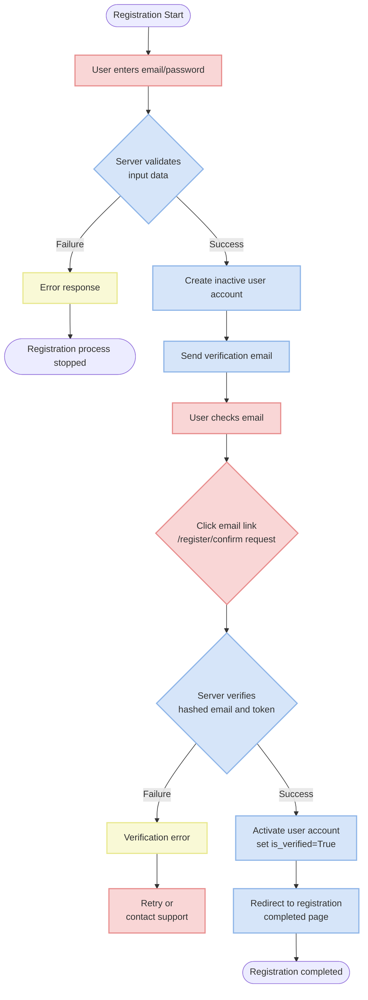
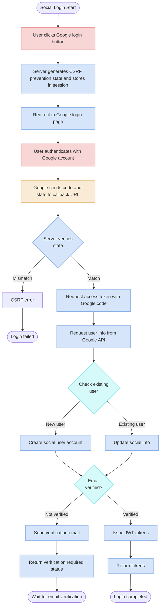
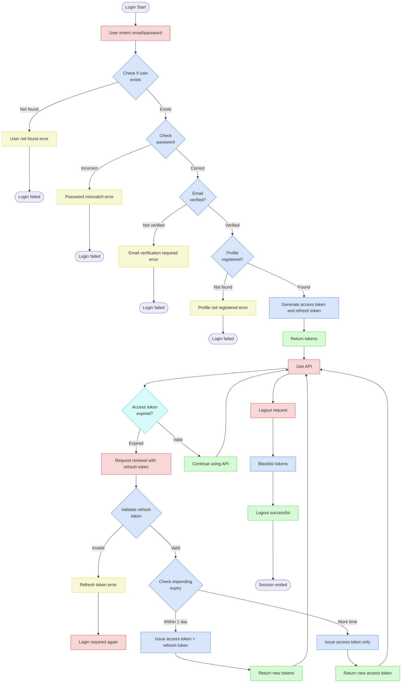
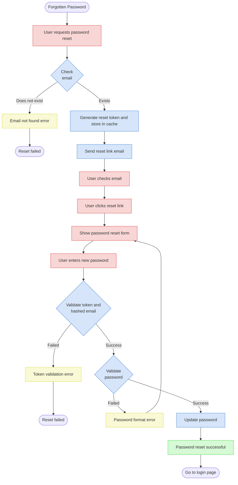

# Account API Documentation

## Overview

This document is a guide to account-related API functionality. The system provides regular signup/login and social login (currently only Google is supported), including features such as email verification, login, token management, and password management.

## API Endpoints

| Path | Method | Description |
|------|--------|-------------|
| `/v1/account/register/` | POST | User registration |
| `/v1/account/register/confirm/` | GET | Email address verification |
| `/v1/account/login/` | POST | User login |
| `/v1/account/refresh/` | POST | Access token renewal |
| `/v1/account/logout/` | POST | User logout |
| `/v1/account/password/reset/` | POST | Password reset request |
| `/v1/account/password/change/` | POST | Password change |
| `/v1/account/google/login/` | GET | Redirect to Google login page |
| `/v1/account/google/callback/` | GET | Handle Google login callback |

## Authentication Flow Diagrams

### 1. Registration and Email Verification Flow



### 2. Social Login (Google) Flow



### 3. Login and Token Management Flow



### 4. Password Reset Flow



## API Detailed Descriptions

### 1. Registration API

Creates a new user account.

**URL**: `/v1/account/register/`

**Method**: `POST`

**Request Body**:
```json
{
  "email": "user@example.com",
  "password": "password123",
  "password_confirm": "password123"
}
```

**Response (201 Created)**:
```json
{
  "email": "user@example.com"
}
```

**Validation**:
- Email: Must be a valid email format matching regex `^[a-zA-Z0-9_.+-]+@[a-zA-Z0-9-]+\.[a-zA-Z0-9-.]+$`
- Password: Must match regex `^(?=.*[a-z])(?=.*\d)[a-zA-Z0-9_-]{6,30}$` containing letters and numbers, 6-30 characters
- Password Confirmation: Must match the password

**Error Codes**:
- `E0010001`: Invalid email format
- `E0010002`: Email already exists but not verified
- `E0010003`: Email already in use
- `E0010004`: Invalid password format
- `E0010005`: Password and password confirmation do not match

### 2. Email Verification API

Verifies an account through a link sent in the registration email.

**URL**: `/v1/account/register/confirm/`

**Method**: `GET`

**Query Parameters**:
- `hashed_email`: Email hash value (32-character MD5 hash)
- `token`: Verification token (32-character token)

**Success**: Redirects to the configured `SIGNUP_COMPLETED_URL` page (with email included as a query parameter)

**Verification Process**:
1. Validates the hashed email and token created during registration
2. Checks stored information in cache (`email_verification:{env}:{hashed_email}`)
3. On successful verification, sets the user's `is_verified` field to `True`

**Error Codes**:
- `E0020001`: Invalid hashed email format
- `E0020002`: Invalid verification token format
- `E0020003`: No verification information in cache
- `E0020004`: Email already verified
- `E0020005`: Token mismatch

### 3. Login API

Logs in with a verified account and issues tokens.

**URL**: `/v1/account/login/`

**Method**: `POST`

**Request Body**:
```json
{
  "email": "user@example.com",
  "password": "password123"
}
```

**Response (200 OK)**:
```json
{
  "access_token": "eyJhbGciOiJIUzI1NiIsInR5cCI6IkpXVCJ9...",
  "refresh_token": "eyJhbGciOiJIUzI1NiIsInR5cCI6IkpXVCJ9..."
}
```

**Important Notes**:
- Only accounts with completed email verification can log in
- User profile must be registered

**Error Codes**:
- `E0030001`: Password does not match
- `E0030002`: Email verification not completed
- `E0030004`: Profile not registered

### 4. Token Refresh API

Issues a new access token using a refresh token.

**URL**: `/v1/account/refresh/`

**Method**: `POST`

**Request Body**:
```json
{
  "refresh_token": "eyJhbGciOiJIUzI1NiIsInR5cCI6IkpXVCJ9..."
}
```

**Response (200 OK)** - When expiry is more than 1 day away:
```json
{
  "access_token": "eyJhbGciOiJIUzI1NiIsInR5cCI6IkpXVCJ9..."
}
```

**Response (200 OK)** - When expiry is within 1 day:
```json
{
  "access_token": "eyJhbGciOiJIUzI1NiIsInR5cCI6IkpXVCJ9...",
  "refresh_token": "eyJhbGciOiJIUzI1NiIsInR5cCI6IkpXVCJ9..."
}
```

**Error Codes**:
- `E0030003`: Refresh token renewal failed

### 5. Logout API

Invalidates issued tokens.

**URL**: `/v1/account/logout/`

**Method**: `POST`

**Authentication**: Access token required (Bearer token in Authorization header)

**Request Body**:
```json
{
  "refresh_token": "eyJhbGciOiJIUzI1NiIsInR5cCI6IkpXVCJ9..."
}
```

**Response (204 No Content)**:
No response body

**Operation**:
- Both access token and refresh token are added to the blacklist to invalidate them
- JWT blacklist is managed using the `OutstandingToken` and `BlacklistedToken` models

**Error Codes**:
- `E0030006`: Blacklisting failed

### 6. Password Reset Request API

Sends a password reset link via email.

**URL**: `/v1/account/password/reset/`

**Method**: `POST`

**Request Body**:
```json
{
  "email": "user@example.com"
}
```

**Response (200 OK)**:
```json
{
  "email": "user@example.com"
}
```

**Process**:
1. Validates email address and checks if user exists
2. Sends an email with a password reset link (includes hashed email and verification token)
3. Stores reset information in cache (timeout: `EMAIL_VERIFICATION_TIMEOUT` - default 10 minutes)

**Error Codes**:
- `E0010001`: Invalid email format
- `E0010002`: Email does not exist

### 7. Password Change API

Changes the password using information received from the reset link.

**URL**: `/v1/account/password/change/`

**Method**: `POST`

**Request Body**:
```json
{
  "hashed_email": "abcdef1234567890abcdef1234567890",
  "token": "1234567890abcdef1234567890abcdef",
  "password": "newpassword123",
  "password_confirm": "newpassword123"
}
```

**Response (200 OK)**:
Empty response body (only status code returned on success)

**Validation**:
- Hashed Email: 32-character hexadecimal string (MD5 hash)
- Token: 32-character hexadecimal string
- Password: Letters and numbers, 6-30 characters
- Password Confirmation: Must match the password

**Error Codes**:
- `E0040001`: Invalid hashed email format
- `E0040002`: Invalid verification token format
- `E0040003`: No verification information in cache
- `E0040005`: Token mismatch
- `E0010004`: Invalid password format
- `E0010005`: Passwords do not match

### 8. Google Login Redirect API

Redirects the user to the Google login page.

**URL**: `/v1/account/google/login/`

**Method**: `GET`

**Response (302 Found)**:
Redirects to Google OAuth page

**Operation**:
1. Generates a state value for CSRF prevention (`secrets.token_urlsafe(16)`)
2. Stores the state value in session (`request.session["oauth_state"]`)
3. Redirects to Google OAuth authentication page (includes `access_type="offline"` parameter)

### 9. Google Login Callback API

Processes the callback after Google authentication to issue tokens.

**URL**: `/v1/account/google/callback/`

**Method**: `GET`

**Query Parameters**:
- `code`: Google authentication code
- `state`: State value (for CSRF prevention)

**Response (200 OK)** - When verification is complete:
```json
{
  "status": "success",
  "access_token": "eyJhbGciOiJIUzI1NiIsInR5cCI6IkpXVCJ9...",
  "refresh_token": "eyJhbGciOiJIUzI1NiIsInR5cCI6IkpXVCJ9..."
}
```

**Response (200 OK)** - When email verification is required:
```json
{
  "status": "verification_required",
  "access_token": null,
  "refresh_token": null
}
```

**Operation**:
1. Compares the `state` value received from Google callback with the `oauth_state` stored in session
2. Issues Google API access token using the code
3. Retrieves user information using the token (email, sub (social ID), name, picture, etc.)
4. Checks user by email and creates if not found (email verification status is automatically set to `True` if verified by Google)
5. Stores social login information (`SocialUser` model)
6. Creates or updates user profile (`UserProfile` model)
7. Sends verification email if needed, or issues JWT tokens if verified

## Error Response Format

The API returns errors in the following format:

### Field-Related Errors

```json
{
  "field_name": [
    {
      "message": "Error message",
      "error_code": "Error code"
    }
  ]
}
```

### Non-Field Errors

```json
{
  "non_field": [
    {
      "message": "Error message",
      "error_code": "Error code"
    }
  ]
}
```

### Example Error Responses

**Invalid Email Format**:
```json
{
  "email": [
    {
      "message": "Invalid email format",
      "error_code": "E0010001"
    }
  ]
}
```

**Password Mismatch**:
```json
{
  "password_confirm": [
    {
      "message": "Passwords do not match",
      "error_code": "E0010005"
    }
  ]
}
```

**Email Verification Incomplete**:
```json
{
  "non_field": [
    {
      "message": "Please complete email verification",
      "error_code": "E0030002"
    }
  ]
}
```

## Error Code List

| Error Code | Description | Field |
|------------|-------------|-------|
| E0010001 | Invalid email format | email |
| E0010002 | Email verification not completed | email |
| E0010003 | Email already in use | email |
| E0010004 | Invalid password format | password |
| E0010005 | Password mismatch | password_confirm |
| E0020001 | Invalid hashed email format | hashed_email |
| E0020002 | Invalid verification token | token |
| E0020003 | Verification information not found | non_field |
| E0020004 | Email already verified | non_field |
| E0020005 | Verification token mismatch | non_field |
| E0030001 | Incorrect password | non_field |
| E0030002 | Email verification incomplete | non_field |
| E0030003 | Refresh token renewal failed | refresh_token |
| E0030004 | Profile not registered | non_field |
| E0030005 | Invalid token | message |
| E0030006 | Blacklisting failed | message |
| E0030007 | User not found | message |
| E0040001 | Invalid hashed email format | hashed_email |
| E0040002 | Invalid verification token | token |
| E0040003 | Verification information not found | non_field |
| E0040005 | Verification token mismatch | non_field |

## Token Management

### JWT Tokens

This project uses a JWT (JSON Web Token) based authentication system. The system issues two types of tokens:

- **Access Token**: Short-term token used for API access (5 minutes)
- **Refresh Token**: Long-term token used for access token renewal (7 days)

### Token Settings (settings.py)

```python
SIMPLE_JWT = {
    "ACCESS_TOKEN_LIFETIME": timedelta(minutes=5),
    "REFRESH_TOKEN_LIFETIME": timedelta(days=7),
    "ROTATE_REFRESH_TOKENS": False,
    "BLACKLIST_AFTER_ROTATION": True,
    "UPDATE_LAST_LOGIN": False,
    "ALGORITHM": "HS256",
    "SIGNING_KEY": SECRET_KEY,
    "VERIFYING_KEY": None,
    "AUDIENCE": None,
    "ISSUER": PROJECT_NAME,
    "AUTH_HEADER_TYPES": ("Bearer",),
    "USER_ID_FIELD": "id",
    "USER_ID_CLAIM": "user_id",
    "AUTH_TOKEN_CLASSES": ("rest_framework_simplejwt.tokens.AccessToken",),
    "TOKEN_TYPE_CLAIM": "token_type",
    "JTI_CLAIM": "jti",
    "SLIDING_TOKEN_REFRESH_EXP_CLAIM": "refresh_exp",
    "SLIDING_TOKEN_LIFETIME": timedelta(minutes=5),
    "SLIDING_TOKEN_REFRESH_LIFETIME": timedelta(days=1),
}
```

### Refresh Token Renewal Policy

When a refresh token is about to expire (within 1 day), a new refresh token is issued along with the access token upon renewal request. This allows seamless maintenance of the user's login state.

### Token Blacklist

Tokens are added to a blacklist on logout to prevent reuse. The blacklist is managed using the Django Simple JWT package's `OutstandingToken` and `BlacklistedToken` models.

## Email Verification System

### Verification Email Templates

Email verification and password reset use template-based HTML emails. There are two main templates:

1. **Registration Verification Email** (`account/signup.html`)
2. **Password Reset Email** (`account/reset_password.html`) 

### Email Verification Token Generation and Storage

```python
def send_email_verification_token(email: str, template_type: EmailTemplate) -> dict:
    # Generate verification key
    token = uuid.uuid4().hex  # 32-character random uuid
    django_env = settings.DJANGO_ENVIRONMENT
    hash_input = (email + settings.EMAIL_VERIFICATION_HASH_SALT).encode("utf-8")
    hashed_email = hashlib.md5(hash_input).hexdigest()
    
    # Store verification info in cache (valid for 10 minutes)
    cache_key = f"email_verification:{django_env}:{hashed_email}"
    cache.set(
        cache_key,
        {"token": token, "email": email},
        timeout=settings.EMAIL_VERIFICATION_TIMEOUT,
    )
    
    # Send email
    subject, base_url, template_path = template_type.value
    verification_url = f"{base_url}?hashed_email={hashed_email}&token={token}"
    # ... email sending logic ...
    
    return {"hashed_email": hashed_email, "token": token}
```

### Email Verification URLs

Email verification and password reset link generation is based on environment variables:

- `SIGNUP_CONFIRM_URL`: Base URL for registration email verification
- `RESET_PASSWORD_URL`: Base URL for password reset
- `SIGNUP_COMPLETED_URL`: Redirect URL after registration is completed

## Google Social Login

### Google Login Settings

Environment variables needed for Google social login:

- `GOOGLE_CLIENT_ID`: Google OAuth client ID
- `GOOGLE_CLIENT_SECRET`: Google OAuth client secret
- `GOOGLE_REDIRECT_URI`: Redirect URI after Google login
- `GOOGLE_PROJECT_ID`: Google project ID

### Social Login User Processing

Google login follows these steps:

1. Check for existing account using the user's email
2. Create a new account if none exists (no password)
3. Store social login information in the `SocialUser` model (provider: "google", social_id: Google's sub value)
4. Create/update profile information in the `UserProfile` model
5. Automatically verify email if it's verified by Google
6. Send verification email if verification is needed

Social login users do not use regular passwords, so `set_unusable_password()` is used to specially mark the password field.

## Security Considerations

1. **Password Policy**:
   - Minimum 6 characters
   - Letters and numbers combination required
   - Maximum 30 characters

2. **Email Verification and Password Reset**:
   - Limited validity period (default 10 minutes)
   - MD5 hash and 32-character UUID-based tokens
   - Email verification status tracking

3. **JWT Token Management**:
   - Short access token lifetime (5 minutes)
   - Limited refresh token lifetime (7 days)
   - Logout handling through token blacklisting

4. **CSRF Prevention**:
   - `state` parameter used in social login
   - Session-based validation

5. **Environment Separation**:
   - Separate settings for each environment (dev, test, prod)
   - Environment information included in cache keys