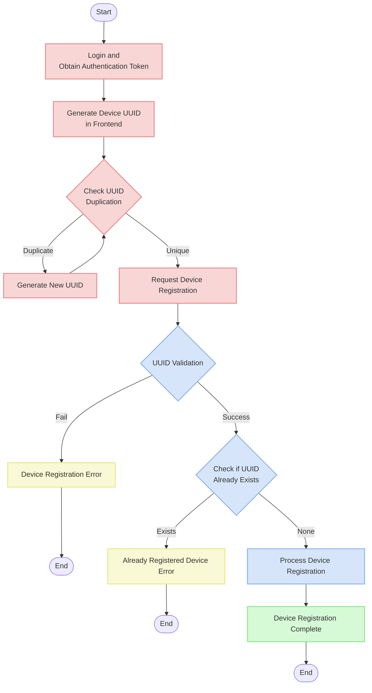
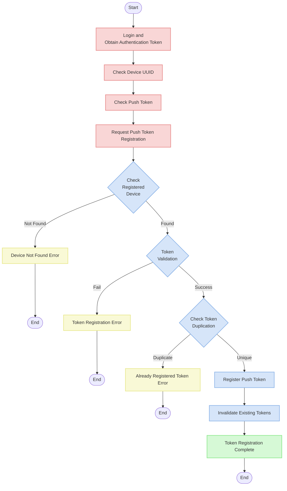

# Device API Documentation

## Overview

This document is a guide for user device and push token-related API functionalities. It describes the process of device registration and push token management.

## API Endpoints

| Path                                  | Method | Description |
|---------------------------------------|--------|-------------|
| `/v1/device/`                         | POST   | Register user device |
| `/v1/device/{device_uuid}/push_token/`| POST   | Register push token |

## Device Registration Flow



## Push Token Registration Flow



## Model Structure

### Device Model

```python
class Device(models.Model):
    """Device"""

    user = models.ForeignKey(
        "user.User",
        on_delete=models.CASCADE,
        related_name="devices",
        verbose_name="User",
    )
    uuid = models.UUIDField(
        unique=True,
        verbose_name="UUID",
    )
    platform = models.CharField(
        max_length=50,
        choices=DevicePlatform.choices,
        default=DevicePlatform.WEB,
        verbose_name="Platform",
    )
    created_at = models.DateTimeField(
        auto_now_add=True,
        verbose_name="Created at",
    )
    updated_at = models.DateTimeField(
        auto_now=True,
        verbose_name="Updated at",
    )
```

### Push Token Model

```python
class PushToken(models.Model):
    """Push Token"""

    device = models.ForeignKey(
        Device,
        on_delete=models.CASCADE,
        related_name="push_tokens",
        verbose_name="Device",
    )
    token = models.CharField(
        max_length=255,
        verbose_name="Token",
    )
    endpoint_arn = models.CharField(
        max_length=255,
        null=True,
        blank=True,
        verbose_name="Endpoint ARN",
    )
    is_valid = models.BooleanField(
        default=True,
        verbose_name="Validity",
    )
    created_at = models.DateTimeField(
        auto_now_add=True,
        verbose_name="Created at",
    )
    updated_at = models.DateTimeField(
        auto_now=True,
        verbose_name="Updated at",
    )
```

## API Detailed Description

### 1. User Device Registration API

Registers a device for the logged-in user.

**URL**: `/v1/device/`

**Method**: `POST`

**Request Header**:
```
Authorization: Bearer {access_token}
```

**Request Body**:
```json
{
  "uuid": "550e8400-e29b-41d4-a716-446655440000"
}
```

**Response (201 Created)**:
```json
{
  "id": 1,
  "uuid": "550e8400-e29b-41d4-a716-446655440000",
  "platform": "WEB",
  "created_at": "2025-03-17T09:00:00Z",
  "updated_at": "2025-03-17T09:00:00Z"
}
```

**Validation**:
- UUID: Required field, must be in valid UUID format
- UUID: Must not be already registered for the same user
- UUID: A unique identifier created in the frontend, must be unique for each device

### 2. Push Token Registration API

Registers a push token for a registered device.

**URL**: `/v1/device/{device_uuid}/push_token/`

**Method**: `POST`

**Request Header**:
```
Authorization: Bearer {access_token}
```

**Request Body**:
```json
{
  "token": "firebase-push-token-example"
}
```

**Response (201 Created)**:
```json
{
  "id": 1,
  "token": "firebase-push-token-example"
}
```

**Validation**:
- token: Required field, string
- The token to be registered must not already be registered for another device of the same user

**Processing Steps**:
1. Check registered device through device_uuid in the URL path
2. If the device exists, validate the push token
3. If the token is valid, invalidate all existing tokens and register the new token
4. If there are existing tokens for the same device, they are automatically set to `is_valid=False`

## Serializer Details

### Device Serializer

```python
class DeviceSerializer(serializers.ModelSerializer):
    """Device Serializer"""

    def validate_uuid(self, attr):
        """UUID Validation"""
        if not attr:
            raise serializers.ValidationError(E007_DEVICE_UUID_REQUIRED)
        elif Device.objects.filter(
            uuid=attr,
            user=self.context["request"].user,
        ).exists():
            raise serializers.ValidationError(E007_DEVICE_ALREADY_REGISTERED)
        return attr

    def create(self, validated_data):
        instance = super().create(validated_data)
        # TODO: Update AWS SNS subscription information
        return instance

    class Meta:
        model = Device
        fields = [
            "id",
            "uuid",
            "platform",
            "created_at",
            "updated_at",
        ]
```

### Push Token Serializer

```python
class PushTokenSerializer(serializers.ModelSerializer):
    """Push Token Serializer"""

    def validate_token(self, attr):
        """Token Validation"""
        if not attr:
            raise serializers.ValidationError(E007_PUSH_TOKEN_REQUIRED)
        elif PushToken.objects.filter(
            token=attr,
            device__user=self.context["request"].user,
        ).exists():
            raise serializers.ValidationError(E007_PUSH_TOKEN_ALREADY_REGISTERED)
        return attr

    def create(self, validated_data):
        """Create"""
        instance = super().create(validated_data)
        # TODO: Create endpoint arn after push token creation
        return instance

    class Meta:
        model = PushToken
        fields = [
            "id",
            "token",
        ]
```

## Error Response Format

Errors are responded to in the following format:

### Validation Failure (400 Bad Request)

```json
{
  "field_name": [
    {
      "message": "Error message",
      "error_code": "Error code"
    }
  ]
}
```

### Authentication Failure (401 Unauthorized)

```json
{
  "detail": "Authentication credentials were not provided."
}
```

### Device Not Found (404 Not Found)

```json
{
  "detail": "Not found."
}
```

## Error Code List

| Error Code | Description | Field |
|------------|-------------|-------|
| E0070001 | Device UUID is required | uuid |
| E0070002 | Device is already registered with my account | uuid |
| E0070003 | Push token is required | token |
| E0070004 | Push token is already registered | token |

## Example Error Responses

### Missing UUID Field

```json
{
  "uuid": [
    {
      "message": "Device UUID is required",
      "error_code": "E0070001"
    }
  ]
}
```

### Invalid UUID Format

```json
{
  "uuid": [
    "Enter a valid UUID."
  ]
}
```

### Already Registered UUID

```json
{
  "uuid": [
    {
      "message": "Device is already registered with my account",
      "error_code": "E0070002"
    }
  ]
}
```

### Missing Token Field

```json
{
  "token": [
    {
      "message": "Push token is required",
      "error_code": "E0070003"
    }
  ]
}
```

### Already Registered Token

```json
{
  "token": [
    {
      "message": "Push token is already registered",
      "error_code": "E0070004"
    }
  ]
}
```

### Non-existent Device

```json
{
  "detail": "Not found."
}
```

## Special Behaviors and Precautions

### Device UUID Management

- Device UUID is generated in the frontend and must be a **unique value** for each device.
- If a duplicate UUID is detected, the frontend must generate a new UUID to maintain uniqueness.
- UUID should be consistently maintained even when the device changes or the app is reinstalled.

### Automatic Push Token Management

- When a new push token is registered, previously registered tokens for the same device are automatically invalidated.
- This is automatically handled in the `save` method of the `PushToken` model:

```python
def save(self, *args, **kwargs):
    # Invalidate existing tokens when registering a new token or updating a valid token
    if self.is_valid:
        self.device.push_tokens.filter(is_valid=True).update(is_valid=False)
    super().save(*args, **kwargs)
```

## Test Cases

Test cases for verifying the functionality of device and push token APIs.

### Device Registration Tests

- Success: Register device with valid UUID
- Failure: Invalid UUID format
- Failure: Attempt to register a duplicate UUID by the same user
- Failure: Missing UUID field

### Push Token Registration Tests

- Success: Register valid token for a valid device
- Failure: Attempt to register token for non-existent device
- Failure: Missing token field
- Failure: Attempt to register a duplicate token

## Planned Improvements

Features to be added to the currently implemented API:

1. AWS SNS Integration: Update AWS SNS subscription information when registering a device
2. Endpoint ARN Generation: Create AWS SNS endpoint ARN after push token registration
3. Platform-specific Push Notification Handling: Differentiate message formats for Android, iOS, Web, etc.
4. Extended Device and Push Token Management API: Add retrieval, update, and delete functionalities