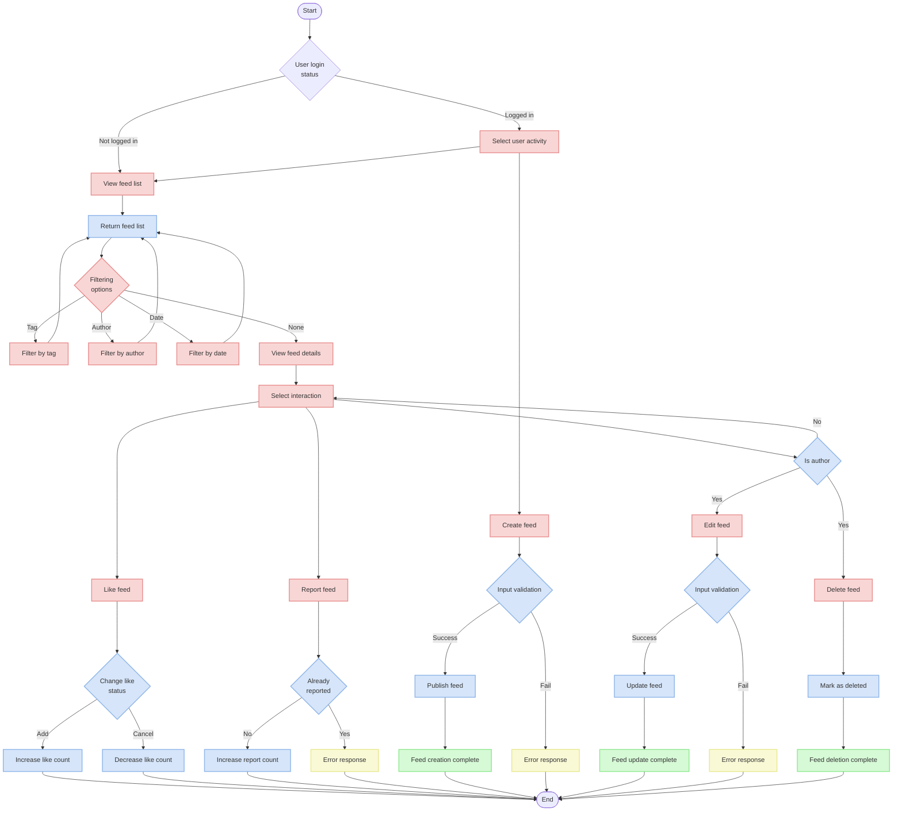
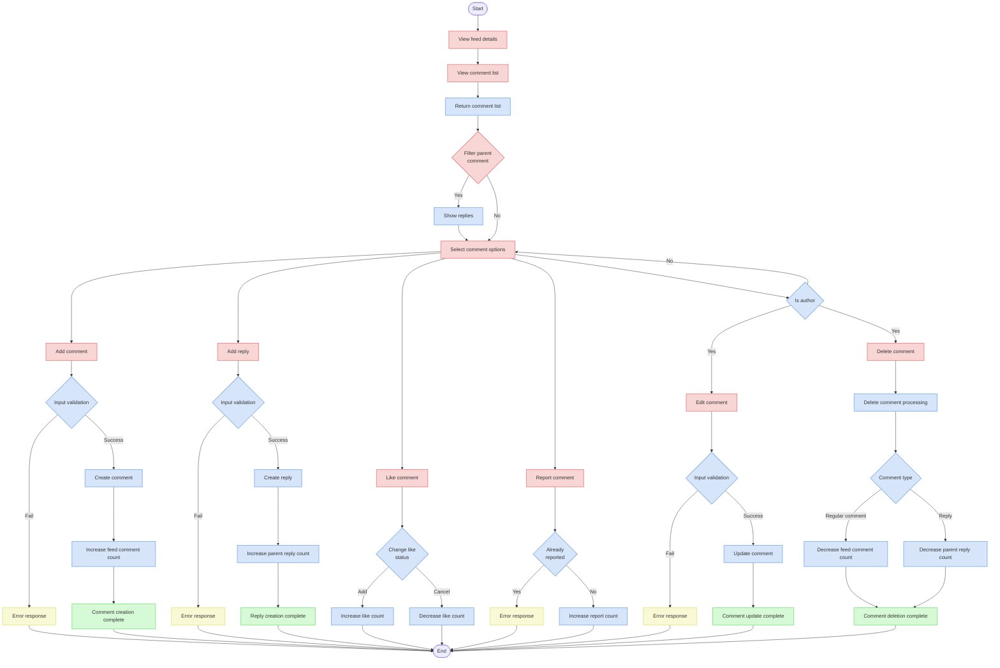

# Feed API Documentation

## Overview

This document is a guide to the Feed-related API functions. It describes the features such as feed creation, viewing, editing, deletion, likes, reporting, and comment management.

## API Endpoints

| Path                             | Method | Description |
|--------------------------------|--------|------|
| `/v1/feed/`                    | GET    | View feed list |
| `/v1/feed/`                    | POST   | Create feed |
| `/v1/feed/{uuid}/`             | GET    | View feed details |
| `/v1/feed/{uuid}/`             | PUT    | Edit feed |
| `/v1/feed/{uuid}/`             | DELETE | Delete feed |
| `/v1/feed/{uuid}/like/`        | POST   | Like/unlike feed |
| `/v1/feed/{uuid}/report/`      | POST   | Report feed |
| `/v1/feed/{feed_uuid}/comment/` | GET    | View feed comment list |
| `/v1/feed/{feed_uuid}/comment/` | POST   | Create feed comment |
| `/v1/feed/{feed_uuid}/comment/{uuid}/` | PUT    | Edit feed comment |
| `/v1/feed/{feed_uuid}/comment/{uuid}/` | DELETE | Delete feed comment |
| `/v1/feed/{feed_uuid}/comment/{uuid}/like/` | POST   | Like/unlike feed comment |
| `/v1/feed/{feed_uuid}/comment/{uuid}/report/` | POST   | Report feed comment |

## Flow Diagrams

### 1. Feed Processing Flow



### 2. Feed Comment Processing Flow



## API Detailed Description

### 1. Feed List View API

Retrieve a list of feeds.

**URL**: `/v1/feed/`

**Method**: `GET`

**Authentication**: Optional (includes like and report status if authenticated)

**Query Parameters**:
- `tag`: Tag search (partial match by tag name)
- `author`: Author UUID (exact match)
- `published_at__gte`: Feeds published after a specific date
- `published_at__lte`: Feeds published before a specific date
- `uuid`: Feed UUID (exact match)
- `title__icontains`: Title search (case-insensitive partial match)
- `cursor`: Paging cursor

**Response (200 OK)**:
```json
{
  "next": "http://example.com/v1/feed/?cursor=cD0yMDIxLTAxLTAxKzAwJTNBMDAlM0EwMC4wMDAwMDA=",
  "previous": null,
  "results": [
    {
      "uuid": "123e4567-e89b-12d3-a456-426614174000",
      "author": {
        "uuid": "123e4567-e89b-12d3-a456-426614174001",
        "nickname": "username",
        "image": "https://example.com/profile.jpg"
      },
      "title": "Feed Title",
      "content": "Feed Content",
      "best_comment": {
        "uuid": "123e4567-e89b-12d3-a456-426614174002",
        "author": {
          "uuid": "123e4567-e89b-12d3-a456-426614174003",
          "nickname": "commenter",
          "image": "https://example.com/commenter.jpg"
        },
        "content": "Best comment content",
        "likes_count": 10,
        "reported_count": 0,
        "reply_count": 2,
        "is_deleted": false,
        "created_at": "2023-01-01T00:00:00.000000Z",
        "updated_at": "2023-01-01T00:00:00.000000Z"
      },
      "likes_count": 42,
      "comments_count": 7,
      "reported_count": 0,
      "is_like": false,
      "is_reported": false,
      "is_displayed": true,
      "published_at": "2023-01-01T00:00:00.000000Z"
    }
  ]
}
```

**Notes**:
- Uses cursor-based pagination with default page size of 10
- For logged-in users, includes feed like and report status
- Best comment is the comment with the most likes among those with at least 1 like
- Results are sorted by newest feeds (`-published_at`) by default
- Deleted feeds (`is_deleted=True`) are excluded from the list
- Feeds scheduled for future publication are not displayed

### 2. Feed Creation API

Create a new feed.

**URL**: `/v1/feed/`

**Method**: `POST`

**Authentication**: Required

**Request Body**:
```json
{
  "title": "Feed Title",
  "content": "Feed Content",
  "image": "https://example.com/image.jpg",
  "tags": [
    {"name": "tag1"},
    {"name": "tag2"}
  ],
  "published_at": "2023-01-01T00:00:00.000000Z"
}
```

**Response (201 Created)**:
```json
{
  "uuid": "123e4567-e89b-12d3-a456-426614174000",
  "title": "Feed Title",
  "content": "Feed Content",
  "image": "https://example.com/image.jpg",
  "likes_count": 0,
  "comments_count": 0,
  "reported_count": 0,
  "tags": [
    {"id": 1, "name": "tag1"},
    {"id": 2, "name": "tag2"}
  ],
  "published_at": "2023-01-01T00:00:00.000000Z"
}
```

**Validation**:
- `title`: Required, maximum 255 characters
- `content`: Required
- `image`: Optional, valid URL
- `tags`: Optional, list of tags
- `published_at`: Required, valid date format

**Rate Limit**: Limited to 1 request per second

### 3. Feed Detail View API

Retrieve detailed information for a specific feed.

**URL**: `/v1/feed/{uuid}/`

**Method**: `GET`

**Authentication**: Optional (includes like and report status if authenticated)

**Response (200 OK)**:
```json
{
  "uuid": "123e4567-e89b-12d3-a456-426614174000",
  "author": {
    "uuid": "123e4567-e89b-12d3-a456-426614174001",
    "nickname": "username",
    "image": "https://example.com/profile.jpg"
  },
  "title": "Feed Title",
  "content": "Feed Content",
  "image": "https://example.com/image.jpg",
  "tags": [
    {"id": 1, "name": "tag1"},
    {"id": 2, "name": "tag2"}
  ],
  "best_comment": {
    "uuid": "123e4567-e89b-12d3-a456-426614174002",
    "author": {
      "uuid": "123e4567-e89b-12d3-a456-426614174003",
      "nickname": "commenter",
      "image": "https://example.com/commenter.jpg"
    },
    "content": "Best comment content",
    "likes_count": 10,
    "reported_count": 0,
    "reply_count": 2,
    "is_deleted": false,
    "created_at": "2023-01-01T00:00:00.000000Z",
    "updated_at": "2023-01-01T00:00:00.000000Z"
  },
  "likes_count": 42,
  "comments_count": 7,
  "reported_count": 0,
  "is_like": false,
  "is_reported": false,
  "is_displayed": true,
  "published_at": "2023-01-01T00:00:00.000000Z"
}
```

### 4. Feed Edit API

Edit a feed you created.

**URL**: `/v1/feed/{uuid}/`

**Method**: `PUT`

**Authentication**: Required (only the author can edit)

**Request Body**:
```json
{
  "title": "Updated Feed Title",
  "content": "Updated Feed Content",
  "image": "https://example.com/new-image.jpg",
  "tags": [
    {"name": "tag1"},
    {"name": "newtag"}
  ],
  "published_at": "2023-01-01T00:00:00.000000Z"
}
```

**Response (200 OK)**:
```json
{
  "uuid": "123e4567-e89b-12d3-a456-426614174000",
  "title": "Updated Feed Title",
  "content": "Updated Feed Content",
  "image": "https://example.com/new-image.jpg",
  "likes_count": 42,
  "comments_count": 7,
  "reported_count": 0,
  "tags": [
    {"id": 1, "name": "tag1"},
    {"id": 3, "name": "newtag"}
  ],
  "published_at": "2023-01-01T00:00:00.000000Z"
}
```

**Notes**:
- If the tag list is changed, all existing tags are removed and replaced with the new tag list
- Only feeds you've created can be edited (returns 404 Not Found for other users' feeds)
- `PATCH` method is not supported (only full resource updates are allowed)

### 5. Feed Delete API

Delete a feed you created.

**URL**: `/v1/feed/{uuid}/`

**Method**: `DELETE`

**Authentication**: Required (only the author can delete)

**Response (204 No Content)**:
No response body

**Notes**:
- This is a soft delete that sets the `is_deleted` field to `True` rather than physically deleting
- Deleted feeds no longer appear in lists or detail views
- Only feeds you've created can be deleted (returns 404 Not Found for other users' feeds)

### 6. Feed Like API

Add or remove a like from a feed.

**URL**: `/v1/feed/{uuid}/like/`

**Method**: `POST`

**Authentication**: Required

**Request Body**:
```json
{
  "is_like": true
}
```

**Response (200 OK)**:
```json
{
  "is_like": true
}
```

**Notes**:
- `is_like` set to `true` adds a like, `false` removes a like
- The feed's `likes_count` is automatically updated when likes are added or removed
- Multiple likes from the same user on the same feed do not increase the feed's likes_count
- Rate limit: Limited to 2 requests per second

### 7. Feed Report API

Report an inappropriate feed.

**URL**: `/v1/feed/{uuid}/report/`

**Method**: `POST`

**Authentication**: Required

**Request Body**:
```json
{
  "report_reason": 1,
  "content": "Detailed report reason"
}
```

**Response (200 OK)**:
```json
{
  "report_reason": 1,
  "content": "Detailed report reason"
}
```

**Notes**:
- `report_reason` codes:
  - 1: Inappropriate content
  - 2: Spam
  - 3: Hate speech
  - 4: Other
- `content` is optional for providing detailed report information
- The same user cannot report the same feed multiple times
- When reported, the feed's `reported_count` automatically increases
- Rate limit: Limited to 2 requests per second

**Error Response (400 Bad Request)** - Already reported:
```json
{
  "non_field": [
    {
      "message": "This feed has already been reported",
      "error_code": "E0060001"
    }
  ]
}
```

### 8. Feed Comment List View API

Retrieve comments for a specific feed.

**URL**: `/v1/feed/{feed_uuid}/comment/`

**Method**: `GET`

**Authentication**: Optional (includes like and report status if authenticated)

**Query Parameters**:
- `parent`: Parent comment UUID (for viewing replies)
- `cursor`: Paging cursor

**Response (200 OK)**:
```json
{
  "next": "http://example.com/v1/feed/123e4567-e89b-12d3-a456-426614174000/comment/?cursor=cD0yMDIxLTAxLTAxKzAwJTNBMDAlM0EwMC4wMDAwMDA=",
  "previous": null,
  "results": [
    {
      "uuid": "123e4567-e89b-12d3-a456-426614174002",
      "author": {
        "uuid": "123e4567-e89b-12d3-a456-426614174003",
        "nickname": "commenter",
        "image": "https://example.com/commenter.jpg"
      },
      "content": "Comment content",
      "likes_count": 5,
      "reported_count": 0,
      "reply_count": 2,
      "is_deleted": false,
      "is_like": false,
      "is_reported": false,
      "created_at": "2023-01-01T00:00:00.000000Z",
      "updated_at": "2023-01-01T00:00:00.000000Z"
    }
  ]
}
```

**Notes**:
- Uses cursor-based pagination with default page size of 10
- For logged-in users, includes comment like and report status
- Use the `parent` parameter to view replies to a specific comment
- Results are sorted by newest comments (`-created_at`) by default
- Comments marked as not displayed (`is_displayed=False`) are excluded from the list

### 9. Feed Comment Creation API

Create a new comment on a feed.

**URL**: `/v1/feed/{feed_uuid}/comment/`

**Method**: `POST`

**Authentication**: Required

**Request Body**:
```json
{
  "content": "Comment content",
  "parent": null
}
```

**Response (201 Created)**:
```json
{
  "uuid": "123e4567-e89b-12d3-a456-426614174002",
  "feed": "123e4567-e89b-12d3-a456-426614174000",
  "parent": null,
  "content": "Comment content",
  "likes_count": 0,
  "reported_count": 0,
  "reply_count": 0,
  "created_at": "2023-01-01T00:00:00.000000Z",
  "updated_at": "2023-01-01T00:00:00.000000Z"
}
```

**Notes**:
- `parent`: Parent comment UUID for replies, `null` for regular comments
- When a comment is created, the feed's `comments_count` automatically increases
- When a reply is created, the parent comment's `reply_count` automatically increases
- Rate limit: Limited to 1 request per second

**Error Response (400 Bad Request)** - Feed not found:
```json
{
  "feed": [
    {
      "message": "Feed not found",
      "error_code": "E0060003"
    }
  ]
}
```

**Error Response (400 Bad Request)** - Parent comment not found:
```json
{
  "parent": [
    {
      "message": "Parent comment not found",
      "error_code": "E0060005"
    }
  ]
}
```

### 10. Feed Comment Edit API

Edit a comment you created.

**URL**: `/v1/feed/{feed_uuid}/comment/{uuid}/`

**Method**: `PUT`

**Authentication**: Required (only the author can edit)

**Request Body**:
```json
{
  "content": "Updated comment content"
}
```

**Response (200 OK)**:
```json
{
  "uuid": "123e4567-e89b-12d3-a456-426614174002",
  "feed": "123e4567-e89b-12d3-a456-426614174000",
  "parent": null,
  "content": "Updated comment content",
  "likes_count": 5,
  "reported_count": 0,
  "reply_count": 2,
  "is_deleted": false,
  "created_at": "2023-01-01T00:00:00.000000Z",
  "updated_at": "2023-01-02T00:00:00.000000Z"
}
```

**Notes**:
- Only comments you've created can be edited (returns 404 Not Found for other users' comments)
- The parent comment information (`parent`) cannot be modified
- `PATCH` method is not supported (only full resource updates are allowed)

**Error Response (400 Bad Request)** - Attempting to change parent comment:
```json
{
  "parent": [
    {
      "message": "Parent comment cannot be changed",
      "error_code": "E0060004"
    }
  ]
}
```

### 11. Feed Comment Delete API

Delete a comment you created.

**URL**: `/v1/feed/{feed_uuid}/comment/{uuid}/`

**Method**: `DELETE`

**Authentication**: Required (only the author can delete)

**Response (204 No Content)**:
No response body

**Notes**:
- When a comment is deleted, the feed's `comments_count` automatically decreases
- When a reply is deleted, the parent comment's `reply_count` automatically decreases
- Only comments you've created can be deleted (returns 404 Not Found for other users' comments)
- Comments are physically deleted from the database (not soft deleted)

### 12. Feed Comment Like API

Add or remove a like from a comment.

**URL**: `/v1/feed/{feed_uuid}/comment/{uuid}/like/`

**Method**: `POST`

**Authentication**: Required

**Request Body**:
```json
{
  "is_like": true
}
```

**Response (200 OK)**:
```json
{
  "is_like": true
}
```

**Notes**:
- `is_like` set to `true` adds a like, `false` removes a like
- The comment's `likes_count` is automatically updated when likes are added or removed
- Multiple likes from the same user on the same comment do not increase the comment's likes_count
- Rate limit: Limited to 2 requests per second

### 13. Feed Comment Report API

Report an inappropriate comment.

**URL**: `/v1/feed/{feed_uuid}/comment/{uuid}/report/`

**Method**: `POST`

**Authentication**: Required

**Request Body**:
```json
{
  "report_reason": 1,
  "content": "Detailed report reason"
}
```

**Response (200 OK)**:
```json
{
  "report_reason": 1,
  "content": "Detailed report reason"
}
```

**Notes**:
- `report_reason` codes are the same as feed reporting:
  - 1: Inappropriate content
  - 2: Spam
  - 3: Hate speech
  - 4: Other
- `content` is optional for providing detailed report information
- The same user cannot report the same comment multiple times
- When reported, the comment's `reported_count` automatically increases
- Rate limit: Limited to 2 requests per second

**Error Response (400 Bad Request)** - Already reported:
```json
{
  "non_field": [
    {
      "message": "This feed comment has already been reported",
      "error_code": "E0060002"
    }
  ]
}
```

## Model Structure

### Feed Model

Model for storing feed information.

| Field | Type | Description |
|------|------|------|
| uuid | UUIDField | Primary key, uses uuid7 |
| user | ForeignKey | Author (references User model) |
| title | CharField | Title (max 255 characters) |
| content | TextField | Content |
| image | URLField | Image URL (optional) |
| tags | ManyToManyField | Tag list (references FeedTag model) |
| comments_count | IntegerField | Comment count |
| likes_count | IntegerField | Like count |
| reported_count | IntegerField | Report count |
| published_at | DateTimeField | Publication date and time |
| is_displayed | BooleanField | Display status (default: True) |
| is_deleted | BooleanField | Deletion status (default: False) |
| created_at | DateTimeField | Creation date and time (auto-recorded) |
| updated_at | DateTimeField | Modification date and time (auto-recorded) |

### FeedTag Model

Model for storing feed tag information.

| Field | Type | Description |
|------|------|------|
| name | CharField | Tag name (max 50 characters) |
| created_at | DateTimeField | Creation date and time (auto-recorded) |

### FeedComment Model

Model for storing feed comment information.

| Field | Type | Description |
|------|------|------|
| uuid | UUIDField | Primary key, uses uuid7 |
| user | ForeignKey | Author (references User model) |
| feed | ForeignKey | Feed (references Feed model) |
| parent | ForeignKey | Parent comment (self-reference, optional) |
| content | TextField | Content |
| likes_count | IntegerField | Like count |
| reported_count | IntegerField | Report count |
| reply_count | IntegerField | Reply count |
| is_displayed | BooleanField | Display status (default: True) |
| is_deleted | BooleanField | Deletion status (default: False) |
| created_at | DateTimeField | Creation date and time (auto-recorded) |
| updated_at | DateTimeField | Modification date and time (auto-recorded) |

### FeedLike Model

Model for storing feed like information.

| Field | Type | Description |
|------|------|------|
| user | ForeignKey | User (references User model) |
| feed | ForeignKey | Feed (references Feed model) |
| created_at | DateTimeField | Creation date and time (auto-recorded) |

**Constraints**: (user, feed) pair must be unique (unique_together)

### FeedReport Model

Model for storing feed report information.

| Field | Type | Description |
|------|------|------|
| user | ForeignKey | User (references User model) |
| feed | ForeignKey | Feed (references Feed model) |
| report_reason | IntegerField | Report reason (Choices) |
| content | TextField | Report content (optional) |
| created_at | DateTimeField | Creation date and time (auto-recorded) |

**Constraints**: (user, feed) pair must be unique (unique_together)

### FeedCommentLike Model

Model for storing feed comment like information.

| Field | Type | Description |
|------|------|------|
| user | ForeignKey | User (references User model) |
| feed_comment | ForeignKey | Feed comment (references FeedComment model) |
| created_at | DateTimeField | Creation date and time (auto-recorded) |

**Constraints**: (user, feed_comment) pair must be unique (unique_together)

### FeedCommentReport Model

Model for storing feed comment report information.

| Field | Type | Description |
|------|------|------|
| user | ForeignKey | User (references User model) |
| feed_comment | ForeignKey | Feed comment (references FeedComment model) |
| report_reason | IntegerField | Report reason (Choices) |
| content | TextField | Report content (optional) |
| created_at | DateTimeField | Creation date and time (auto-recorded) |

**Constraints**: (user, feed_comment) pair must be unique (unique_together)

## Error Response Format

Feed API error responses follow this format:

```json
{
  "field_name": [
    {
      "message": "Error message",
      "error_code": "Error code"
    }
  ]
}
```

For errors not related to specific fields, the `non_field` key is used:

```json
{
  "non_field": [
    {
      "message": "Error message",
      "error_code": "Error code"
    }
  ]
}
```

## Error Codes

| Error Code | Description | Field |
|-----------|------|------|
| E0060001 | Feed already reported | non_field |
| E0060002 | Feed comment already reported | non_field |
| E0060003 | Feed not found | feed |
| E0060004 | Parent comment cannot be changed | parent |
| E0060005 | Parent comment not found | parent |

## Pagination

Feed API uses cursor-based pagination. This is an efficient method for handling large amounts of data.

### Feed Pagination

- Default sort: `-published_at` (newest first)
- Page size: 10 items

### Comment Pagination

- Default sort: `-created_at` (newest first)
- Page size: 10 items

Pagination response example:
```json
{
  "next": "http://example.com/v1/feed/?cursor=cD0yMDIxLTAxLTAxKzAwJTNBMDAlM0EwMC4wMDAwMDA=",
  "previous": null,
  "results": [
    // Feed or comment list
  ]
}
```

To view the next page, use the `cursor` parameter value from the `next` link in your request.

## Filtering

### Feed Filtering

Feeds can be filtered by various conditions:

- Filter by tag: `?tag=tagname` (searches for tags that contain the specified string)
- Filter by author: `?author=authorUUID` (exact UUID match)
- Filter by publication date range: `?published_at__gte=2023-01-01&published_at__lte=2023-01-31`
- Search by title: `?title__icontains=searchterm` (case-insensitive search)
- Search by UUID: `?uuid=123e4567-e89b-12d3-a456-426614174000` (exact UUID match)

### Comment Filtering

Comments can be filtered as follows:

- Filter by parent comment (view replies): `?parent=parentCommentUUID`

## Rate Limits

To prevent excessive requests, rate limits are applied to some APIs:

| API | Rate Limit |
|-----|----------|
| Feed creation | 1 request per second |
| Feed like | 2 requests per second |
| Feed report | 2 requests per second |
| Comment creation | 1 request per second |
| Comment like | 2 requests per second |
| Comment report | 2 requests per second |

When a rate limit is exceeded, the API returns a 429 (Too Many Requests) response.

## Security Considerations

- Feed titles, content, and comment content may be vulnerable to XSS attacks, so HTML escaping is performed on the server side
- Feed and comment editing/deletion is only available to the author
- User authentication is required for interactions such as likes and reports
- Multiple likes from the same user on the same feed/comment are not allowed
- Multiple reports from the same user on the same feed/comment are not allowed
- Reported feeds/comments are reviewed by administrators and may be hidden if necessary

## Example Usage Scenarios

### Creating and Viewing Feeds

1. Create a feed:
```
POST /v1/feed/
{
  "title": "New Feed",
  "content": "Feed body content.",
  "tags": [
    {"name": "tag1"},
    {"name": "tag2"}
  ],
  "published_at": "2023-01-01T00:00:00.000000Z"
}
```

2. View feed list:
```
GET /v1/feed/
```

3. View feed details:
```
GET /v1/feed/123e4567-e89b-12d3-a456-426614174000/
```

4. Like a feed:
```
POST /v1/feed/123e4567-e89b-12d3-a456-426614174000/like/
{
  "is_like": true
}
```

5. Edit a feed:
```
PUT /v1/feed/123e4567-e89b-12d3-a456-426614174000/
{
  "title": "Updated Feed Title",
  "content": "Updated content",
  "tags": [
    {"name": "tag1"},
    {"name": "tag3"}
  ],
  "published_at": "2023-01-01T00:00:00.000000Z"
}
```

### Comment Creation and Interaction

1. Create a comment:
```
POST /v1/feed/123e4567-e89b-12d3-a456-426614174000/comment/
{
  "content": "Comment on the feed."
}
```

2. View comment list:
```
GET /v1/feed/123e4567-e89b-12d3-a456-426614174000/comment/
```

3. Create a reply:
```
POST /v1/feed/123e4567-e89b-12d3-a456-426614174000/comment/
{
  "parent": "123e4567-e89b-12d3-a456-426614174002",
  "content": "Reply to the comment."
}
```

4. View replies to a specific comment:
```
GET /v1/feed/123e4567-e89b-12d3-a456-426614174000/comment/?parent=123e4567-e89b-12d3-a456-426614174002
```

5. Like a comment:
```
POST /v1/feed/123e4567-e89b-12d3-a456-426614174000/comment/123e4567-e89b-12d3-a456-426614174002/like/
{
  "is_like": true
}
```

6. Edit a comment:
```
PUT /v1/feed/123e4567-e89b-12d3-a456-426614174000/comment/123e4567-e89b-12d3-a456-426614174002/
{
  "content": "Updated comment content"
}
```

### Reporting Feeds and Comments

1. Report a feed:
```
POST /v1/feed/123e4567-e89b-12d3-a456-426614174000/report/
{
  "report_reason": 1,
  "content": "This contains inappropriate content."
}
```

2. Report a comment:
```
POST /v1/feed/123e4567-e89b-12d3-a456-426614174000/comment/123e4567-e89b-12d3-a456-426614174002/report/
{
  "report_reason": 3,
  "content": "This contains hate speech."
}
```