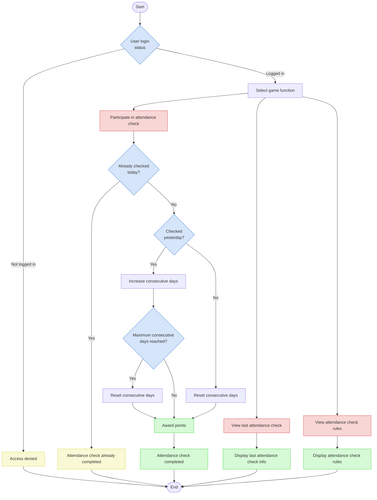

# Game API Documentation

## Overview

This document is a guide to the Game-related API functions. It explains the Attendance Check feature and Game Point system. Users can earn points through daily attendance checks, with more points awarded for consecutive attendance.

## API Endpoints

| Path                              | Method  | Description                |
|----------------------------------|---------|----------------------------|
| `/v1/game/attendance-check/`     | GET     | View last attendance check |
| `/v1/game/attendance-check/`     | POST    | Participate in attendance check |
| `/v1/game/attendance-check/role/`| GET     | View attendance check rules |

## Game Flow

1. Users can access game APIs after authentication
2. Attendance check can be done once per day
3. Points increase according to consecutive attendance days
4. Consecutive day count resets if attendance is interrupted
5. When maximum consecutive days (7 days) is reached, the consecutive count resets to 0



## Attendance Check System

### Attendance Check Rules

The attendance check system operates with the following rules:

1. Users can check in only once per day.
2. Different points are awarded based on consecutive attendance days.
3. Consecutive attendance days are counted up to a maximum of 7 days, after which the count resets to 0.
4. Missing a day resets the consecutive day count to 0.
5. Points awarded for each consecutive day can be configured via environment variables (default: [5,5,5,10,10,10,100]).

### Consecutive Attendance Logic

```python
# Calculate consecutive days based on yesterday's attendance
if (
    self.instance  # If there's a previous attendance record
    and self.instance.check_in_date == timezone.now().date() - timedelta(days=1)  # Checked in yesterday
    and self.instance.consecutive_days < len(settings.ATTENDANCE_CHECK_REWARD_POINTS) - 1  # Not reached max consecutive days
):
    # Increase consecutive days
    data["consecutive_days"] = self.instance.consecutive_days + 1
else:
    # Reset consecutive days
    data["consecutive_days"] = 0
```

### Point Award Logic

When attendance check is completed, points are automatically awarded based on consecutive days. This logic is implemented in the `save` method of the `AttendanceCheck` model:

```python
def save(self, *args, **kwargs):
    if not self.pk:  # Only for new attendance checks
        # Award points for the corresponding consecutive days
        reward_point = settings.ATTENDANCE_CHECK_REWARD_POINTS[self.consecutive_days]
        GamePoint.objects.create(
            user=self.user,
            point=reward_point,
            reason=PointReason.ATTENDANCE_CHECK,
        )
    return super().save(*args, **kwargs)
```

## API Details

### 1. View Last Attendance Check API

View the user's last attendance check record.

**URL**: `/v1/game/attendance-check/`

**Method**: `GET`

**Authentication**: Required (JWT token)

**Permission**: `IsAuthenticated`

**Response (200 OK)**:
```json
{
  "id": 42,
  "check_in_date": "2023-01-01",
  "consecutive_days": 3,
  "created_at": "2023-01-01T00:00:00.000000Z"
}
```

**Response (200 OK, no attendance record)**:
```json
null
```

**Notes**:
- Returns only the most recent attendance check information
- Returns null if no attendance check record exists
- This API is used to check a user's current attendance status via the last check-in date and consecutive days

### 2. Attendance Check Participation API

Participate in today's attendance check.

**URL**: `/v1/game/attendance-check/`

**Method**: `POST`

**Authentication**: Required (JWT token)

**Permission**: `IsAuthenticated`

**Request body**: Not required (empty object {} is acceptable)

**Response (200 OK)**:
```json
{
  "id": 43,
  "check_in_date": "2023-01-02",
  "consecutive_days": 4,
  "created_at": "2023-01-02T00:00:00.000000Z"
}
```

**Operation**:
1. Retrieves the user's last attendance check record.
2. Calculates consecutive days by checking if attended yesterday.
   - If checked yesterday, increases consecutive days
   - Otherwise, resets consecutive days
3. Creates or retrieves an attendance check record for today (returns existing record if already checked in today).
4. Automatically awards points based on consecutive days.

**Notes**:
- Attendance check is limited to once per day
- If already checked in today, returns the existing attendance check information
- Consecutive days reset to 0 after reaching the maximum (length of settings.ATTENDANCE_CHECK_REWARD_POINTS - 1)
- A new GamePoint record is created when attendance check is successful

### 3. View Attendance Check Rules API

View the attendance check reward point rules.

**URL**: `/v1/game/attendance-check/role/`

**Method**: `GET`

**Authentication**: Required (JWT token)

**Permission**: `IsAuthenticated`

**Response (200 OK)**:
```json
[5, 5, 5, 10, 10, 10, 100]
```

**Response Description**:
- Array index represents consecutive days (starting from 0)
- Values are points awarded for the corresponding consecutive days
- Example) Index 0: First attendance (0 consecutive days) - 5 points
- Example) Index 6: Seventh attendance (6 consecutive days) - 100 points

**Notes**:
- This API is used by clients to display attendance check reward rules
- Actual point calculation is handled on the server side
- Default values are [5,5,5,10,10,10,100] but can be changed via the 'ATTENDANCE_CHECK_REWARD_POINTS' environment variable

## Error Response Format

Game API error responses follow this format:

```json
{
  "detail": "Error message"
}
```

### Main Error Codes

| HTTP Status Code | Description |
|------------------|-------------|
| 401 Unauthorized | Unauthenticated user access |
| 405 Method Not Allowed | Use of disallowed HTTP method |
| 500 Internal Server Error | Server internal error |

### Example Error Responses

**Unauthenticated user access (401 Unauthorized)**:
```json
{
  "detail": "Authentication credentials were not provided."
}
```

**Using disallowed method (405 Method Not Allowed)**:
```json
{
  "detail": "PUT method is not allowed."
}
```

**Duplicate attendance check attempt (implemented to prevent server errors)**:
In the current implementation, duplicate attendance checks do not cause IntegrityError, but instead return the existing attendance check data for today.

## Data Models

### 1. Attendance Check (AttendanceCheck)

Model for storing attendance check records.

**Fields**:

| Field Name        | Type                 | Description            |
|-------------------|----------------------|------------------------|
| id                | AutoField            | Unique identifier      |
| user              | ForeignKey (User)    | User reference         |
| check_in_date     | DateField            | Participation date     |
| consecutive_days  | PositiveIntegerField | Consecutive days       |
| created_at        | DateTimeField        | Creation datetime      |

**Constraints**:
- The (user, check_in_date) pair must be unique (participation limited to once per day)

**Methods**:
- `save()`: Includes logic to award points based on consecutive days when creating a new attendance check


### 2. Point Reason (PointReason)

Enum class defining game point award reasons.

```python
class PointReason(models.IntegerChoices):
    """Point issuance reasons"""
    
    ATTENDANCE_CHECK = 1, "Attendance Check"
    COIN_FLIP = 2, "Coin Flip"
```

### 3. Game Point (GamePoint)

Model for storing game point award/deduction records.

**Fields**:

| Field Name        | Type                     | Description              |
|-------------------|--------------------------|-----------------------|
| id                | AutoField                | Unique identifier     |
| user              | ForeignKey (User)        | User reference        |
| point             | IntegerField             | Award/deduction points |
| reason            | PositiveSmallIntegerField | Point issuance reason |
| created_at        | DateTimeField            | Creation datetime      |


## Related Settings

### Attendance Check Reward Points

Reward points based on consecutive attendance days are set via environment variables:

```python
ATTENDANCE_CHECK_REWARD_POINTS = list(
    map(
        lambda x: int(x),
        os.environ.get("ATTENDANCE_CHECK_REWARD_POINTS", "5,5,5,10,10,10,100").split(","),
    )
)
```

- Default values: `[5, 5, 5, 10, 10, 10, 100]`
- Each value's index represents consecutive days (starting from 0)

## Example Usage Scenarios

### 1. Consecutive Attendance Check Scenario

The following is a scenario for a user checking in for 7 consecutive days:

1. First day attendance check (0 consecutive days, 5 points awarded)
2. Second day attendance check (1 consecutive day, 5 points awarded)
3. Third day attendance check (2 consecutive days, 5 points awarded)
4. Fourth day attendance check (3 consecutive days, 10 points awarded)
5. Fifth day attendance check (4 consecutive days, 10 points awarded)
6. Sixth day attendance check (5 consecutive days, 10 points awarded)
7. Seventh day attendance check (6 consecutive days, 100 points awarded)
8. Eighth day attendance check (reset to 0 consecutive days, 5 points awarded)

### 2. Interrupted Attendance Scenario

Scenario for a user who interrupts their attendance:

1. First day attendance check (0 consecutive days, 5 points awarded)
2. Second day attendance check (1 consecutive day, 5 points awarded)
3. Third day not participating
4. Fourth day attendance check (reset to 0 consecutive days, 5 points awarded)

## Security Considerations

1. **Authentication Required**:
   - All game APIs use the `IsAuthenticated` permission class to ensure only authenticated users can access
   - JWT (JSON Web Token) based authentication system used

2. **Data Consistency**:
   - The unique_together constraint in the AttendanceCheck model prevents duplicate attendance checks for the same user on the same date
   - Use of get_or_create in serializers to prevent race conditions

3. **Preventing Point Abuse**:
   - Point awards only occur in the save method of the AttendanceCheck model
   - Point calculations based on consecutive days are performed only on the server side
   - Attendance check API is only available via POST requests

4. **Blocking Unnecessary HTTP Methods**:
   - Attendance check API only allows GET (view) and POST (participate)
   - PUT method is explicitly blocked

## Test Cases

Test cases are implemented to verify the operation of the Game API:

1. **AttendanceCheckSerializerTests**: Tests for consecutive day calculation and reset logic in serializers
2. **AttendanceCheckViewSetTests**: Tests for attendance check API endpoint operation
3. **AttendanceCheckRoleAPIViewTests**: Tests for attendance check rule view API
4. **GamePointTests**: Tests for point awards based on attendance checks
5. **AttendanceCheckEdgeCaseTests**: Tests for edge cases such as first attendance, processing after reaching maximum consecutive days, etc.

Tests use `override_settings` to set reward point values in the test environment:

```python
TEST_REWARD_POINTS = [5, 5, 5, 10, 10, 10, 100]

@override_settings(ATTENDANCE_CHECK_REWARD_POINTS=TEST_REWARD_POINTS)
class AttendanceCheckSerializerTests(APITestCase):
    # ... test code ...
```

## Extensibility

The current Game API provides attendance check and point systems, but the following extensions are possible:

1. **Additional Game Features**: 
   - The `PointReason` enum in the model already includes a "Coin Flip" option, making it easy to extend additional game features
   - New game APIs can be easily integrated with the point system

2. **Point Usage and Management**:
   - Functions for point inquiry, usage, and charging can be added
   - APIs for point usage history and statistics can be developed

3. **Notification System**:
   - Attendance check notification features can be added
   - Reminders for consecutive attendance
   - Special point event and reward notifications

4. **Ranking System**:
   - Ranking system based on points earned by users
   - Daily/weekly/monthly rankings for most attendance or most points earned

5. **Enhanced Attendance Check Policies**:
   - Add time-based attendance check bonuses
   - Bonus point awards for specific dates or event periods

## Code Optimization and Performance Considerations

The current implementation is suitable for small-scale services, but the following optimizations can be considered if the number of users increases:

1. **Caching Strategy**:
   - Apply caching to frequently accessed attendance check rules
   - Cache last attendance check information

2. **Database Indexes**:
   - The `check_in_date` field currently has an index applied, but additional indexes can be considered based on frequent query patterns

3. **Batch Processing**:
   - Implement batch jobs for processing large amounts of points

4. **Query Optimization**:
   - Minimize unnecessary queries when processing consecutive attendance
   - Optimize related data retrieval using `select_related` and `prefetch_related`

## Conclusion

This Game API provides an attendance check system to increase user participation and retention. The reward system for consecutive attendance encourages continuous user participation. Integration with the point system has laid the foundation for expansion into various game and reward features in the future.

Potential improvements for additional development include point usage APIs, user ranking systems, special event rewards, and more. Additionally, a personalized notification system can be implemented through analysis of attendance check patterns.
