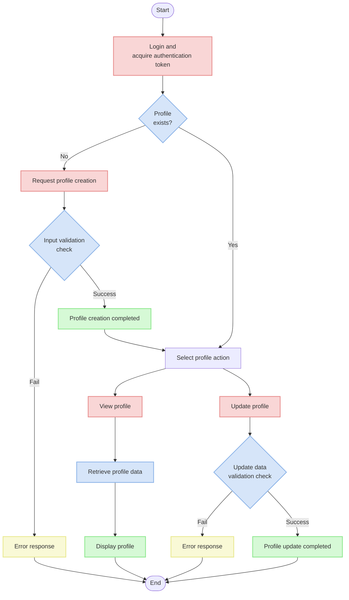
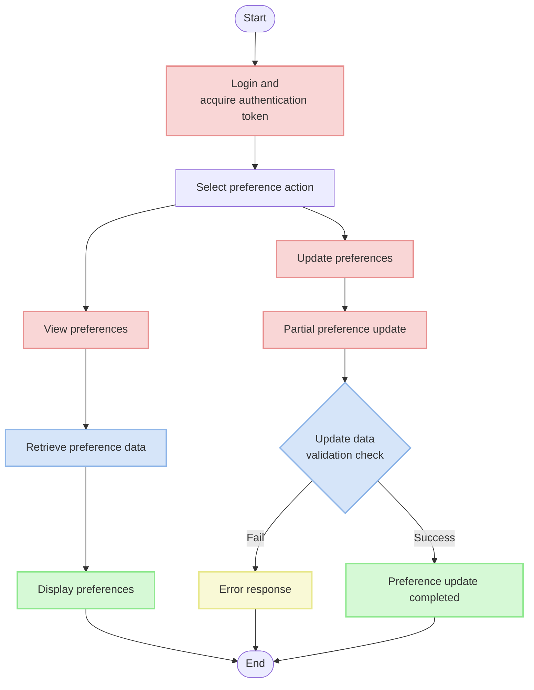
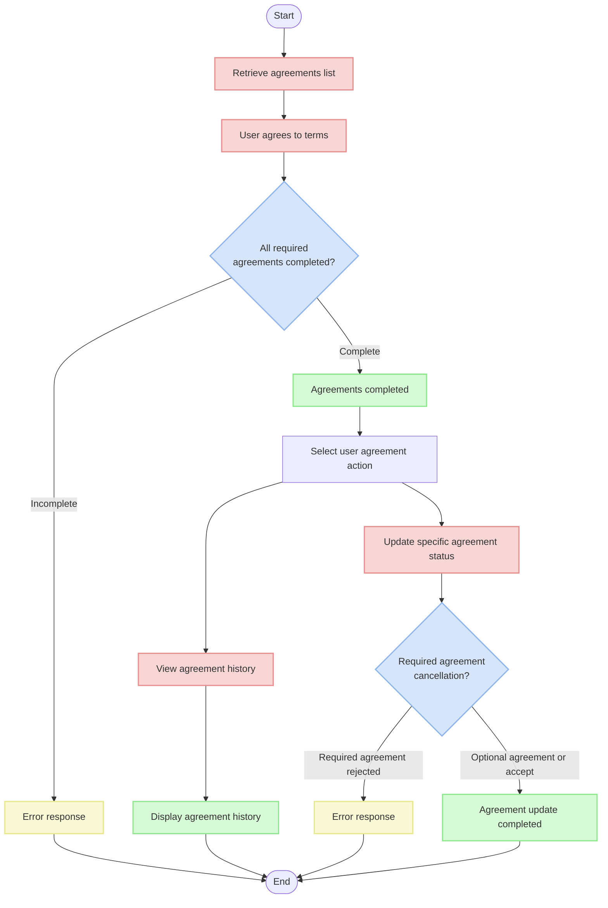

# User Profile & Agreement API Documentation

## Overview

This document serves as a guide for API functions related to user profiles and terms of agreement. It explains the processes of creating, retrieving, and modifying profiles along with the user agreement consent process.

## API Endpoints

| Path                         | Method | Description               |
|----------------------------|--------|------------------|
| `/v1/user/me/profile/`     | POST   | Create user profile     |
| `/v1/user/me/profile/`     | GET    | Retrieve user profile     |
| `/v1/user/me/profile/`     | PUT    | Update user profile     |
| `/v1/user/me/preference/`  | GET    | Retrieve user preferences   |
| `/v1/user/me/preference/`  | PATCH  | Update user preferences   |
| `/v1/user/me/agreement/`   | GET    | Retrieve user agreement list |
| `/v1/user/me/agreement/`   | POST   | Create user agreement   |
| `/v1/user/me/agreement/{id}/` | PATCH | Update user agreement   |

## Profile Management Flow



## Preference Management Flow



## Agreement Management Flow



## API Detailed Description

### 1. User Profile Creation API

Creates a profile for the logged-in user.

**URL**: `/v1/user/me/profile/`

**Method**: `POST`

**Request Header**:
```
Authorization: Bearer {access_token}
```

**Request Body**:
```json
{
  "nickname": "UserNickname",
  "image": "https://example.com/profile.jpg"  // Optional
}
```

**Response (201 Created)**:
```json
{
  "id": 1,
  "nickname": "UserNickname",
  "image": "https://example.com/profile.jpg"
}
```

**Validation**:
- Nickname: Required field, maximum 30 characters
- Image: Optional field, valid URL format

### 2. User Profile Retrieval API

Retrieves the profile information of the logged-in user.

**URL**: `/v1/user/me/profile/`

**Method**: `GET`

**Request Header**:
```
Authorization: Bearer {access_token}
```

**Response (200 OK)**:
```json
{
  "id": 1,
  "nickname": "UserNickname",
  "image": "https://example.com/profile.jpg"
}
```

**Notes**:
- Only authenticated users can view their own profile
- Returns 404 response if profile doesn't exist

### 3. User Profile Update API

Updates the profile information of the logged-in user.

**URL**: `/v1/user/me/profile/`

**Method**: `PUT`

**Request Header**:
```
Authorization: Bearer {access_token}
```

**Request Body**:
```json
{
  "nickname": "NewNickname",
  "image": "https://example.com/new-profile.jpg"
}
```

**Response (200 OK)**:
```json
{
  "id": 1,
  "nickname": "NewNickname",
  "image": "https://example.com/new-profile.jpg"
}
```

**Validation**:
- Nickname: Required field, maximum 30 characters
- Image: Optional field, valid URL format

### 4. User Preference Retrieval API

Retrieves the notification preferences of the logged-in user.

**URL**: `/v1/user/me/preference/`

**Method**: `GET`

**Request Header**:
```
Authorization: Bearer {access_token}
```

**Response (200 OK)**:
```json
{
  "id": 1,
  "user": 1,
  "is_night_notification": false,
  "is_push_notification": true,
  "is_email_notification": true,
  "created_at": "2023-01-01T00:00:00Z"
}
```

**Notes**:
- Only authenticated users can view their own preferences
- Returns 404 response if preferences don't exist

### 5. User Preference Update API

Updates the notification preferences of the logged-in user.

**URL**: `/v1/user/me/preference/`

**Method**: `PATCH`

**Request Header**:
```
Authorization: Bearer {access_token}
```

**Request Body** (include only fields to be changed):
```json
{
  "is_night_notification": true,
  "is_push_notification": false
}
```

**Response (200 OK)**:
```json
{
  "id": 1,
  "user": 1,
  "is_night_notification": true,
  "is_push_notification": false,
  "is_email_notification": true,
  "created_at": "2023-01-01T00:00:00Z"
}
```

**Validation**:
- Include only fields you want to change in the request
- All fields must be boolean type (true/false)

### 6. User Agreement List Retrieval API

Retrieves the agreement history of the logged-in user.

**URL**: `/v1/user/me/agreement/`

**Method**: `GET`

**Request Header**:
```
Authorization: Bearer {access_token}
```

**Response (200 OK)**:
```json
[
  {
    "id": 1,
    "agreement": {
      "id": 1,
      "title": "Terms of Service",
      "content": "This is the content of Terms of Service...",
      "version": "1.0",
      "agreement_type": 1,
      "order": 1,
      "is_required": true
    },
    "is_agreed": true
  },
  {
    "id": 2,
    "agreement": {
      "id": 2,
      "title": "Privacy Policy",
      "content": "This is the content of Privacy Policy...",
      "version": "1.0",
      "agreement_type": 2,
      "order": 2,
      "is_required": true
    },
    "is_agreed": true
  },
  {
    "id": 3,
    "agreement": {
      "id": 3,
      "title": "Marketing Information Consent",
      "content": "This is the content of Marketing Information Consent...",
      "version": "1.0",
      "agreement_type": 3,
      "order": 3,
      "is_required": false
    },
    "is_agreed": false
  }
]
```

### 7. User Agreement Creation API

Creates user agreement information.

**URL**: `/v1/user/me/agreement/`

**Method**: `POST`

**Request Header**:
```
Authorization: Bearer {access_token}
```

**Request Body**:
```json
{
  "agreements": [
    {
      "id": 1,
      "is_agreed": true
    },
    {
      "id": 2,
      "is_agreed": true
    },
    {
      "id": 3,
      "is_agreed": false
    }
  ]
}
```

**Response (201 Created)**:
```json
{
  "agreements": [
    {
      "id": 1,
      "is_agreed": true
    },
    {
      "id": 2,
      "is_agreed": true
    },
    {
      "id": 3,
      "is_agreed": false
    }
  ]
}
```

**Validation**:
- Agreement status must be provided for all active agreements
- Required agreements (is_required=true) must be agreed to (is_agreed=true)
- Optional agreements don't need to be agreed to

### 8. User Agreement Update API

Updates a user's consent status for a specific agreement.

**URL**: `/v1/user/me/agreement/{id}/`

**Method**: `PATCH`

**Request Header**:
```
Authorization: Bearer {access_token}
```

**Request Body**:
```json
{
  "is_agreed": true
}
```

**Response (200 OK)**:
```json
{
  "id": 3,
  "agreement": {
    "id": 3,
    "title": "Marketing Information Consent",
    "content": "This is the content of Marketing Information Consent...",
    "version": "1.0",
    "agreement_type": 3,
    "order": 3,
    "is_required": false
  },
  "is_agreed": true
}
```

**Validation**:
- Cannot withdraw consent for required agreements (cannot change is_agreed to false)
- Optional agreements can be both agreed to and withdrawn

## Error Response Format

### Validation Failure (400 Bad Request)

When validation fails, responses are returned in the following format:

```json
{
  "field_name": [
    "Error message"
  ]
}
```

### Authentication Failure (401 Unauthorized)

When authentication fails, the following response is returned:

```json
{
  "detail": "Authentication credentials were not provided."
}
```

### Resource Not Found (404 Not Found)

When a profile or preference information cannot be found, the following response is returned:

```json
{
  "detail": "Not found."
}
```

### Example Error Responses

**Missing Nickname**:
```json
{
  "nickname": [
    "This field is required."
  ]
}
```

**Required Agreement Not Agreed To**:
```json
{
  "agreements": [
    "You must agree to required agreements."
  ]
}
```

## Example Usage Scenarios

### Profile Creation and Update

1. Login and acquire access token

2. Create profile request:
```
POST /v1/user/me/profile/
Header: Authorization: Bearer {access_token}
{
  "nickname": "UserNickname",
  "image": "https://example.com/profile.jpg"
}
```

3. View profile:
```
GET /v1/user/me/profile/
Header: Authorization: Bearer {access_token}
```

4. Update profile:
```
PUT /v1/user/me/profile/
Header: Authorization: Bearer {access_token}
{
  "nickname": "NewNickname",
  "image": "https://example.com/new-profile.jpg"
}
```

### Preference Management

1. View preferences:
```
GET /v1/user/me/preference/
Header: Authorization: Bearer {access_token}
```

2. Partial preference update:
```
PATCH /v1/user/me/preference/
Header: Authorization: Bearer {access_token}
{
  "is_night_notification": true,
  "is_push_notification": false
}
```

3. Update only specific notification setting:
```
PATCH /v1/user/me/preference/
Header: Authorization: Bearer {access_token}
{
  "is_email_notification": false
}
```

### Agreement Consent Process

1. View agreement list (refer to account.md)

2. Submit agreement consent:
```
POST /v1/user/me/agreement/
Header: Authorization: Bearer {access_token}
{
  "agreements": [
    {
      "id": 1,
      "is_agreed": true
    },
    {
      "id": 2,
      "is_agreed": true
    },
    {
      "id": 3,
      "is_agreed": false
    }
  ]
}
```

3. View agreement history:
```
GET /v1/user/me/agreement/
Header: Authorization: Bearer {access_token}
```

4. Update specific agreement status (change optional agreement to agreed):
```
PATCH /v1/user/me/agreement/3/
Header: Authorization: Bearer {access_token}
{
  "is_agreed": true
}
```

## Important Notes

- All API requests require an authentication token (except for viewing the agreement list).
- Nickname is required when creating and updating profiles.
- Image URL is optional.
- Partial updates (PATCH) are not supported for profiles. When updating a profile, use the PUT method and provide all fields.
- Preferences can be partially updated using the PATCH method.
- Users can only view and modify their own profiles and preferences.
- All required agreements must be agreed to during the agreement consent process.
- After agreeing to required agreements, they cannot be withdrawn.
- Agreement history is managed historically, and all changes are recorded.

## Planned Future Updates

### Re-consent Process for Agreement Changes

A feature to receive re-consent from users when agreement content changes will be added. The following process will be implemented:

1. When a new version of an agreement is registered, the previous agreement is deactivated (is_active=false)
2. When a user accesses the app/web, the system checks if there are new agreements requiring consent
3. If new agreements exist, the re-consent screen is displayed to the user
4. The user must agree to all necessary agreements to continue using the service

This feature will be added to comply with personal information protection laws and related regulations.

### Notification System Integration

Notification settings stored in user preferences will be integrated with push notification and email notification systems:

1. If `is_night_notification` is set to false, notifications will not be sent during night hours (22:00-08:00)
2. If `is_push_notification` is set to false, app push notifications will not be sent
3. If `is_email_notification` is set to false, email notifications will not be sent

This feature will be implemented to improve user experience and reduce notification fatigue.
