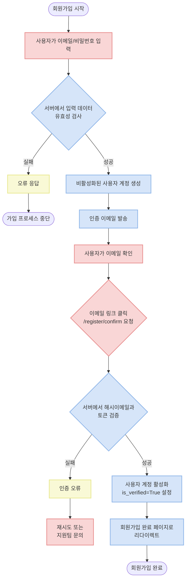
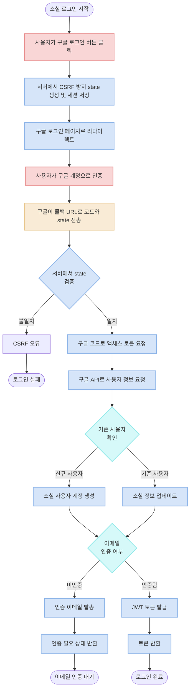
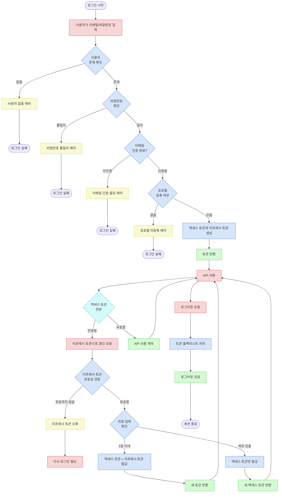
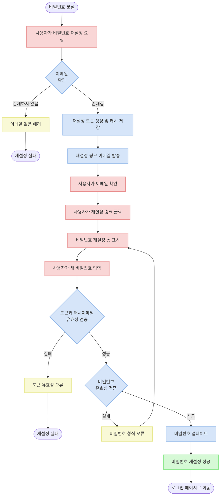

# Account API Documentation

## Overview

이 문서는 계정 관련 API 기능에 대한 가이드입니다. 시스템은 일반 회원가입/로그인과 소셜 로그인(현재 구글만 지원)을 제공하며, 이메일 인증, 로그인, 토큰 관리, 비밀번호 관리 등의 기능을 포함합니다.

## API 엔드포인트

| 경로                             | 메서드 | 설명 |
|--------------------------------|--------|------|
| `/v1/account/register/`        | POST | 회원 가입 |
| `/v1/account/register/confirm/` | GET | 이메일 주소 인증 |
| `/v1/account/login/`           | POST | 사용자 로그인 |
| `/v1/account/refresh/`         | POST | 액세스 토큰 갱신 |
| `/v1/account/logout/`          | POST | 사용자 로그아웃 |
| `/v1/account/password/reset/`  | POST | 비밀번호 초기화 요청 |
| `/v1/account/password/change/` | POST | 비밀번호 변경 |
| `/v1/account/google/login/`    | GET | 구글 로그인 페이지로 리다이렉트 |
| `/v1/account/google/callback/` | GET | 구글 로그인 콜백 처리 |

## 인증 흐름 도표

### 1. 회원 가입 및 이메일 인증 흐름



### 2. 소셜 로그인 (구글) 흐름



### 3. 로그인 및 토큰 관리 흐름



### 4. 비밀번호 재설정 흐름



## API 상세 설명

### 1. 회원가입 API

새로운 사용자 계정을 생성합니다.

**URL**: `/v1/account/register/`

**메서드**: `POST`

**요청 본문**:
```json
{
  "email": "user@example.com",
  "password": "password123",
  "password_confirm": "password123"
}
```

**응답 (201 Created)**:
```json
{
  "email": "user@example.com"
}
```

**유효성 검사**:
- 이메일: 정규식 `^[a-zA-Z0-9_.+-]+@[a-zA-Z0-9-]+\.[a-zA-Z0-9-.]+$`에 맞는 유효한 이메일 형식이어야 함
- 비밀번호: 정규식 `^(?=.*[a-z])(?=.*\d)[a-zA-Z0-9_-]{6,30}$`에 맞는 영문자와 숫자를 포함하여 6~30자
- 비밀번호 확인: 비밀번호와 일치해야 함

**오류 코드**:
- `E0010001`: 이메일 형식이 올바르지 않음
- `E0010002`: 이미 존재하는 이메일이나 인증이 완료되지 않음
- `E0010003`: 이미 사용 중인 이메일
- `E0010004`: 비밀번호 형식이 올바르지 않음
- `E0010005`: 비밀번호와 비밀번호 확인이 일치하지 않음

### 2. 이메일 인증 API

회원가입 후 발송된 이메일의 링크를 통해 계정을 인증합니다.

**URL**: `/v1/account/register/confirm/`

**메서드**: `GET`

**쿼리 파라미터**:
- `hashed_email`: 이메일 해시값 (32자 MD5 해시)
- `token`: 인증 토큰 (32자 토큰)

**성공 시**: 설정된 `SIGNUP_COMPLETED_URL` 페이지로 리다이렉트 (URL에 이메일이 쿼리 파라미터로 포함됨)

**인증 과정**:
1. 회원가입 시 생성된 해시된 이메일과 토큰 검증
2. 캐시(`email_verification:{env}:{hashed_email}`)에서 저장된 정보 확인
3. 인증 성공 시 사용자의 `is_verified` 필드를 `True`로 설정

**오류 코드**:
- `E0020001`: 해시된 이메일 형식이 올바르지 않음
- `E0020002`: 인증 토큰 형식이 올바르지 않음
- `E0020003`: 캐시에 인증 정보가 없음
- `E0020004`: 이미 인증된 이메일
- `E0020005`: 토큰이 일치하지 않음

### 3. 로그인 API

인증된 계정으로 로그인하여 토큰을 발급받습니다.

**URL**: `/v1/account/login/`

**메서드**: `POST`

**요청 본문**:
```json
{
  "email": "user@example.com",
  "password": "password123"
}
```

**응답 (200 OK)**:
```json
{
  "access_token": "eyJhbGciOiJIUzI1NiIsInR5cCI6IkpXVCJ9...",
  "refresh_token": "eyJhbGciOiJIUzI1NiIsInR5cCI6IkpXVCJ9..."
}
```

**주의사항**:
- 이메일 인증이 완료된 계정만 로그인 가능
- 사용자 프로필이 등록되어 있어야 함

**오류 코드**:
- `E0030001`: 비밀번호가 일치하지 않음
- `E0030002`: 이메일 인증이 완료되지 않음
- `E0030004`: 프로필이 등록되어 있지 않음

### 4. 토큰 갱신 API

리프레시 토큰을 사용하여 새로운 액세스 토큰을 발급받습니다.

**URL**: `/v1/account/refresh/`

**메서드**: `POST`

**요청 본문**:
```json
{
  "refresh_token": "eyJhbGciOiJIUzI1NiIsInR5cCI6IkpXVCJ9..."
}
```

**응답 (200 OK)** - 만료가 1일 이상 남은 경우:
```json
{
  "access_token": "eyJhbGciOiJIUzI1NiIsInR5cCI6IkpXVCJ9..."
}
```

**응답 (200 OK)** - 만료가 1일 이내인 경우:
```json
{
  "access_token": "eyJhbGciOiJIUzI1NiIsInR5cCI6IkpXVCJ9...",
  "refresh_token": "eyJhbGciOiJIUzI1NiIsInR5cCI6IkpXVCJ9..."
}
```

**오류 코드**:
- `E0030003`: 리프레시 토큰 갱신 실패

### 5. 로그아웃 API

발급받은 토큰을 무효화합니다.

**URL**: `/v1/account/logout/`

**메서드**: `POST`

**인증**: 액세스 토큰 필요 (Authorization 헤더에 Bearer 토큰)

**요청 본문**:
```json
{
  "refresh_token": "eyJhbGciOiJIUzI1NiIsInR5cCI6IkpXVCJ9..."
}
```

**응답 (204 No Content)**:
응답 본문 없음

**동작**:
- 액세스 토큰과 리프레시 토큰 모두 블랙리스트에 추가하여 무효화
- JWT 블랙리스트는 `OutstandingToken`과 `BlacklistedToken` 모델을 사용하여 관리

**오류 코드**:
- `E0030006`: 블랙리스트 처리 실패

### 6. 비밀번호 초기화 요청 API

비밀번호 초기화 링크를 이메일로 전송합니다.

**URL**: `/v1/account/password/reset/`

**메서드**: `POST`

**요청 본문**:
```json
{
  "email": "user@example.com"
}
```

**응답 (200 OK)**:
```json
{
  "email": "user@example.com"
}
```

**처리 과정**:
1. 이메일 주소 유효성 확인 및 사용자 존재 여부 확인
2. 이메일에 비밀번호 초기화 링크 발송 (링크는 해시된 이메일과 인증 토큰 포함)
3. 캐시에 초기화 정보 저장 (타임아웃: `EMAIL_VERIFICATION_TIMEOUT` - 기본 10분)

**오류 코드**:
- `E0010001`: 이메일 형식이 올바르지 않음
- `E0010002`: 존재하지 않는 이메일

### 7. 비밀번호 변경 API

초기화 링크로 받은 정보를 사용하여 비밀번호를 변경합니다.

**URL**: `/v1/account/password/change/`

**메서드**: `POST`

**요청 본문**:
```json
{
  "hashed_email": "abcdef1234567890abcdef1234567890",
  "token": "1234567890abcdef1234567890abcdef",
  "password": "newpassword123",
  "password_confirm": "newpassword123"
}
```

**응답 (200 OK)**:
응답 본문은 비어 있음 (성공 시 상태 코드만 반환)

**유효성 검사**:
- 해시된 이메일: 32자의 16진수 문자열 (MD5 해시)
- 토큰: 32자의 16진수 문자열
- 비밀번호: 영문자와 숫자를 포함하여 6~30자
- 비밀번호 확인: 비밀번호와 일치해야 함

**오류 코드**:
- `E0040001`: 해시된 이메일 형식이 올바르지 않음
- `E0040002`: 인증 토큰 형식이 올바르지 않음
- `E0040003`: 캐시에 인증 정보가 없음
- `E0040005`: 토큰이 일치하지 않음
- `E0010004`: 비밀번호 형식이 올바르지 않음
- `E0010005`: 비밀번호가 일치하지 않음

### 8. 구글 로그인 리다이렉트 API

사용자를 구글 로그인 페이지로 리다이렉트합니다.

**URL**: `/v1/account/google/login/`

**메서드**: `GET`

**응답 (302 Found)**:
구글 OAuth 페이지로 리다이렉트

**동작**:
1. CSRF 방지를 위한 state 값 생성 (`secrets.token_urlsafe(16)`)
2. state 값을 세션에 저장 (`request.session["oauth_state"]`)
3. 구글 OAuth 인증 페이지로 리다이렉트 (`access_type="offline"` 파라미터 포함)

### 9. 구글 로그인 콜백 API

구글 인증 후 콜백을 처리하여 토큰을 발급합니다.

**URL**: `/v1/account/google/callback/`

**메서드**: `GET`

**쿼리 파라미터**:
- `code`: 구글 인증 코드
- `state`: 상태 값 (CSRF 방지)

**응답 (200 OK)** - 인증 완료된 경우:
```json
{
  "status": "success",
  "access_token": "eyJhbGciOiJIUzI1NiIsInR5cCI6IkpXVCJ9...",
  "refresh_token": "eyJhbGciOiJIUzI1NiIsInR5cCI6IkpXVCJ9..."
}
```

**응답 (200 OK)** - 이메일 인증 필요한 경우:
```json
{
  "status": "verification_required",
  "access_token": null,
  "refresh_token": null
}
```

**동작**:
1. 구글 콜백으로 받은 `state` 값과 세션에 저장된 `oauth_state` 값 비교
2. 코드로 구글 API 액세스 토큰 발급
3. 토큰으로 사용자 정보 조회 (이메일, sub(소셜ID), name, picture 등)
4. 이메일로 사용자 확인 및 없으면 생성 (이메일 인증 여부는 구글에서 확인된 경우 자동으로 `True`)
5. 소셜 로그인 정보 저장 (`SocialUser` 모델)
6. 사용자 프로필 생성 또는 업데이트 (`UserProfile` 모델)
7. 이메일 인증 필요한 경우 인증 메일 발송, 인증된 경우 JWT 토큰 발급

## 오류 응답 형식

API는 다음과 같은 형식으로 오류를 반환합니다:

### 필드 관련 오류

```json
{
  "필드명": [
    {
      "message": "오류 메시지",
      "error_code": "오류 코드"
    }
  ]
}
```

### 필드와 관련 없는 오류

```json
{
  "non_field": [
    {
      "message": "오류 메시지",
      "error_code": "오류 코드"
    }
  ]
}
```

### 예시 오류 응답

**유효하지 않은 이메일 형식**:
```json
{
  "email": [
    {
      "message": "이메일 형식이 올바르지 않습니다",
      "error_code": "E0010001"
    }
  ]
}
```

**비밀번호 불일치**:
```json
{
  "password_confirm": [
    {
      "message": "비밀번호가 일치하지 않습니다",
      "error_code": "E0010005"
    }
  ]
}
```

**이메일 인증 미완료**:
```json
{
  "non_field": [
    {
      "message": "이메일 인증을 완료해주세요",
      "error_code": "E0030002"
    }
  ]
}
```

## 오류 코드 목록

| 오류 코드 | 설명 | 필드 |
|-----------|------|------|
| E0010001 | 이메일 형식이 올바르지 않음 | email |
| E0010002 | 이메일 인증이 완료되지 않음 | email |
| E0010003 | 이미 사용 중인 이메일 | email |
| E0010004 | 비밀번호 형식이 올바르지 않음 | password |
| E0010005 | 비밀번호 불일치 | password_confirm |
| E0020001 | 유효하지 않은 해시된 이메일 형식 | hashed_email |
| E0020002 | 유효하지 않은 인증 토큰 | token |
| E0020003 | 인증 정보를 찾을 수 없음 | non_field |
| E0020004 | 이미 인증된 이메일 | non_field |
| E0020005 | 인증 토큰 불일치 | non_field |
| E0030001 | 잘못된 비밀번호 | non_field |
| E0030002 | 이메일 인증 미완료 | non_field |
| E0030003 | 리프레시 토큰 갱신 실패 | refresh_token |
| E0030004 | 프로필이 등록되어 있지 않음 | non_field |
| E0030005 | 토큰이 유효하지 않음 | message |
| E0030006 | 블랙리스트 처리 실패 | message |
| E0030007 | 사용자를 찾을 수 없음 | message |
| E0040001 | 유효하지 않은 해시된 이메일 형식 | hashed_email |
| E0040002 | 유효하지 않은 인증 토큰 | token |
| E0040003 | 인증 정보를 찾을 수 없음 | non_field |
| E0040005 | 인증 토큰 불일치 | non_field |

## 토큰 관리

### JWT 토큰

이 프로젝트는 JWT(JSON Web Token) 기반의 인증 시스템을 사용합니다. 시스템에서는 두 종류의 토큰을 발급합니다:

- **액세스 토큰**: API 접근에 사용되는 단기 토큰 (5분)
- **리프레시 토큰**: 액세스 토큰 갱신에 사용되는 장기 토큰 (7일)

### 토큰 설정 (settings.py)

```python
SIMPLE_JWT = {
    "ACCESS_TOKEN_LIFETIME": timedelta(minutes=5),
    "REFRESH_TOKEN_LIFETIME": timedelta(days=7),
    "ROTATE_REFRESH_TOKENS": False,
    "BLACKLIST_AFTER_ROTATION": True,
    "UPDATE_LAST_LOGIN": False,
    "ALGORITHM": "HS256",
    "SIGNING_KEY": SECRET_KEY,
    "VERIFYING_KEY": None,
    "AUDIENCE": None,
    "ISSUER": PROJECT_NAME,
    "AUTH_HEADER_TYPES": ("Bearer",),
    "USER_ID_FIELD": "id",
    "USER_ID_CLAIM": "user_id",
    "AUTH_TOKEN_CLASSES": ("rest_framework_simplejwt.tokens.AccessToken",),
    "TOKEN_TYPE_CLAIM": "token_type",
    "JTI_CLAIM": "jti",
    "SLIDING_TOKEN_REFRESH_EXP_CLAIM": "refresh_exp",
    "SLIDING_TOKEN_LIFETIME": timedelta(minutes=5),
    "SLIDING_TOKEN_REFRESH_LIFETIME": timedelta(days=1),
}
```

### 리프레시 토큰 갱신 정책

리프레시 토큰의 만료가 1일 이내로 임박한 경우, 토큰 갱신 요청 시 새로운 리프레시 토큰도 함께 발급됩니다. 이를 통해 사용자의 로그인 상태를 자연스럽게 유지할 수 있습니다.

### 토큰 블랙리스트

로그아웃 시 토큰은 블랙리스트에 추가되어 재사용을 방지합니다. 블랙리스트는 Django Simple JWT 패키지의 `OutstandingToken`과 `BlacklistedToken` 모델을 사용하여 관리됩니다.

## 이메일 인증 시스템

### 인증 이메일 템플릿

이메일 인증 및 비밀번호 재설정은 템플릿 기반의 HTML 이메일을 사용합니다. 두 가지 주요 템플릿이 있습니다:

1. **회원가입 인증 이메일** (`account/signup.html`)
2. **비밀번호 재설정 이메일** (`account/reset_password.html`) 

### 이메일 검증 토큰 생성 및 저장

```python
def send_email_verification_token(email: str, template_type: EmailTemplate) -> dict:
    # 검증 키 생성
    token = uuid.uuid4().hex  # 32자 랜덤 uuid
    django_env = settings.DJANGO_ENVIRONMENT
    hash_input = (email + settings.EMAIL_VERIFICATION_HASH_SALT).encode("utf-8")
    hashed_email = hashlib.md5(hash_input).hexdigest()
    
    # 캐시에 검증 정보 저장 (10분 유효)
    cache_key = f"email_verification:{django_env}:{hashed_email}"
    cache.set(
        cache_key,
        {"token": token, "email": email},
        timeout=settings.EMAIL_VERIFICATION_TIMEOUT,
    )
    
    # 이메일 발송
    subject, base_url, template_path = template_type.value
    verification_url = f"{base_url}?hashed_email={hashed_email}&token={token}"
    # ... 이메일 발송 로직 ...
    
    return {"hashed_email": hashed_email, "token": token}
```

### 이메일 인증 URL

이메일 인증 및 비밀번호 재설정 링크 생성은 환경 변수에 기반합니다:

- `SIGNUP_CONFIRM_URL`: 회원가입 이메일 인증 기본 URL
- `RESET_PASSWORD_URL`: 비밀번호 재설정 기본 URL
- `SIGNUP_COMPLETED_URL`: 회원가입 완료 후 리다이렉트 URL

## 구글 소셜 로그인

### 구글 로그인 설정

구글 소셜 로그인을 위해 필요한 환경 변수:

- `GOOGLE_CLIENT_ID`: 구글 OAuth 클라이언트 ID
- `GOOGLE_CLIENT_SECRET`: 구글 OAuth 클라이언트 시크릿
- `GOOGLE_REDIRECT_URI`: 구글 로그인 후 리다이렉트 URI
- `GOOGLE_PROJECT_ID`: 구글 프로젝트 ID

### 소셜 로그인 사용자 처리

구글 로그인 시 다음 절차를 따릅니다:

1. 사용자의 이메일로 기존 계정 확인
2. 계정이 없는 경우 신규 생성 (비밀번호 없음)
3. `SocialUser` 모델에 소셜 로그인 정보 저장 (provider: "google", social_id: Google의 sub 값)
4. `UserProfile` 모델에 프로필 정보 생성/업데이트
5. 구글에서 이메일이 인증된 경우 자동으로 이메일 인증 처리
6. 인증이 필요한 경우 인증 이메일 발송

소셜 로그인 사용자는 일반 비밀번호를 사용하지 않으므로 `set_unusable_password()`를 통해 비밀번호 필드를 특수하게 설정합니다.

## 보안 고려사항

1. **비밀번호 정책**:
   - 최소 6자 이상
   - 영문자와 숫자 조합 필수
   - 최대 30자 제한

2. **이메일 인증 및 비밀번호 초기화**:
   - 유효 기간 제한 (기본 10분)
   - MD5 해시와 32자 UUID 기반 토큰 사용
   - 이메일 인증 상태 추적

3. **JWT 토큰 관리**:
   - 짧은 액세스 토큰 수명 (5분)
   - 리프레시 토큰의 제한된 수명 (7일)
   - 토큰 블랙리스트를 통한 로그아웃 처리

4. **CSRF 방지**:
   - 소셜 로그인 시 `state` 파라미터 사용
   - 세션 기반 검증

5. **환경 분리**:
   - 각 환경(dev, test, prod)별 분리된 설정
   - 캐시 키에 환경 정보 포함
