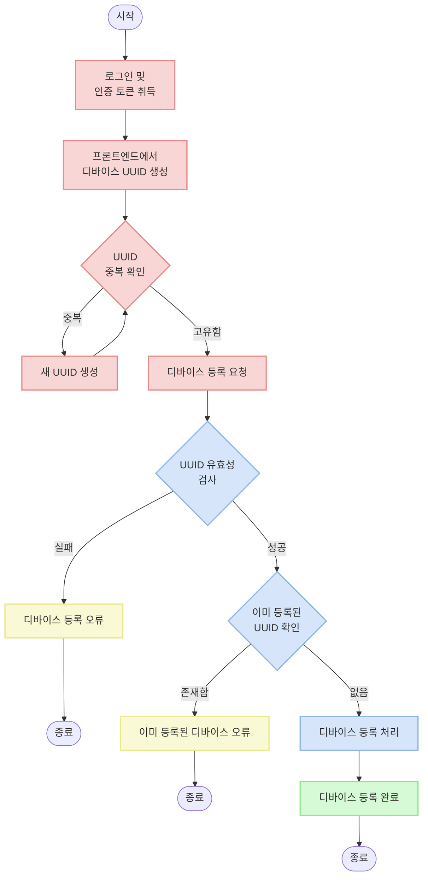
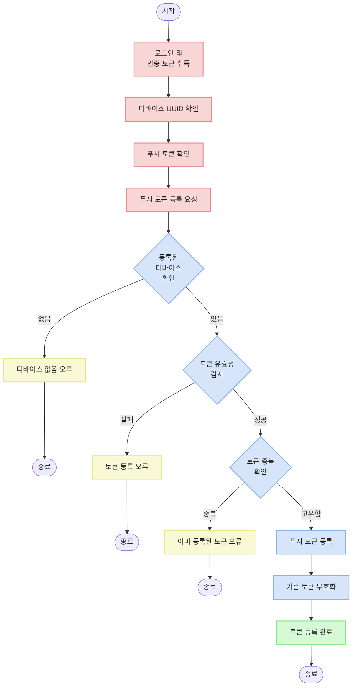

# Device API Documentation

## Overview

이 문서는 사용자 디바이스 및 푸시 토큰 관련 API 기능에 대한 가이드입니다. 디바이스 등록 및 푸시 토큰 관리 과정에 대해 설명합니다.

## API 엔드포인트

| 경로                                   | 메서드 | 설명 |
|---------------------------------------|--------|------|
| `/v1/device/`                         | POST   | 사용자 디바이스 등록 |
| `/v1/device/{device_uuid}/push_token/`| POST   | 푸시 토큰 등록 |

## 디바이스 등록 흐름



## 푸시 토큰 등록 흐름



## 모델 구조

### 디바이스 모델 (Device)

```python
class Device(models.Model):
    """디바이스"""

    user = models.ForeignKey(
        "user.User",
        on_delete=models.CASCADE,
        related_name="devices",
        verbose_name="사용자",
    )
    uuid = models.UUIDField(
        unique=True,
        verbose_name="UUID",
    )
    platform = models.CharField(
        max_length=50,
        choices=DevicePlatform.choices,
        default=DevicePlatform.WEB,
        verbose_name="플랫폼",
    )
    created_at = models.DateTimeField(
        auto_now_add=True,
        verbose_name="생성 일시",
    )
    updated_at = models.DateTimeField(
        auto_now=True,
        verbose_name="수정 일시",
    )
```

### 푸시 토큰 모델 (PushToken)

```python
class PushToken(models.Model):
    """푸시 토큰"""

    device = models.ForeignKey(
        Device,
        on_delete=models.CASCADE,
        related_name="push_tokens",
        verbose_name="디바이스",
    )
    token = models.CharField(
        max_length=255,
        verbose_name="토큰",
    )
    endpoint_arn = models.CharField(
        max_length=255,
        null=True,
        blank=True,
        verbose_name="엔드포인트 ARN",
    )
    is_valid = models.BooleanField(
        default=True,
        verbose_name="유효 여부",
    )
    created_at = models.DateTimeField(
        auto_now_add=True,
        verbose_name="생성 일시",
    )
    updated_at = models.DateTimeField(
        auto_now=True,
        verbose_name="수정 일시",
    )
```

## API 세부 설명

### 1. 사용자 디바이스 등록 API

로그인한 사용자의 디바이스를 등록합니다.

**URL**: `/v1/device/`

**메서드**: `POST`

**요청 헤더**:
```
Authorization: Bearer {access_token}
```

**요청 본문**:
```json
{
  "uuid": "550e8400-e29b-41d4-a716-446655440000"
}
```

**응답 (201 Created)**:
```json
{
  "id": 1,
  "uuid": "550e8400-e29b-41d4-a716-446655440000",
  "platform": "WEB",
  "created_at": "2025-03-17T09:00:00Z",
  "updated_at": "2025-03-17T09:00:00Z"
}
```

**유효성 검사**:
- UUID: 필수 필드, 유효한 UUID 형식이어야 함
- UUID: 같은 사용자에 대해 이미 등록된 UUID가 아니어야 함
- UUID: 프론트엔드에서 생성한 고유한 식별자로, 디바이스마다 고유해야 함

### 2. 푸시 토큰 등록 API

등록된 디바이스에 푸시 토큰을 등록합니다.

**URL**: `/v1/device/{device_uuid}/push_token/`

**메서드**: `POST`

**요청 헤더**:
```
Authorization: Bearer {access_token}
```

**요청 본문**:
```json
{
  "token": "firebase-push-token-example"
}
```

**응답 (201 Created)**:
```json
{
  "id": 1,
  "token": "firebase-push-token-example"
}
```

**유효성 검사**:
- token: 필수 필드, 문자열
- 등록하려는 토큰이 같은 사용자의 다른 디바이스에 이미 등록되어 있지 않아야 함

**처리 과정**:
1. URL 경로의 device_uuid를 통해 등록된 디바이스 확인
2. 디바이스가 존재하면 푸시 토큰 유효성 검사
3. 토큰이 유효하면 기존 토큰을 모두 무효화하고 새 토큰 등록
4. 같은 디바이스에 기존 토큰이 있으면 `is_valid=False`로 자동 설정

## 시리얼라이저 상세 정보

### 디바이스 시리얼라이저 (DeviceSerializer)

```python
class DeviceSerializer(serializers.ModelSerializer):
    """디바이스 시리얼라이저"""

    def validate_uuid(self, attr):
        """UUID 유효성 검사"""
        if not attr:
            raise serializers.ValidationError(E007_DEVICE_UUID_REQUIRED)
        elif Device.objects.filter(
            uuid=attr,
            user=self.context["request"].user,
        ).exists():
            raise serializers.ValidationError(E007_DEVICE_ALREADY_REGISTERED)
        return attr

    def create(self, validated_data):
        instance = super().create(validated_data)
        # TODO: AWS SNS 의 구독 정보 업데이트
        return instance

    class Meta:
        model = Device
        fields = [
            "id",
            "uuid",
            "platform",
            "created_at",
            "updated_at",
        ]
```

### 푸시 토큰 시리얼라이저 (PushTokenSerializer)

```python
class PushTokenSerializer(serializers.ModelSerializer):
    """푸시 토큰 시리얼라이저"""

    def validate_token(self, attr):
        """토큰 유효성 검사"""
        if not attr:
            raise serializers.ValidationError(E007_PUSH_TOKEN_REQUIRED)
        elif PushToken.objects.filter(
            token=attr,
            device__user=self.context["request"].user,
        ).exists():
            raise serializers.ValidationError(E007_PUSH_TOKEN_ALREADY_REGISTERED)
        return attr

    def create(self, validated_data):
        """생성"""
        instance = super().create(validated_data)
        # TODO: 푸시 토큰 생성 후 endpoint arn 생성
        return instance

    class Meta:
        model = PushToken
        fields = [
            "id",
            "token",
        ]
```

## 오류 응답 형식

오류 발생 시 다음과 같은 형식으로 응답합니다:

### 유효성 검사 실패 (400 Bad Request)

```json
{
  "필드명": [
    {
      "message": "오류 메시지",
      "error_code": "오류 코드"
    }
  ]
}
```

### 인증 실패 (401 Unauthorized)

```json
{
  "detail": "자격 인증데이터(authentication credentials)가 제공되지 않았습니다."
}
```

### 디바이스 없음 (404 Not Found)

```json
{
  "detail": "찾을 수 없습니다."
}
```

## 오류 코드 목록

| 오류 코드 | 설명 | 필드 |
|-----------|------|------|
| E0070001 | 디바이스 UUID는 필수입니다 | uuid |
| E0070002 | 이미 내 계정으로 등록된 디바이스입니다 | uuid |
| E0070003 | 푸시 토큰은 필수입니다 | token |
| E0070004 | 이미 등록된 푸시 토큰입니다 | token |

## 예시 오류 응답

### UUID 필드 누락

```json
{
  "uuid": [
    {
      "message": "디바이스 UUID는 필수입니다",
      "error_code": "E0070001"
    }
  ]
}
```

### 유효하지 않은 UUID 형식

```json
{
  "uuid": [
    "유효한 UUID를 입력하십시오."
  ]
}
```

### 이미 등록된 UUID

```json
{
  "uuid": [
    {
      "message": "이미 내 계정으로 등록된 디바이스입니다",
      "error_code": "E0070002"
    }
  ]
}
```

### 토큰 필드 누락

```json
{
  "token": [
    {
      "message": "푸시 토큰은 필수입니다",
      "error_code": "E0070003"
    }
  ]
}
```

### 이미 등록된 토큰

```json
{
  "token": [
    {
      "message": "이미 등록된 푸시 토큰입니다",
      "error_code": "E0070004"
    }
  ]
}
```

### 존재하지 않는 디바이스

```json
{
  "detail": "찾을 수 없습니다."
}
```

## 특별 동작 및 주의사항

### 디바이스 UUID 관리

- 디바이스 UUID는 프론트엔드에서 생성하며, 각 디바이스별로 **고유한 값**이어야 합니다.
- 중복된 UUID가 발견되면 프론트엔드에서 새로운 UUID를 생성하여 고유성을 유지해야 합니다.
- UUID는 디바이스 변경이나 앱 재설치 시에도 일관되게 유지되어야 합니다.

### 푸시 토큰 자동 관리

- 새로운 푸시 토큰이 등록되면 이전에 등록된 같은 디바이스의 토큰들은 자동으로 무효화됩니다.
- 이는 `PushToken` 모델의 `save` 메서드에서 자동으로 처리됩니다:

```python
def save(self, *args, **kwargs):
    # 신규 등록 또는 유효한 토큰 업데이트 시 기존 토큰 무효화
    if self.is_valid:
        self.device.push_tokens.filter(is_valid=True).update(is_valid=False)
    super().save(*args, **kwargs)
```

## 테스트 사례

디바이스 및 푸시 토큰 API의 기능 검증을 위한 테스트 사례입니다.

### 디바이스 등록 테스트

- 성공: 유효한 UUID로 디바이스 등록
- 실패: UUID 형식이 올바르지 않은 경우
- 실패: 같은 사용자가 동일한 UUID로 중복 등록 시도
- 실패: UUID 필드가 누락된 경우

### 푸시 토큰 등록 테스트

- 성공: 유효한 디바이스에 유효한 토큰 등록
- 실패: 존재하지 않는 디바이스에 토큰 등록 시도
- 실패: 토큰 필드가 누락된 경우
- 실패: 이미 등록된 토큰으로 중복 등록 시도

## 개선 계획 사항

현재 구현된 API에 추가될 예정인 기능입니다:

1. AWS SNS 연동: 디바이스 등록 시 AWS SNS 구독 정보 업데이트
2. 엔드포인트 ARN 생성: 푸시 토큰 등록 후 AWS SNS 엔드포인트 ARN 생성
3. 디바이스 플랫폼별 푸시 알림 처리: Android, iOS, Web 등 플랫폼별 메시지 형식 차별화
4. 디바이스 및 푸시 토큰 관리 API 확장: 조회, 업데이트, 삭제 기능 추가