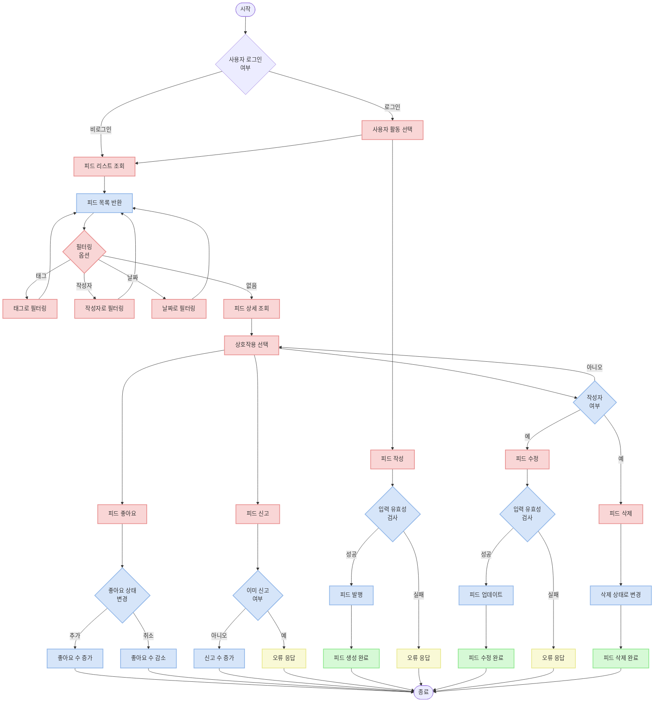
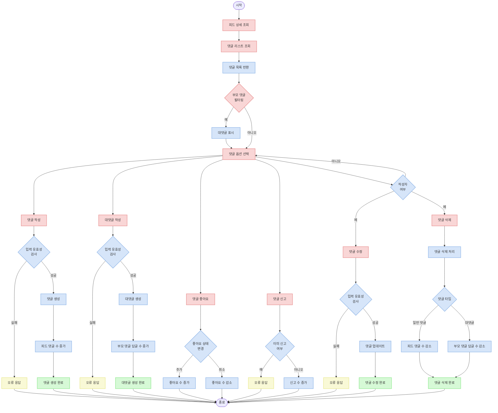

# Feed API Documentation

## Overview

이 문서는 피드 관련 API 기능에 대한 가이드입니다. 피드 작성, 조회, 수정, 삭제, 좋아요, 신고, 댓글 관리 등의 기능에 대해 설명합니다.

## API 엔드포인트

| 경로                             | 메서드 | 설명 |
|--------------------------------|--------|------|
| `/v1/feed/`                    | GET    | 피드 리스트 조회 |
| `/v1/feed/`                    | POST   | 피드 생성 |
| `/v1/feed/{uuid}/`             | GET    | 피드 상세 조회 |
| `/v1/feed/{uuid}/`             | PUT    | 피드 수정 |
| `/v1/feed/{uuid}/`             | DELETE | 피드 삭제 |
| `/v1/feed/{uuid}/like/`        | POST   | 피드 좋아요/취소 |
| `/v1/feed/{uuid}/report/`      | POST   | 피드 신고 |
| `/v1/feed/{feed_uuid}/comment/` | GET    | 피드 댓글 리스트 조회 |
| `/v1/feed/{feed_uuid}/comment/` | POST   | 피드 댓글 생성 |
| `/v1/feed/{feed_uuid}/comment/{uuid}/` | PUT    | 피드 댓글 수정 |
| `/v1/feed/{feed_uuid}/comment/{uuid}/` | DELETE | 피드 댓글 삭제 |
| `/v1/feed/{feed_uuid}/comment/{uuid}/like/` | POST   | 피드 댓글 좋아요/취소 |
| `/v1/feed/{feed_uuid}/comment/{uuid}/report/` | POST   | 피드 댓글 신고 |

## 흐름도

### 1. 피드 처리 흐름



### 2. 피드 댓글 처리 흐름



## API 세부 설명

### 1. 피드 리스트 조회 API

피드 목록을 조회합니다.

**URL**: `/v1/feed/`

**메서드**: `GET`

**인증**: 선택 사항 (인증 시 좋아요, 신고 여부 포함)

**쿼리 파라미터**:
- `tag`: 태그 검색 (태그명으로 부분 일치 검색)
- `author`: 작성자 UUID (정확히 일치)
- `published_at__gte`: 특정 날짜 이후 발행된 피드
- `published_at__lte`: 특정 날짜 이전 발행된 피드
- `uuid`: 피드 UUID (정확히 일치)
- `title__icontains`: 제목 검색 (대소문자 구분 없이 부분 일치)
- `cursor`: 페이징 커서

**응답 (200 OK)**:
```json
{
  "next": "http://example.com/v1/feed/?cursor=cD0yMDIxLTAxLTAxKzAwJTNBMDAlM0EwMC4wMDAwMDA=",
  "previous": null,
  "results": [
    {
      "uuid": "123e4567-e89b-12d3-a456-426614174000",
      "author": {
        "uuid": "123e4567-e89b-12d3-a456-426614174001",
        "nickname": "username",
        "image": "https://example.com/profile.jpg"
      },
      "title": "피드 제목",
      "content": "피드 내용",
      "best_comment": {
        "uuid": "123e4567-e89b-12d3-a456-426614174002",
        "author": {
          "uuid": "123e4567-e89b-12d3-a456-426614174003",
          "nickname": "commenter",
          "image": "https://example.com/commenter.jpg"
        },
        "content": "베스트 댓글 내용",
        "likes_count": 10,
        "reported_count": 0,
        "reply_count": 2,
        "is_deleted": false,
        "created_at": "2023-01-01T00:00:00.000000Z",
        "updated_at": "2023-01-01T00:00:00.000000Z"
      },
      "likes_count": 42,
      "comments_count": 7,
      "reported_count": 0,
      "is_like": false,
      "is_reported": false,
      "is_displayed": true,
      "published_at": "2023-01-01T00:00:00.000000Z"
    }
  ]
}
```

**참고사항**:
- 커서 기반 페이지네이션을 사용하며, 기본 페이지 크기는 10개
- 로그인 사용자의 경우 피드 좋아요 및 신고 여부 정보가 포함됨
- 베스트 댓글은 좋아요가 1개 이상인 댓글 중 가장 좋아요 수가 많은 댓글
- 기본적으로 최신 피드(`-published_at`)부터 정렬되어 반환됨
- 삭제된 피드(`is_deleted=True`)는 리스트에서 제외됨
- 현재 시간 이후에 발행 예정인 피드는 조회되지 않음

### 2. 피드 생성 API

새로운 피드를 생성합니다.

**URL**: `/v1/feed/`

**메서드**: `POST`

**인증**: 필수

**요청 본문**:
```json
{
  "title": "피드 제목",
  "content": "피드 내용",
  "image": "https://example.com/image.jpg",
  "tags": [
    {"name": "태그1"},
    {"name": "태그2"}
  ],
  "published_at": "2023-01-01T00:00:00.000000Z"
}
```

**응답 (201 Created)**:
```json
{
  "uuid": "123e4567-e89b-12d3-a456-426614174000",
  "title": "피드 제목",
  "content": "피드 내용",
  "image": "https://example.com/image.jpg",
  "likes_count": 0,
  "comments_count": 0,
  "reported_count": 0,
  "tags": [
    {"id": 1, "name": "태그1"},
    {"id": 2, "name": "태그2"}
  ],
  "published_at": "2023-01-01T00:00:00.000000Z"
}
```

**유효성 검사**:
- `title`: 필수, 최대 255자
- `content`: 필수
- `image`: 선택 사항, 유효한 URL
- `tags`: 선택 사항, 태그 목록
- `published_at`: 필수, 유효한 날짜 형식

**속도 제한**: 초당 1회로 제한됨

### 3. 피드 상세 조회 API

특정 피드의 상세 정보를 조회합니다.

**URL**: `/v1/feed/{uuid}/`

**메서드**: `GET`

**인증**: 선택 사항 (인증 시 좋아요, 신고 여부 포함)

**응답 (200 OK)**:
```json
{
  "uuid": "123e4567-e89b-12d3-a456-426614174000",
  "author": {
    "uuid": "123e4567-e89b-12d3-a456-426614174001",
    "nickname": "username",
    "image": "https://example.com/profile.jpg"
  },
  "title": "피드 제목",
  "content": "피드 내용",
  "image": "https://example.com/image.jpg",
  "tags": [
    {"id": 1, "name": "태그1"},
    {"id": 2, "name": "태그2"}
  ],
  "best_comment": {
    "uuid": "123e4567-e89b-12d3-a456-426614174002",
    "author": {
      "uuid": "123e4567-e89b-12d3-a456-426614174003",
      "nickname": "commenter",
      "image": "https://example.com/commenter.jpg"
    },
    "content": "베스트 댓글 내용",
    "likes_count": 10,
    "reported_count": 0,
    "reply_count": 2,
    "is_deleted": false,
    "created_at": "2023-01-01T00:00:00.000000Z",
    "updated_at": "2023-01-01T00:00:00.000000Z"
  },
  "likes_count": 42,
  "comments_count": 7,
  "reported_count": 0,
  "is_like": false,
  "is_reported": false,
  "is_displayed": true,
  "published_at": "2023-01-01T00:00:00.000000Z"
}
```

### 4. 피드 수정 API

자신이 작성한 피드를 수정합니다.

**URL**: `/v1/feed/{uuid}/`

**메서드**: `PUT`

**인증**: 필수 (작성자만 수정 가능)

**요청 본문**:
```json
{
  "title": "수정된 피드 제목",
  "content": "수정된 피드 내용",
  "image": "https://example.com/new-image.jpg",
  "tags": [
    {"name": "태그1"},
    {"name": "새태그"}
  ],
  "published_at": "2023-01-01T00:00:00.000000Z"
}
```

**응답 (200 OK)**:
```json
{
  "uuid": "123e4567-e89b-12d3-a456-426614174000",
  "title": "수정된 피드 제목",
  "content": "수정된 피드 내용",
  "image": "https://example.com/new-image.jpg",
  "likes_count": 42,
  "comments_count": 7,
  "reported_count": 0,
  "tags": [
    {"id": 1, "name": "태그1"},
    {"id": 3, "name": "새태그"}
  ],
  "published_at": "2023-01-01T00:00:00.000000Z"
}
```

**참고사항**:
- 태그 목록이 변경되면 기존 태그는 모두 제거되고 새 태그 목록으로 대체됨
- 자신이 작성한 피드만 수정 가능 (다른 사용자의 피드는 404 Not Found 반환)
- `PATCH` 메서드는 지원하지 않음 (전체 리소스만 업데이트 가능)

### 5. 피드 삭제 API

자신이 작성한 피드를 삭제합니다.

**URL**: `/v1/feed/{uuid}/`

**메서드**: `DELETE`

**인증**: 필수 (작성자만 삭제 가능)

**응답 (204 No Content)**:
응답 본문 없음

**참고사항**:
- 실제로는 물리적 삭제가 아닌 `is_deleted` 필드를 `True`로 설정하는 소프트 삭제 방식
- 삭제된 피드는 리스트나 상세 조회에서 더 이상 표시되지 않음
- 자신이 작성한 피드만 삭제 가능 (다른 사용자의 피드는 404 Not Found 반환)

### 6. 피드 좋아요 API

피드에 좋아요를 추가하거나 취소합니다.

**URL**: `/v1/feed/{uuid}/like/`

**메서드**: `POST`

**인증**: 필수

**요청 본문**:
```json
{
  "is_like": true
}
```

**응답 (200 OK)**:
```json
{
  "is_like": true
}
```

**참고사항**:
- `is_like`가 `true`일 경우 좋아요 추가, `false`일 경우 좋아요 취소
- 좋아요 추가/취소에 따라 피드의 `likes_count`가 자동으로 업데이트됨
- 동일한 사용자가 같은 피드에 중복 좋아요는 피드의 likes_count를 증가시키지 않음
- 속도 제한: 초당 2회로 제한됨

### 7. 피드 신고 API

부적절한 피드를 신고합니다.

**URL**: `/v1/feed/{uuid}/report/`

**메서드**: `POST`

**인증**: 필수

**요청 본문**:
```json
{
  "report_reason": 1,
  "content": "신고 사유 상세 내용"
}
```

**응답 (200 OK)**:
```json
{
  "report_reason": 1,
  "content": "신고 사유 상세 내용"
}
```

**참고사항**:
- `report_reason` 코드:
  - 1: 부적절한 내용
  - 2: 스팸
  - 3: 혐오 발언
  - 4: 기타
- `content`는 선택 사항으로, 상세 신고 내용을 입력할 수 있음
- 동일한 사용자가 같은 피드를 중복 신고할 수 없음
- 신고 시 피드의 `reported_count`가 자동으로 증가함
- 속도 제한: 초당 2회로 제한됨

**오류 응답 (400 Bad Request)** - 이미 신고한 경우:
```json
{
  "non_field": [
    {
      "message": "이미 신고된 피드입니다",
      "error_code": "E0060001"
    }
  ]
}
```

### 8. 피드 댓글 리스트 조회 API

특정 피드의 댓글 목록을 조회합니다.

**URL**: `/v1/feed/{feed_uuid}/comment/`

**메서드**: `GET`

**인증**: 선택 사항 (인증 시 좋아요, 신고 여부 포함)

**쿼리 파라미터**:
- `parent`: 부모 댓글 UUID (대댓글 조회용)
- `cursor`: 페이징 커서

**응답 (200 OK)**:
```json
{
  "next": "http://example.com/v1/feed/123e4567-e89b-12d3-a456-426614174000/comment/?cursor=cD0yMDIxLTAxLTAxKzAwJTNBMDAlM0EwMC4wMDAwMDA=",
  "previous": null,
  "results": [
    {
      "uuid": "123e4567-e89b-12d3-a456-426614174002",
      "author": {
        "uuid": "123e4567-e89b-12d3-a456-426614174003",
        "nickname": "commenter",
        "image": "https://example.com/commenter.jpg"
      },
      "content": "댓글 내용",
      "likes_count": 5,
      "reported_count": 0,
      "reply_count": 2,
      "is_deleted": false,
      "is_like": false,
      "is_reported": false,
      "created_at": "2023-01-01T00:00:00.000000Z",
      "updated_at": "2023-01-01T00:00:00.000000Z"
    }
  ]
}
```

**참고사항**:
- 커서 기반 페이지네이션을 사용하며, 기본 페이지 크기는 10개
- 로그인 사용자의 경우 댓글 좋아요 및 신고 여부 정보가 포함됨
- `parent` 파라미터를 사용하여 특정 댓글의 대댓글만 조회할 수 있음
- 기본적으로 최근 댓글(`-created_at`)부터 정렬되어 반환됨
- 표시되지 않는 댓글(`is_displayed=False`)은 리스트에서 제외됨

### 9. 피드 댓글 생성 API

피드에 새 댓글을 작성합니다.

**URL**: `/v1/feed/{feed_uuid}/comment/`

**메서드**: `POST`

**인증**: 필수

**요청 본문**:
```json
{
  "content": "댓글 내용",
  "parent": null
}
```

**응답 (201 Created)**:
```json
{
  "uuid": "123e4567-e89b-12d3-a456-426614174002",
  "feed": "123e4567-e89b-12d3-a456-426614174000",
  "parent": null,
  "content": "댓글 내용",
  "likes_count": 0,
  "reported_count": 0,
  "reply_count": 0,
  "created_at": "2023-01-01T00:00:00.000000Z",
  "updated_at": "2023-01-01T00:00:00.000000Z"
}
```

**참고사항**:
- `parent`: 대댓글일 경우 부모 댓글의 UUID, 일반 댓글은 `null`
- 댓글 생성 시 피드의 `comments_count`가 자동으로 증가함
- 대댓글 생성 시 부모 댓글의 `reply_count`가 자동으로 증가함
- 속도 제한: 초당 1회로 제한됨

**오류 응답 (400 Bad Request)** - 피드가 존재하지 않는 경우:
```json
{
  "feed": [
    {
      "message": "피드를 찾을 수 없습니다",
      "error_code": "E0060003"
    }
  ]
}
```

**오류 응답 (400 Bad Request)** - 부모 댓글이 존재하지 않는 경우:
```json
{
  "parent": [
    {
      "message": "부모 댓글을 찾을 수 없습니다",
      "error_code": "E0060005"
    }
  ]
}
```

### 10. 피드 댓글 수정 API

자신이 작성한 댓글을 수정합니다.

**URL**: `/v1/feed/{feed_uuid}/comment/{uuid}/`

**메서드**: `PUT`

**인증**: 필수 (작성자만 수정 가능)

**요청 본문**:
```json
{
  "content": "수정된 댓글 내용"
}
```

**응답 (200 OK)**:
```json
{
  "uuid": "123e4567-e89b-12d3-a456-426614174002",
  "feed": "123e4567-e89b-12d3-a456-426614174000",
  "parent": null,
  "content": "수정된 댓글 내용",
  "likes_count": 5,
  "reported_count": 0,
  "reply_count": 2,
  "is_deleted": false,
  "created_at": "2023-01-01T00:00:00.000000Z",
  "updated_at": "2023-01-02T00:00:00.000000Z"
}
```

**참고사항**:
- 자신이 작성한 댓글만 수정 가능 (다른 사용자의 댓글은 404 Not Found 반환)
- 부모 댓글 정보(`parent`)는 수정할 수 없음
- `PATCH` 메서드는 지원하지 않음 (전체 리소스만 업데이트 가능)

**오류 응답 (400 Bad Request)** - 부모 댓글 변경 시도:
```json
{
  "parent": [
    {
      "message": "부모 댓글을 변경할 수 없습니다",
      "error_code": "E0060004"
    }
  ]
}
```

### 11. 피드 댓글 삭제 API

자신이 작성한 댓글을 삭제합니다.

**URL**: `/v1/feed/{feed_uuid}/comment/{uuid}/`

**메서드**: `DELETE`

**인증**: 필수 (작성자만 삭제 가능)

**응답 (204 No Content)**:
응답 본문 없음

**참고사항**:
- 댓글 삭제 시 피드의 `comments_count`가 자동으로 감소함
- 대댓글 삭제 시 부모 댓글의 `reply_count`가 자동으로 감소함
- 자신이 작성한 댓글만 삭제 가능 (다른 사용자의 댓글은 404 Not Found 반환)
- 물리적으로 데이터베이스에서 삭제됨 (소프트 삭제가 아님)

### 12. 피드 댓글 좋아요 API

댓글에 좋아요를 추가하거나 취소합니다.

**URL**: `/v1/feed/{feed_uuid}/comment/{uuid}/like/`

**메서드**: `POST`

**인증**: 필수

**요청 본문**:
```json
{
  "is_like": true
}
```

**응답 (200 OK)**:
```json
{
  "is_like": true
}
```

**참고사항**:
- `is_like`가 `true`일 경우 좋아요 추가, `false`일 경우 좋아요 취소
- 좋아요 추가/취소에 따라 댓글의 `likes_count`가 자동으로 업데이트됨
- 동일한 사용자가 같은 댓글에 중복 좋아요는 댓글의 likes_count를 증가시키지 않음
- 속도 제한: 초당 2회로 제한됨

### 13. 피드 댓글 신고 API

부적절한 댓글을 신고합니다.

**URL**: `/v1/feed/{feed_uuid}/comment/{uuid}/report/`

**메서드**: `POST`

**인증**: 필수

**요청 본문**:
```json
{
  "report_reason": 1,
  "content": "신고 사유 상세 내용"
}
```

**응답 (200 OK)**:
```json
{
  "report_reason": 1,
  "content": "신고 사유 상세 내용"
}
```

**참고사항**:
- `report_reason` 코드는 피드 신고와 동일:
  - 1: 부적절한 내용
  - 2: 스팸
  - 3: 혐오 발언
  - 4: 기타
- `content`는 선택 사항으로, 상세 신고 내용을 입력할 수 있음
- 동일한 사용자가 같은 댓글을 중복 신고할 수 없음
- 신고 시 댓글의 `reported_count`가 자동으로 증가함
- 속도 제한: 초당 2회로 제한됨

**오류 응답 (400 Bad Request)** - 이미 신고한 경우:
```json
{
  "non_field": [
    {
      "message": "이미 신고된 피드 댓글입니다",
      "error_code": "E0060002"
    }
  ]
}
```

## 모델 구조

### Feed 모델

피드 정보를 저장하는 모델입니다.

| 필드 | 타입 | 설명 |
|------|------|------|
| uuid | UUIDField | 기본 키, uuid7 사용 |
| user | ForeignKey | 작성자 (User 모델 참조) |
| title | CharField | 제목 (최대 255자) |
| content | TextField | 내용 |
| image | URLField | 이미지 URL (선택 사항) |
| tags | ManyToManyField | 태그 목록 (FeedTag 모델 참조) |
| comments_count | IntegerField | 댓글 수 |
| likes_count | IntegerField | 좋아요 수 |
| reported_count | IntegerField | 신고 수 |
| published_at | DateTimeField | 발행 일시 |
| is_displayed | BooleanField | 노출 여부 (기본값: True) |
| is_deleted | BooleanField | 삭제 여부 (기본값: False) |
| created_at | DateTimeField | 생성 일시 (자동 기록) |
| updated_at | DateTimeField | 수정 일시 (자동 기록) |

### FeedTag 모델

피드 태그 정보를 저장하는 모델입니다.

| 필드 | 타입 | 설명 |
|------|------|------|
| name | CharField | 태그명 (최대 50자) |
| created_at | DateTimeField | 생성 일시 (자동 기록) |

### FeedComment 모델

피드 댓글 정보를 저장하는 모델입니다.

| 필드 | 타입 | 설명 |
|------|------|------|
| uuid | UUIDField | 기본 키, uuid7 사용 |
| user | ForeignKey | 작성자 (User 모델 참조) |
| feed | ForeignKey | 피드 (Feed 모델 참조) |
| parent | ForeignKey | 부모 댓글 (자기 참조, 선택 사항) |
| content | TextField | 내용 |
| likes_count | IntegerField | 좋아요 수 |
| reported_count | IntegerField | 신고 수 |
| reply_count | IntegerField | 답글 수 |
| is_displayed | BooleanField | 노출 여부 (기본값: True) |
| is_deleted | BooleanField | 삭제 여부 (기본값: False) |
| created_at | DateTimeField | 생성 일시 (자동 기록) |
| updated_at | DateTimeField | 수정 일시 (자동 기록) |

### FeedLike 모델

피드 좋아요 정보를 저장하는 모델입니다.

| 필드 | 타입 | 설명 |
|------|------|------|
| user | ForeignKey | 사용자 (User 모델 참조) |
| feed | ForeignKey | 피드 (Feed 모델 참조) |
| created_at | DateTimeField | 생성 일시 (자동 기록) |

**제약조건**: (user, feed) 쌍은 유일해야 함 (unique_together)

### FeedReport 모델

피드 신고 정보를 저장하는 모델입니다.

| 필드 | 타입 | 설명 |
|------|------|------|
| user | ForeignKey | 사용자 (User 모델 참조) |
| feed | ForeignKey | 피드 (Feed 모델 참조) |
| report_reason | IntegerField | 신고 사유 (Choices) |
| content | TextField | 신고 내용 (선택 사항) |
| created_at | DateTimeField | 생성 일시 (자동 기록) |

**제약조건**: (user, feed) 쌍은 유일해야 함 (unique_together)

### FeedCommentLike 모델

피드 댓글 좋아요 정보를 저장하는 모델입니다.

| 필드 | 타입 | 설명 |
|------|------|------|
| user | ForeignKey | 사용자 (User 모델 참조) |
| feed_comment | ForeignKey | 피드 댓글 (FeedComment 모델 참조) |
| created_at | DateTimeField | 생성 일시 (자동 기록) |

**제약조건**: (user, feed_comment) 쌍은 유일해야 함 (unique_together)

### FeedCommentReport 모델

피드 댓글 신고 정보를 저장하는 모델입니다.

| 필드 | 타입 | 설명 |
|------|------|------|
| user | ForeignKey | 사용자 (User 모델 참조) |
| feed_comment | ForeignKey | 피드 댓글 (FeedComment 모델 참조) |
| report_reason | IntegerField | 신고 사유 (Choices) |
| content | TextField | 신고 내용 (선택 사항) |
| created_at | DateTimeField | 생성 일시 (자동 기록) |

**제약조건**: (user, feed_comment) 쌍은 유일해야 함 (unique_together)

## 오류 응답 형식

피드 API의 오류 응답은 다음과 같은 형식을 따릅니다:

```json
{
  "필드명": [
    {
      "message": "오류 메시지",
      "error_code": "오류 코드"
    }
  ]
}
```

필드와 관련 없는 오류의 경우 `non_field` 키를 사용합니다:

```json
{
  "non_field": [
    {
      "message": "오류 메시지",
      "error_code": "오류 코드"
    }
  ]
}
```

## 오류 코드

| 오류 코드 | 설명 | 필드 |
|-----------|------|------|
| E0060001 | 이미 신고된 피드 | non_field |
| E0060002 | 이미 신고된 피드 댓글 | non_field |
| E0060003 | 피드를 찾을 수 없음 | feed |
| E0060004 | 부모 댓글을 변경할 수 없음 | parent |
| E0060005 | 부모 댓글을 찾을 수 없음 | parent |

## 페이지네이션

피드 API는 커서 기반 페이지네이션을 사용합니다. 이는 대량의 데이터를 효율적으로 처리하기 위한 방법입니다.

### 피드 페이지네이션

- 기본 정렬: `-published_at` (최신순)
- 페이지 크기: 10개

### 댓글 페이지네이션

- 기본 정렬: `-created_at` (최신순)
- 페이지 크기: 10개

페이지네이션 응답 예시:
```json
{
  "next": "http://example.com/v1/feed/?cursor=cD0yMDIxLTAxLTAxKzAwJTNBMDAlM0EwMC4wMDAwMDA=",
  "previous": null,
  "results": [
    // 피드 또는 댓글 목록
  ]
}
```

다음 페이지를 조회하려면 `next` 링크의 `cursor` 파라미터 값을 사용하여 요청합니다.

## 필터링

### 피드 필터링

피드 리스트는 다양한 조건으로 필터링할 수 있습니다:

- 태그로 필터링: `?tag=태그명` (태그명에 포함된 문자열과 일치하는 태그 검색)
- 작성자로 필터링: `?author=작성자UUID` (정확한 UUID와 일치)
- 발행 날짜 범위 필터링: `?published_at__gte=2023-01-01&published_at__lte=2023-01-31`
- 제목 검색: `?title__icontains=검색어` (대소문자 구분 없이 검색)
- UUID 검색: `?uuid=123e4567-e89b-12d3-a456-426614174000` (정확한 UUID와 일치)

### 댓글 필터링

댓글 리스트는 다음과 같이 필터링할 수 있습니다:

- 부모 댓글로 필터링(대댓글 조회): `?parent=부모댓글UUID`

## 속도 제한

과도한 요청을 방지하기 위해 일부 API에는 요청 속도 제한이 적용됩니다:

| API | 속도 제한 |
|-----|----------|
| 피드 생성 | 초당 1회 |
| 피드 좋아요 | 초당 2회 |
| 피드 신고 | 초당 2회 |
| 댓글 생성 | 초당 1회 |
| 댓글 좋아요 | 초당 2회 |
| 댓글 신고 | 초당 2회 |

속도 제한을 초과하면 API는 429 (Too Many Requests) 응답을 반환합니다.

## 보안 고려사항

- 피드 제목과 내용, 댓글 내용은 XSS 공격에 취약할 수 있으므로, 서버 측에서 HTML 이스케이프 처리
- 피드 및 댓글 수정/삭제는 작성자만 가능
- 좋아요, 신고 등의 상호작용에는 사용자 인증 필요
- 동일한 사용자가 같은 피드/댓글에 중복 좋아요 불가
- 동일한 사용자가 같은 피드/댓글에 중복 신고 불가
- 신고된 피드/댓글은 관리자가 검토하여 필요시 비노출 처리

## 예시 사용 시나리오

### 피드 작성 및 조회

1. 피드 작성 요청:
```
POST /v1/feed/
{
  "title": "새로운 피드",
  "content": "피드 본문 내용입니다.",
  "tags": [
    {"name": "태그1"},
    {"name": "태그2"}
  ],
  "published_at": "2023-01-01T00:00:00.000000Z"
}
```

2. 피드 리스트 조회:
```
GET /v1/feed/
```

3. 피드 상세 조회:
```
GET /v1/feed/123e4567-e89b-12d3-a456-426614174000/
```

4. 피드 좋아요:
```
POST /v1/feed/123e4567-e89b-12d3-a456-426614174000/like/
{
  "is_like": true
}
```

5. 피드 수정:
```
PUT /v1/feed/123e4567-e89b-12d3-a456-426614174000/
{
  "title": "수정된 피드 제목",
  "content": "수정된 내용",
  "tags": [
    {"name": "태그1"},
    {"name": "태그3"}
  ],
  "published_at": "2023-01-01T00:00:00.000000Z"
}
```

### 댓글 작성 및 상호작용

1. 댓글 작성:
```
POST /v1/feed/123e4567-e89b-12d3-a456-426614174000/comment/
{
  "content": "피드에 대한 댓글입니다."
}
```

2. 댓글 리스트 조회:
```
GET /v1/feed/123e4567-e89b-12d3-a456-426614174000/comment/
```

3. 대댓글 작성:
```
POST /v1/feed/123e4567-e89b-12d3-a456-426614174000/comment/
{
  "parent": "123e4567-e89b-12d3-a456-426614174002",
  "content": "댓글에 대한 답글입니다."
}
```

4. 특정 댓글의 대댓글 조회:
```
GET /v1/feed/123e4567-e89b-12d3-a456-426614174000/comment/?parent=123e4567-e89b-12d3-a456-426614174002
```

5. 댓글 좋아요:
```
POST /v1/feed/123e4567-e89b-12d3-a456-426614174000/comment/123e4567-e89b-12d3-a456-426614174002/like/
{
  "is_like": true
}
```

6. 댓글 수정:
```
PUT /v1/feed/123e4567-e89b-12d3-a456-426614174000/comment/123e4567-e89b-12d3-a456-426614174002/
{
  "content": "수정된 댓글 내용"
}
```

### 피드 및 댓글 신고

1. 피드 신고:
```
POST /v1/feed/123e4567-e89b-12d3-a456-426614174000/report/
{
  "report_reason": 1,
  "content": "부적절한 내용이 포함되어 있습니다."
}
```

2. 댓글 신고:
```
POST /v1/feed/123e4567-e89b-12d3-a456-426614174000/comment/123e4567-e89b-12d3-a456-426614174002/report/
{
  "report_reason": 3,
  "content": "혐오 발언이 포함되어 있습니다."
}
```