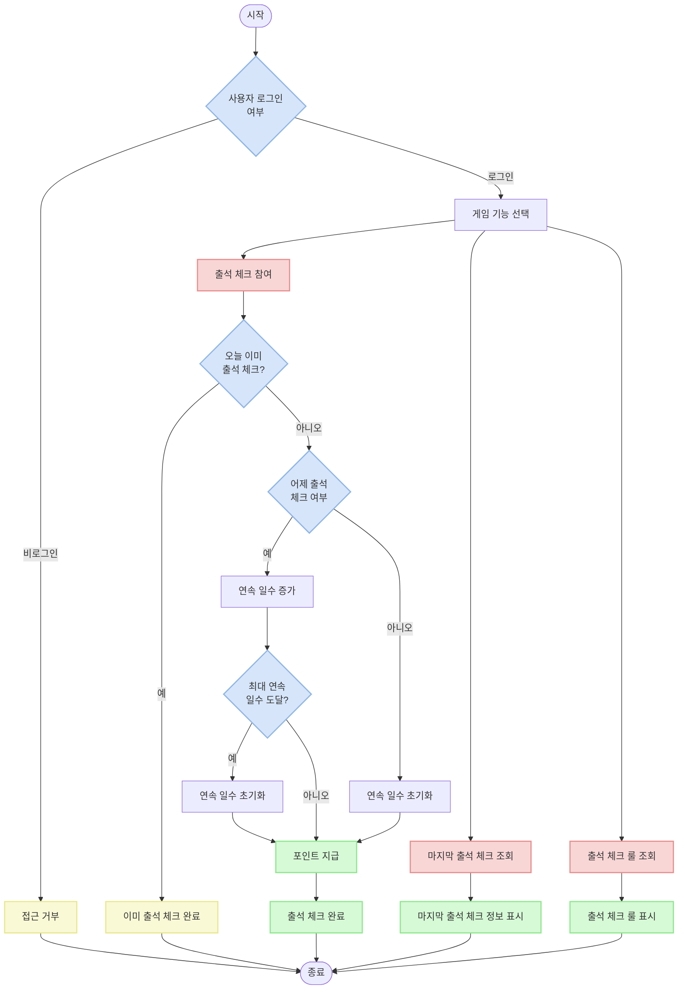

# Game API Documentation

## Overview

이 문서는 게임(Game) 관련 API 기능에 대한 가이드입니다. 출석 체크(Attendance Check) 기능과 게임 포인트(Game Point) 시스템에 대해 설명합니다. 사용자는 매일 출석 체크를 통해 포인트를 획득할 수 있으며, 연속 출석 시 더 많은 포인트를 획득할 수 있습니다.

## API 엔드포인트

| 경로                              | 메서드  | 설명                 |
|----------------------------------|---------|---------------------|
| `/v1/game/attendance-check/`     | GET     | 마지막 출석 체크 조회   |
| `/v1/game/attendance-check/`     | POST    | 출석 체크 참여         |
| `/v1/game/attendance-check/role/`| GET     | 출석 체크 룰 조회      |

## 게임 흐름

1. 사용자는 인증 후 게임 API에 접근 가능
2. 출석 체크는 하루에 1번만 참여 가능
3. 연속 출석 시 연속 일수에 따라 지급되는 포인트가 증가
4. 연속 출석 중단 시 연속 일수가 초기화됨
5. 최대 연속 일수(7일)에 도달하면 연속 일수가 다시 0으로 초기화됨



## 출석 체크 시스템

### 출석 체크 규칙

출석 체크 시스템은 다음과 같은 규칙으로 작동합니다:

1. 사용자는 하루에 한 번만 출석 체크가 가능합니다.
2. 연속 출석 일수에 따라 차등적인 포인트가 지급됩니다.
3. 연속 출석 일수는 최대 7일까지 카운트되며, 7일 연속 출석 후에는 다시 0일부터 시작합니다.
4. 출석을 하루라도 놓치면 연속 일수는 0으로 초기화됩니다.
5. 각 출석 일수별 지급 포인트는 환경 변수로 설정 가능합니다(기본값: [5,5,5,10,10,10,100]).

### 연속 출석 판단 로직

```python
# 어제 출석체크 여부에 따른 연속 일수 계산
if (
    self.instance  # 이전 출석 체크 기록이 있고
    and self.instance.check_in_date == timezone.now().date() - timedelta(days=1)  # 어제 출석했고
    and self.instance.consecutive_days < len(settings.ATTENDANCE_CHECK_REWARD_POINTS) - 1  # 최대 연속 일수에 도달하지 않았으면
):
    # 연속 일수 증가
    data["consecutive_days"] = self.instance.consecutive_days + 1
else:
    # 연속 일수 초기화
    data["consecutive_days"] = 0
```

### 포인트 지급 로직

출석 체크가 완료되면 연속 일수에 따른 포인트가 자동으로 지급됩니다. 이 로직은 `AttendanceCheck` 모델의 `save` 메서드에 구현되어 있습니다:

```python
def save(self, *args, **kwargs):
    if not self.pk:  # 새로운 출석 체크인 경우에만
        # 연속 일수에 해당하는 포인트 지급
        reward_point = settings.ATTENDANCE_CHECK_REWARD_POINTS[self.consecutive_days]
        GamePoint.objects.create(
            user=self.user,
            point=reward_point,
            reason=PointReason.ATTENDANCE_CHECK,
        )
    return super().save(*args, **kwargs)
```

## API 세부 설명

### 1. 마지막 출석 체크 조회 API

사용자의 마지막 출석 체크 기록을 조회합니다.

**URL**: `/v1/game/attendance-check/`

**메서드**: `GET`

**인증**: 필수 (JWT 토큰)

**권한**: `IsAuthenticated`

**응답 (200 OK)**:
```json
{
  "id": 42,
  "check_in_date": "2023-01-01",
  "consecutive_days": 3,
  "created_at": "2023-01-01T00:00:00.000000Z"
}
```

**응답 (200 OK, 출석 체크 기록이 없는 경우)**:
```json
null
```

**참고사항**:
- 가장 최근 출석 체크 정보만 반환됨
- 출석 체크 기록이 없는 경우 null 값 반환
- 이 API는 마지막 출석 체크 일자와 연속 일수를 통해 현재 사용자의 출석 상태를 확인하는 데 사용됨

### 2. 출석 체크 참여 API

오늘의 출석 체크에 참여합니다.

**URL**: `/v1/game/attendance-check/`

**메서드**: `POST`

**인증**: 필수 (JWT 토큰)

**권한**: `IsAuthenticated`

**요청 본문**: 필요 없음 (빈 객체 {}도 가능)

**응답 (200 OK)**:
```json
{
  "id": 43,
  "check_in_date": "2023-01-02",
  "consecutive_days": 4,
  "created_at": "2023-01-02T00:00:00.000000Z"
}
```

**동작**:
1. 요청한 사용자의 마지막 출석 체크 기록을 조회합니다.
2. 어제 출석 체크했는지 확인하여 연속 일수를 계산합니다.
   - 어제 출석했으면 연속 일수 증가
   - 그렇지 않으면 연속 일수 초기화
3. 오늘 날짜로 출석 체크 기록을 생성 또는 조회합니다(이미 오늘 출석했다면 기존 기록 반환).
4. 연속 일수에 해당하는 포인트를 자동으로 지급합니다.

**참고사항**:
- 하루에 한 번만 출석 체크 가능
- 이미 오늘 출석 체크한 경우, 기존 출석 체크 정보 반환
- 연속 일수가 최대 일수(settings.ATTENDANCE_CHECK_REWARD_POINTS의 길이 - 1)에 도달하면 다음 출석 시 0으로 초기화
- 출석 체크가 성공하면 GamePoint에 새로운 포인트 기록이 생성됨

### 3. 출석 체크 룰 조회 API

출석 체크 보상 포인트 규칙을 조회합니다.

**URL**: `/v1/game/attendance-check/role/`

**메서드**: `GET`

**인증**: 필수 (JWT 토큰)

**권한**: `IsAuthenticated`

**응답 (200 OK)**:
```json
[5, 5, 5, 10, 10, 10, 100]
```

**응답 설명**:
- 배열의 인덱스가 연속 일수를 의미함 (0부터 시작)
- 값은 해당 연속 일수에 지급되는 포인트
- 예) 인덱스 0: 첫 번째 출석(연속 0일) - 5 포인트
- 예) 인덱스 6: 일곱 번째 출석(연속 6일) - 100 포인트

**참고사항**:
- 이 API는 클라이언트가 출석 체크의 보상 규칙을 표시하는 데 사용됨
- 실제 포인트 계산 로직은 서버 측에서 처리됨
- 기본값은 [5,5,5,10,10,10,100]이나 환경 변수 'ATTENDANCE_CHECK_REWARD_POINTS'로 변경 가능

## 오류 응답 형식

게임 API의 오류 응답은 다음과 같은 형식을 따릅니다:

```json
{
  "detail": "오류 메시지"
}
```

### 주요 오류 코드

| HTTP 상태 코드 | 설명 |
|---------------|------|
| 401 Unauthorized | 인증되지 않은 사용자 접근 |
| 405 Method Not Allowed | 허용되지 않은 HTTP 메서드 사용 |
| 500 Internal Server Error | 서버 내부 오류 |

### 예시 오류 응답

**인증되지 않은 사용자 접근 (401 Unauthorized)**:
```json
{
  "detail": "자격 인증데이터(authentication credentials)가 제공되지 않았습니다."
}
```

**허용되지 않은 메서드 사용 (405 Method Not Allowed)**:
```json
{
  "detail": "PUT method is not allowed."
}
```

**중복 출석 체크 시도 (서버 오류 방지를 위해 구현됨)**:
현재 구현에서는 중복 출석 체크가 IntegrityError를 발생시키지 않고, 대신 기존 오늘의 출석 체크 데이터를 반환합니다.

## 데이터 모델

### 1. 출석 체크(AttendanceCheck)

출석 체크 기록을 저장하는 모델입니다.

**필드**:

| 필드명            | 타입                  | 설명                        |
|------------------|----------------------|----------------------------|
| id               | AutoField            | 고유 식별자                  |
| user             | ForeignKey (User)    | 사용자 참조                  |
| check_in_date    | DateField            | 참여 일자                    |
| consecutive_days | PositiveIntegerField | 연속 일수                    |
| created_at       | DateTimeField        | 생성 일시                    |

**제약 조건**:
- (user, check_in_date) 쌍은 고유해야 함 (하루에 한 번만 참여 가능)

**메서드**:
- `save()`: 새로운 출석 체크 생성 시 연속 일수에 해당하는 포인트를 지급하는 로직 포함


### 2. 포인트 사유(PointReason)

게임 포인트 지급 사유를 정의하는 열거형(Enum) 클래스입니다.

```python
class PointReason(models.IntegerChoices):
    """포인트 발급 사유"""
    
    ATTENDANCE_CHECK = 1, "출석 체크"
    COIN_FLIP = 2, "동전 뒤집기"
```

### 3. 게임 포인트(GamePoint)

게임 포인트 지급/차감 기록을 저장하는 모델입니다.

**필드**:

| 필드명            | 타입                    | 설명                      |
|------------------|------------------------|--------------------------|
| id               | AutoField              | 고유 식별자                |
| user             | ForeignKey (User)      | 사용자 참조                |
| point            | IntegerField           | 지급/차감 포인트            |
| reason           | PositiveSmallIntegerField | 포인트 발급 사유            |
| created_at       | DateTimeField          | 생성 일시                  |


## 관련 설정

### 출석 체크 보상 포인트

출석 체크 연속 일수에 따른 보상 포인트는 환경 변수로 설정됩니다:

```python
ATTENDANCE_CHECK_REWARD_POINTS = list(
    map(
        lambda x: int(x),
        os.environ.get("ATTENDANCE_CHECK_REWARD_POINTS", "5,5,5,10,10,10,100").split(","),
    )
)
```

- 기본값: `[5, 5, 5, 10, 10, 10, 100]`
- 각 값의 인덱스는 연속 일수를 의미함 (0부터 시작)

## 사용 예시 시나리오

### 1. 연속 출석 체크 시나리오

다음은 7일 연속 출석 체크를 하는 사용자의 시나리오입니다:

1. 첫째 날 출석 체크 (연속 0일, 5포인트 지급)
2. 둘째 날 출석 체크 (연속 1일, 5포인트 지급)
3. 셋째 날 출석 체크 (연속 2일, 5포인트 지급)
4. 넷째 날 출석 체크 (연속 3일, 10포인트 지급)
5. 다섯째 날 출석 체크 (연속 4일, 10포인트 지급)
6. 여섯째 날 출석 체크 (연속 5일, 10포인트 지급)
7. 일곱째 날 출석 체크 (연속 6일, 100포인트 지급)
8. 여덟째 날 출석 체크 (연속 0일로 초기화, 5포인트 지급)

### 2. 출석 중단 시나리오

출석을 중단한 사용자의 시나리오입니다:

1. 첫째 날 출석 체크 (연속 0일, 5포인트 지급)
2. 둘째 날 출석 체크 (연속 1일, 5포인트 지급)
3. 셋째 날 미참여
4. 넷째 날 출석 체크 (연속 0일로 초기화, 5포인트 지급)

## 보안 고려사항

1. **인증 필수**:
   - 모든 게임 API는 `IsAuthenticated` 권한 클래스를 사용하여 인증된 사용자만 접근 가능
   - JWT(JSON Web Token) 기반 인증 시스템 사용

2. **데이터 일관성**:
   - AttendanceCheck 모델의 unique_together 제약조건을 통해 동일 사용자, 동일 날짜에 중복 출석 체크 방지
   - 시리얼라이저에서 get_or_create를 사용하여 경쟁 상태(race condition) 방지

3. **포인트 악용 방지**:
   - 포인트 지급은 AttendanceCheck 모델의 save 메서드에서만 이루어짐
   - 연속 일수에 따른 포인트 계산은 서버 측에서만 수행
   - 출석 체크 API는 POST 요청을 통해서만 가능

4. **불필요한 HTTP 메서드 차단**:
   - 출석 체크 API는 GET(조회)와 POST(참여)만 허용
   - PUT 메서드는 명시적으로 차단

## 테스트 케이스

게임 API의 동작을 검증하기 위한 테스트 케이스가 구현되어 있습니다:

1. **AttendanceCheckSerializerTests**: 시리얼라이저의 연속 일수 계산 및 초기화 로직 테스트
2. **AttendanceCheckViewSetTests**: 출석 체크 API 엔드포인트의 작동 테스트
3. **AttendanceCheckRoleAPIViewTests**: 출석 체크 룰 조회 API 테스트
4. **GamePointTests**: 출석 체크에 따른 포인트 지급 테스트
5. **AttendanceCheckEdgeCaseTests**: 첫 출석, 최대 연속 일수 도달 후 처리 등 엣지 케이스 테스트

테스트는 `override_settings`를 사용하여 테스트 환경에서의 보상 포인트 값을 설정하고 있습니다:

```python
TEST_REWARD_POINTS = [5, 5, 5, 10, 10, 10, 100]

@override_settings(ATTENDANCE_CHECK_REWARD_POINTS=TEST_REWARD_POINTS)
class AttendanceCheckSerializerTests(APITestCase):
    # ... 테스트 코드 ...
```

## 확장 가능성

현재 게임 API는 출석 체크와 포인트 시스템을 제공하지만, 다음과 같은 확장이 가능합니다:

1. **추가 게임 기능**: 
   - 모델의 `PointReason` 열거형에 이미 "동전 뒤집기" 옵션이 포함되어 있어, 추가 게임 기능 확장 가능
   - 새로운 게임 API 추가 시 포인트 시스템과 통합 용이

2. **포인트 사용 및 관리**:
   - 포인트 조회, 사용, 충전 등의 기능 추가 가능
   - 포인트 사용 내역 및 통계 관련 API 개발 가능

3. **알림 시스템**:
   - 출석 체크 알림 기능 추가 가능
   - 연속 출석에 대한 리마인더 통지
   - 특별 포인트 이벤트 및 보상 알림

4. **랭킹 시스템**:
   - 사용자들의 획득 포인트에 따른 랭킹 시스템 구현 가능
   - 일간/주간/월간 최다 출석 또는 최다 포인트 획득 사용자 순위 제공

5. **출석 체크 정책 강화**:
   - 시간대별 출석 체크 보너스 추가
   - 특정 날짜 또는 이벤트 기간 보너스 포인트 지급 기능

## 코드 최적화 및 성능 고려사항

현재 구현은 소규모 서비스에 적합하지만, 사용자가 많아질 경우 다음과 같은 최적화를 고려할 수 있습니다:

1. **캐싱 전략**:
   - 자주 조회되는 출석 체크 규칙(룰)에 캐싱 적용
   - 마지막 출석 체크 정보 캐싱

2. **데이터베이스 인덱스**:
   - 현재 `check_in_date` 필드에 인덱스가 적용되어 있으나, 자주 조회되는 패턴에 따라 추가 인덱스 검토

3. **배치 처리**:
   - 대량의 포인트 처리가 필요한 경우 배치 작업으로 구현

4. **쿼리 최적화**:
   - 연속 출석 처리 시 불필요한 쿼리 최소화
   - `select_related` 및 `prefetch_related`를 활용한 관련 데이터 조회 최적화

## 결론

이 게임 API는 사용자 참여와 리텐션을 높이기 위한 출석 체크 시스템을 제공합니다. 연속 출석에 따른 보상 체계를 통해 사용자들의 지속적인 참여를 유도할 수 있습니다. 포인트 시스템과의 연동을 통해 향후 다양한 게임 및 보상 기능으로 확장 가능한 기반을 마련했습니다.

추가 개발 시 고려할 수 있는 개선 사항으로는 포인트 사용 API, 사용자 랭킹 시스템, 특별 이벤트 보상 등이 있습니다. 또한 출석 체크 패턴 분석을 통한 개인화된 알림 시스템도 구현 가능합니다.