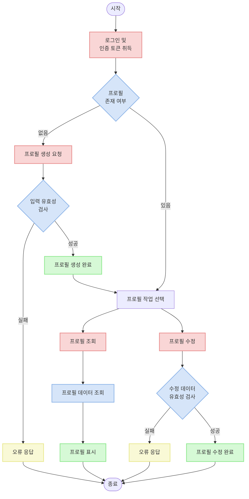
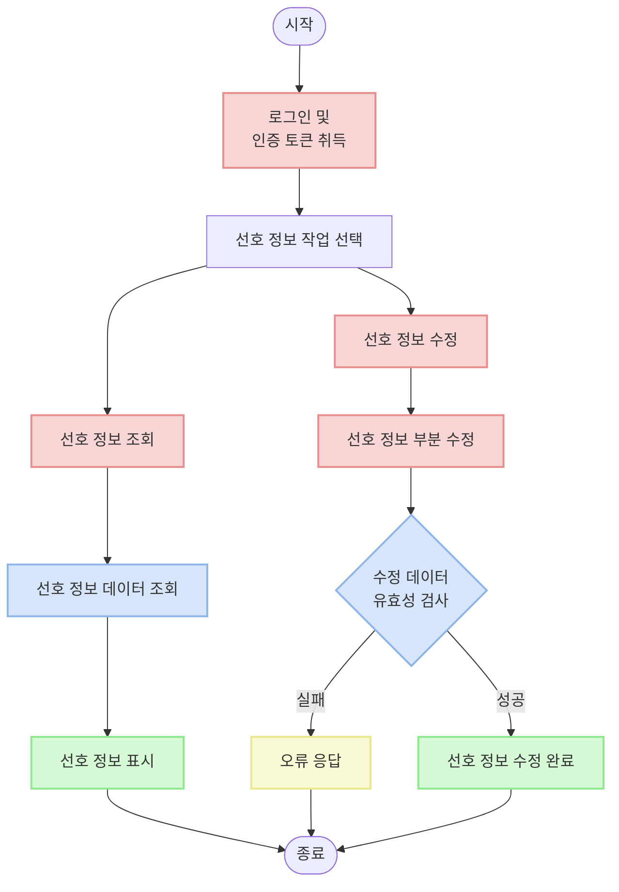
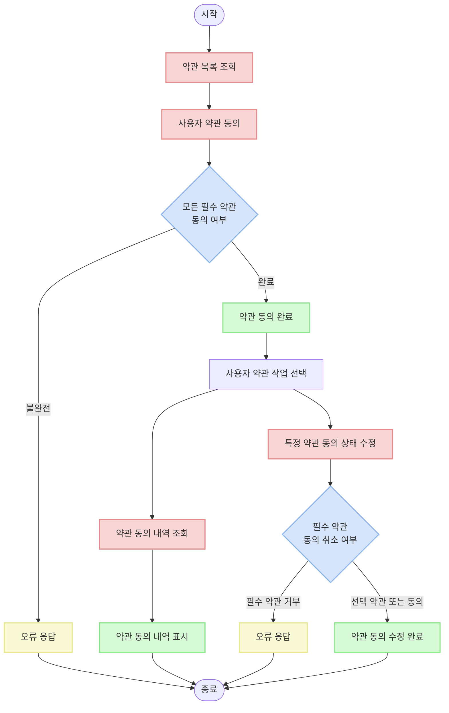

# User Profile & Agreement API Documentation

## Overview

이 문서는 사용자 프로필 및 약관 관련 API 기능에 대한 가이드입니다. 프로필 생성, 조회 및 수정 과정과 함께 사용자 약관 동의 프로세스에 대해 설명합니다.

## API 엔드포인트

| 경로                         | 메서드 | 설명               |
|----------------------------|--------|------------------|
| `/v1/user/me/profile/`     | POST   | 사용자 프로필 생성     |
| `/v1/user/me/profile/`     | GET    | 사용자 프로필 조회     |
| `/v1/user/me/profile/`     | PUT    | 사용자 프로필 수정     |
| `/v1/user/me/preference/`  | GET    | 사용자 선호 정보 조회   |
| `/v1/user/me/preference/`  | PATCH  | 사용자 선호 정보 수정   |
| `/v1/user/me/agreement/`   | GET    | 사용자 약관 동의 목록 조회 |
| `/v1/user/me/agreement/`   | POST   | 사용자 약관 동의 생성   |
| `/v1/user/me/agreement/{id}/` | PATCH | 사용자 약관 동의 수정   |

## 프로필 관리 흐름



## 선호 정보 관리 흐름



## 약관 관리 흐름



## API 세부 설명

### 1. 사용자 프로필 생성 API

로그인한 사용자의 프로필을 생성합니다.

**URL**: `/v1/user/me/profile/`

**메서드**: `POST`

**요청 헤더**:
```
Authorization: Bearer {access_token}
```

**요청 본문**:
```json
{
  "nickname": "사용자닉네임",
  "image": "https://example.com/profile.jpg"  // 선택적
}
```

**응답 (201 Created)**:
```json
{
  "id": 1,
  "nickname": "사용자닉네임",
  "image": "https://example.com/profile.jpg"
}
```

**유효성 검사**:
- 닉네임: 필수 필드, 최대 30자
- 이미지: 선택적 필드, 유효한 URL 형식

### 2. 사용자 프로필 조회 API

로그인한 사용자의 프로필 정보를 조회합니다.

**URL**: `/v1/user/me/profile/`

**메서드**: `GET`

**요청 헤더**:
```
Authorization: Bearer {access_token}
```

**응답 (200 OK)**:
```json
{
  "id": 1,
  "nickname": "사용자닉네임",
  "image": "https://example.com/profile.jpg"
}
```

**주의사항**:
- 인증된 사용자만 자신의 프로필을 조회할 수 있음
- 프로필이 없는 경우 404 응답 반환

### 3. 사용자 프로필 수정 API

로그인한 사용자의 프로필 정보를 수정합니다.

**URL**: `/v1/user/me/profile/`

**메서드**: `PUT`

**요청 헤더**:
```
Authorization: Bearer {access_token}
```

**요청 본문**:
```json
{
  "nickname": "새닉네임",
  "image": "https://example.com/new-profile.jpg"
}
```

**응답 (200 OK)**:
```json
{
  "id": 1,
  "nickname": "새닉네임",
  "image": "https://example.com/new-profile.jpg"
}
```

**유효성 검사**:
- 닉네임: 필수 필드, 최대 30자
- 이미지: 선택적 필드, 유효한 URL 형식

### 4. 사용자 선호 정보 조회 API

로그인한 사용자의 알림 선호 정보를 조회합니다.

**URL**: `/v1/user/me/preference/`

**메서드**: `GET`

**요청 헤더**:
```
Authorization: Bearer {access_token}
```

**응답 (200 OK)**:
```json
{
  "id": 1,
  "user": 1,
  "is_night_notification": false,
  "is_push_notification": true,
  "is_email_notification": true,
  "created_at": "2023-01-01T00:00:00Z"
}
```

**주의사항**:
- 인증된 사용자만 자신의 선호 정보를 조회할 수 있음
- 선호 정보가 없는 경우 404 응답 반환

### 5. 사용자 선호 정보 수정 API

로그인한 사용자의 알림 선호 정보를 수정합니다.

**URL**: `/v1/user/me/preference/`

**메서드**: `PATCH`

**요청 헤더**:
```
Authorization: Bearer {access_token}
```

**요청 본문** (변경하고자 하는 필드만 포함):
```json
{
  "is_night_notification": true,
  "is_push_notification": false
}
```

**응답 (200 OK)**:
```json
{
  "id": 1,
  "user": 1,
  "is_night_notification": true,
  "is_push_notification": false,
  "is_email_notification": true,
  "created_at": "2023-01-01T00:00:00Z"
}
```

**유효성 검사**:
- 변경하고자 하는 필드만 요청에 포함
- 모든 필드는 boolean 타입(true/false)

### 6. 사용자 약관 동의 목록 조회 API

로그인한 사용자의 약관 동의 내역을 조회합니다.

**URL**: `/v1/user/me/agreement/`

**메서드**: `GET`

**요청 헤더**:
```
Authorization: Bearer {access_token}
```

**응답 (200 OK)**:
```json
[
  {
    "id": 1,
    "agreement": {
      "id": 1,
      "title": "서비스 이용약관",
      "content": "서비스 이용약관 내용입니다...",
      "version": "1.0",
      "agreement_type": 1,
      "order": 1,
      "is_required": true
    },
    "is_agreed": true
  },
  {
    "id": 2,
    "agreement": {
      "id": 2,
      "title": "개인정보 처리방침",
      "content": "개인정보 처리방침 내용입니다...",
      "version": "1.0",
      "agreement_type": 2,
      "order": 2,
      "is_required": true
    },
    "is_agreed": true
  },
  {
    "id": 3,
    "agreement": {
      "id": 3,
      "title": "마케팅 정보 수신 동의",
      "content": "마케팅 정보 수신 동의 내용입니다...",
      "version": "1.0",
      "agreement_type": 3,
      "order": 3,
      "is_required": false
    },
    "is_agreed": false
  }
]
```

### 7. 사용자 약관 동의 생성 API

사용자의 약관 동의 정보를 생성합니다.

**URL**: `/v1/user/me/agreement/`

**메서드**: `POST`

**요청 헤더**:
```
Authorization: Bearer {access_token}
```

**요청 본문**:
```json
{
  "agreements": [
    {
      "id": 1,
      "is_agreed": true
    },
    {
      "id": 2,
      "is_agreed": true
    },
    {
      "id": 3,
      "is_agreed": false
    }
  ]
}
```

**응답 (201 Created)**:
```json
{
  "agreements": [
    {
      "id": 1,
      "is_agreed": true
    },
    {
      "id": 2,
      "is_agreed": true
    },
    {
      "id": 3,
      "is_agreed": false
    }
  ]
}
```

**유효성 검사**:
- 모든 활성화된 약관에 대해 동의 여부를 표시해야 함
- 필수(is_required=true) 약관은 반드시 동의(is_agreed=true)해야 함
- 선택 약관은 동의하지 않아도 됨

### 8. 사용자 약관 동의 수정 API

특정 약관에 대한 사용자의 동의 상태를 수정합니다.

**URL**: `/v1/user/me/agreement/{id}/`

**메서드**: `PATCH`

**요청 헤더**:
```
Authorization: Bearer {access_token}
```

**요청 본문**:
```json
{
  "is_agreed": true
}
```

**응답 (200 OK)**:
```json
{
  "id": 3,
  "agreement": {
    "id": 3,
    "title": "마케팅 정보 수신 동의",
    "content": "마케팅 정보 수신 동의 내용입니다...",
    "version": "1.0",
    "agreement_type": 3,
    "order": 3,
    "is_required": false
  },
  "is_agreed": true
}
```

**유효성 검사**:
- 필수 약관인 경우 동의 취소 불가능(is_agreed=false로 변경 불가)
- 선택 약관은 동의 및 취소 모두 가능

## 오류 응답 형식

### 유효성 검사 실패 (400 Bad Request)

유효성 검사에 실패한 경우 다음과 같은 형태로 응답을 반환합니다:

```json
{
  "필드명": [
    "오류 메시지"
  ]
}
```

### 인증 실패 (401 Unauthorized)

인증에 실패한 경우 다음과 같은 응답을 반환합니다:

```json
{
  "detail": "자격 인증데이터(authentication credentials)가 제공되지 않았습니다."
}
```

### 리소스 없음 (404 Not Found)

프로필이나 선호 정보를 찾을 수 없는 경우 다음과 같은 응답을 반환합니다:

```json
{
  "detail": "찾을 수 없습니다."
}
```

### 예시 오류 응답

**닉네임 누락**:
```json
{
  "nickname": [
    "이 필드는 필수 항목입니다."
  ]
}
```

**필수 약관 미동의**:
```json
{
  "agreements": [
    "필수 약관에 동의해야 합니다"
  ]
}
```

## 예시 사용 시나리오

### 프로필 생성 및 수정

1. 로그인 후 액세스 토큰 취득

2. 프로필 생성 요청:
```
POST /v1/user/me/profile/
Header: Authorization: Bearer {access_token}
{
  "nickname": "사용자닉네임",
  "image": "https://example.com/profile.jpg"
}
```

3. 프로필 조회:
```
GET /v1/user/me/profile/
Header: Authorization: Bearer {access_token}
```

4. 프로필 수정:
```
PUT /v1/user/me/profile/
Header: Authorization: Bearer {access_token}
{
  "nickname": "새닉네임",
  "image": "https://example.com/new-profile.jpg"
}
```

### 선호 정보 관리

1. 선호 정보 조회:
```
GET /v1/user/me/preference/
Header: Authorization: Bearer {access_token}
```

2. 선호 정보 부분 수정:
```
PATCH /v1/user/me/preference/
Header: Authorization: Bearer {access_token}
{
  "is_night_notification": true,
  "is_push_notification": false
}
```

3. 특정 알림 설정만 변경:
```
PATCH /v1/user/me/preference/
Header: Authorization: Bearer {access_token}
{
  "is_email_notification": false
}
```

### 약관 동의 과정

1. 약관 목록 조회 (account.md 참조)

2. 약관 동의 요청:
```
POST /v1/user/me/agreement/
Header: Authorization: Bearer {access_token}
{
  "agreements": [
    {
      "id": 1,
      "is_agreed": true
    },
    {
      "id": 2,
      "is_agreed": true
    },
    {
      "id": 3,
      "is_agreed": false
    }
  ]
}
```

3. 약관 동의 내역 조회:
```
GET /v1/user/me/agreement/
Header: Authorization: Bearer {access_token}
```

4. 특정 약관 동의 상태 수정(선택 약관 동의로 변경):
```
PATCH /v1/user/me/agreement/3/
Header: Authorization: Bearer {access_token}
{
  "is_agreed": true
}
```

## 주의사항

- 모든 API 요청에는 인증 토큰이 필요합니다(약관 목록 조회 제외).
- 프로필 생성과 수정 시 닉네임은 필수입니다.
- 이미지 URL은 선택 항목입니다.
- 부분 수정(PATCH)은 프로필에서 지원하지 않습니다. 프로필 수정 시에는 PUT 메서드를 사용하여 모든 필드를 제공해야 합니다.
- 선호 정보는 PATCH 메서드를 통해 부분 업데이트가 가능합니다.
- 사용자는 자신의 프로필과 선호 정보만 조회하고 수정할 수 있습니다.
- 약관 동의 시 모든 필수 약관에는 동의해야 합니다.
- 약관 동의 후에는 필수 약관의 동의 철회가 불가능합니다.
- 약관 동의 내역은 히스토리로 관리되며 모든 변경사항이 기록됩니다.

## 향후 업데이트 예정 기능

### 약관 변경 시 재동의 처리

약관 내용이 변경될 경우 사용자에게 재동의를 받는 기능이 추가될 예정입니다. 다음과 같은 프로세스가 구현될 예정입니다:

1. 새로운 버전의 약관이 등록되면, 이전 약관은 비활성화(is_active=false)됨
2. 사용자가 앱/웹 접속 시 동의가 필요한 새 약관이 있는지 확인
3. 새 약관이 있는 경우, 사용자에게 재동의 화면 표시
4. 사용자가 필요한 약관에 모두 동의해야 서비스 계속 이용 가능

이 기능은 개인정보 보호법 및 관련 규정을 준수하기 위한 목적으로 추가될 예정입니다.

### 알림 시스템 연동

사용자 선호 정보에 저장된 알림 설정은 푸시 알림 및 이메일 알림 시스템과 연동될 예정입니다:

1. `is_night_notification` 설정이 false인 경우 야간 시간대(22:00-08:00)에는 알림이 발송되지 않음
2. `is_push_notification` 설정이 false인 경우 앱 푸시 알림이 발송되지 않음
3. `is_email_notification` 설정이 false인 경우 이메일 알림이 발송되지 않음

이 기능은 사용자 경험 개선 및 알림 피로도 감소를 위해 구현될 예정입니다.